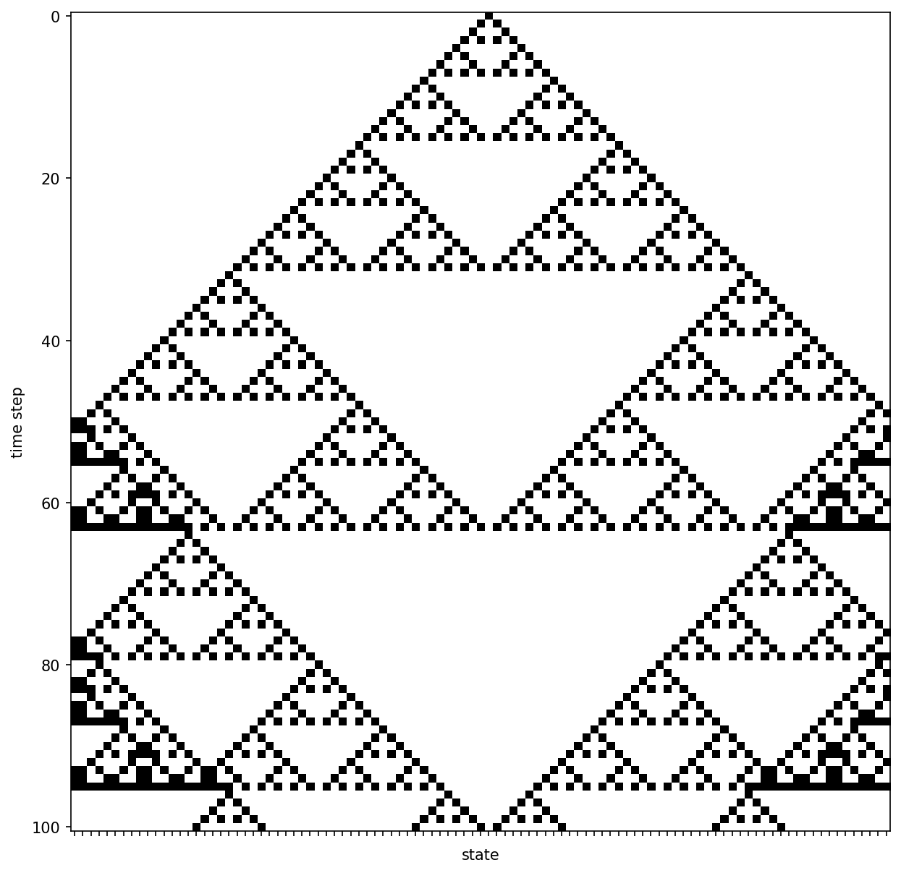

Cellular automata
=================

- boolean network
- spatial pattern of nodes
- local interactions, only nearest neighbors in rules
- all nodes have same rules

| :math:`[X0][X1][X2][X3]...`

Simplest case: 1-dimension
---------------------------

- every node has 3 neighbors (left, center, right)
- circular boundary conditions
- example rules

| :math:`000 \rightarrow 0`
| :math:`001 \rightarrow 1`
| :math:`010 \rightarrow 0`
| :math:`011 \rightarrow 1`
| :math:`100 \rightarrow 1`
| :math:`101 \rightarrow 0`
| :math:`110 \rightarrow 1`
| :math:`111 \rightarrow 0`

| **Example**
| By applying the rules the next time step is calculated. For instance for
| :math:`[0][0][0][1][0]`
| :math:`\downarrow`
| :math:`[0][0][1][0][1]`

Such simple rules can result in complex patterns.

    Time evolution of cellular automaton with 101 states and the rules from above. The code is provided in the examples.

**Insights**: local interactions can lead to global patterns → Pattern formation

2D automata
-----------
| The neighborhoods can be extended to 2 dimension.
| Famous example: **Conway's Game of life**

References
----------

- Game of Life, Wikipedia; https://en.wikipedia.org/wiki/Conway%27s_Game_of_Life
- A Brief History of Cellular Automata, Palash Sarkar, https://www.cs.ucf.edu/~dcm/Teaching/COT4810-Spring2011/Literature/CellularAutomata.pdf