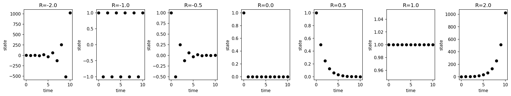
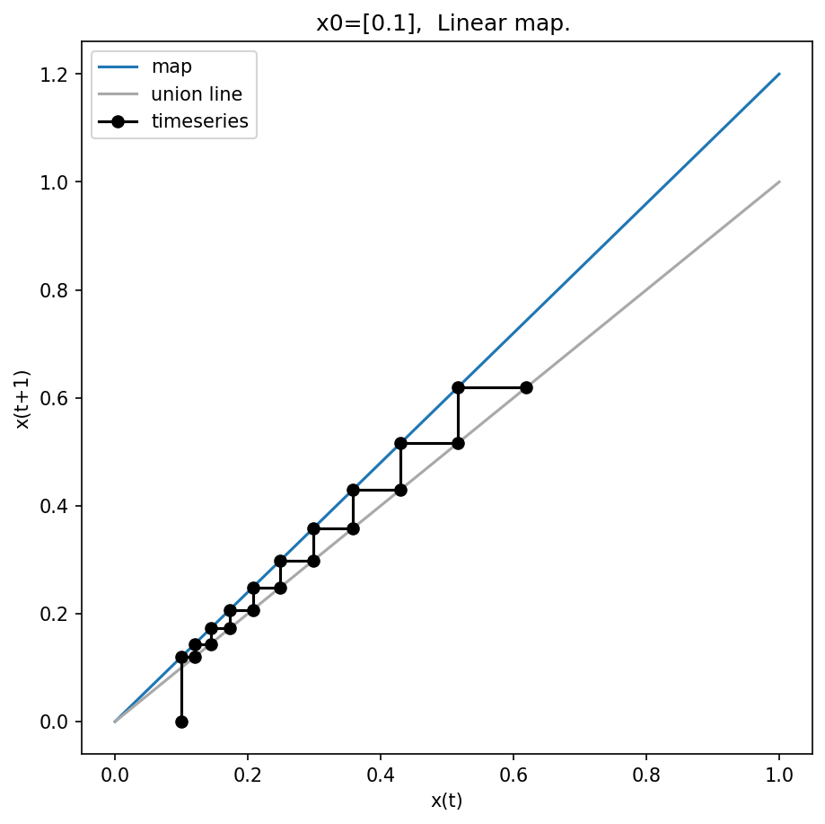
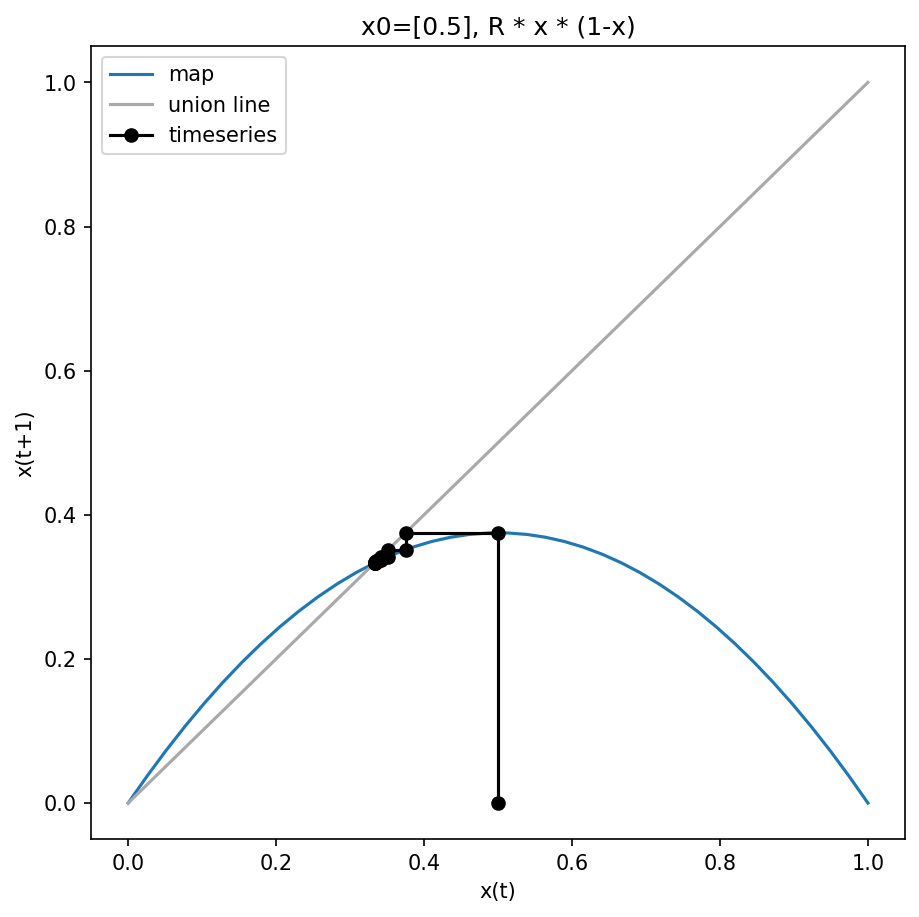

04 Finite difference equations
===============================
(Lineare und nicht-lineare Abbildungen)

- discrete time
- rules for update of states
- also called: maps

:math:`x_{t+1} = f(x_{t})`

Linear map (1D)
----------------
(Abbildung)
First we look at the simplest case of maps, the linear map in 1 dimension

:math:`x_{t+1} = f(x_{t}) = R \cdot x_{t}`

| From a given initial state we can simulate the time evolution:
| :math:`x_{0}` (initial condition)
| :math:`x_{1} = R \cdot x_{0}`
| :math:`x_{2} = R \cdot x_{1} = R^2 \cdot x_{0}`
| :math:`x_{3} = R \cdot x_{2} = \cdots = R^3 \cdot x_{0}`
| :math:`\cdots`

We get a time series of states (trajectory in 1 dimensional state space).

| **steady state**
| An important question for dynamical systems are the steady states. Steady states of a map are defined via:
| :math:`\bar{x}_{t+1} = \bar{x}_{t}`
| In case of the linear map this results in
| :math:`R \cdot \bar{x} = \bar{x}`
| :math:`\bar{x} = 0`

| **system behavior**
| Depending on the value of :math:`R` different system behavior is observed in the linear map

- :math:`R > 1` : growth
- :math:`R = 1` : steady state (for all x)
- :math:`0 < R < 1` : decay
- :math:`-1 < R < 0` : alternating decay
- :math:`R = -1`: periodic cycle
- :math:`R < -1`: alternating growth

We can see the different possible modes in the following figure.

    Simple linear map :math:`x_{t+1} = R \cdot x_{t}`

| **graphical solution** (web method)
| An important tool for the analysis of 1 dimensional maps is the graphical analysis.
| One plots the map function (:math:`(x_{t}, f(x_{t})) = (x_{t}, x_{t+1})` combined with the identity line.

    Graphical solution of linear map.

Nonlinear maps
----------------------
(Nichtlineare Abbildung)

| The linear map
| :math:`x_{t+1} = R \cdot x_{t}`
| is for :math:`R > 1` a simple model of exponential growth. But in reality resources are limited.

| **logistic map**
| A better description of growth processes with limitations is the logistic map, which
| has an additional term restricting growth.
| :math:`x_{t+1} = R \cdot x_{t} \cdot (1-x_{t})`
| :math:`0 \leq R \leq 4`
| The map is a function
| :math:`[0, 1] \rightarrow [0,1]`

| **Example simulation**
| We will run an example starting from :math:`x_{0}=0.5` (initial condition) with :math:`R=1.5`.

| :math:`x_{0} = 0.5`
| :math:`x_{1} = \frac{3}{2} \cdot \frac{1}{2} \cdot(1 - \frac{1}{2})=\frac{3}{8}`
| :math:`x_{2} = \frac{3}{2} \cdot \frac{3}{8} \cdot(1-\frac{3}{8})=0.352`
| :math:`x_{3} = \cdots = 0.342`
| :math:`x_{4} = \cdots = 0.3375`
| :math:`\cdots`

| **steady state**
| We calculate the steady state via
| :math:`\bar{x}_{t+1} = \bar{x}_{t}`
| :math:`R \cdot \bar{x} \cdot(1-\bar{x}) = \bar{x}`
| :math:`R - R \cdot \bar{x} = 1`
| Resulting in
| :math:`\bar{x}_{1} = 1-\frac{1}{R}`
| :math:`\bar{x}_{2} = 0`

| For our example (R=1.5) we get the steady state
| :math:`\bar{x}_{2} = 1-\frac{2}{3} = \frac{1}{3}`

    Graphical solution of logistic map

The steady states can be seen graphically in the web plot

- logistic map is a parabel
- crossings of map function :math:`f` with union line
- corresponds to :math:`x_{t+1} = f(x_{t}) = x_{t}`

| **Steady state analysis**
| We have found that the fix points / steady states in the system are
| :math:`\bar{x}_{1} = 1-\frac{1}{R}`
| :math:`\bar{x}_{2} = 0`

An important question is about stability of this fix points?
The stability can be calculated by evaluating the derivative in the fix point

References
----------