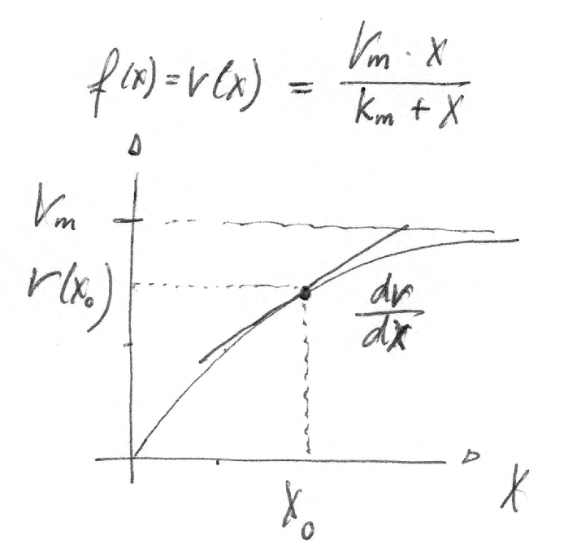
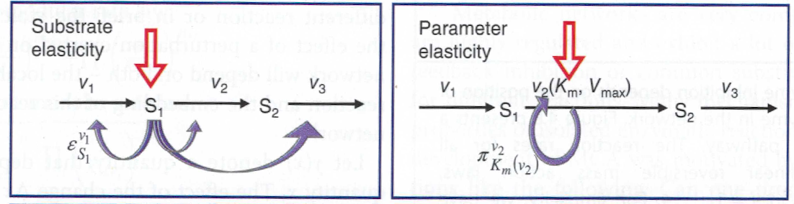
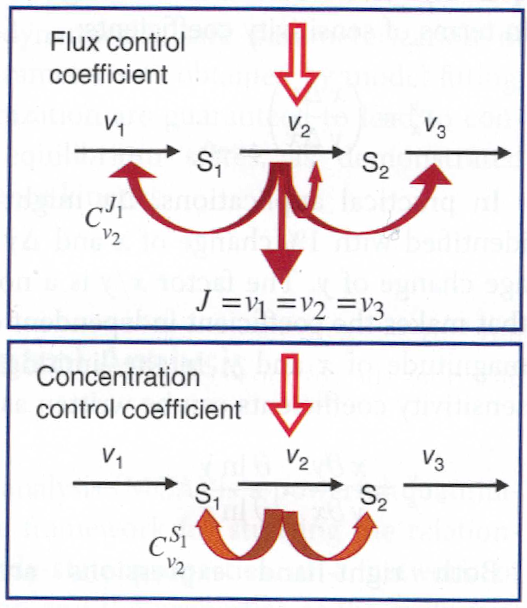
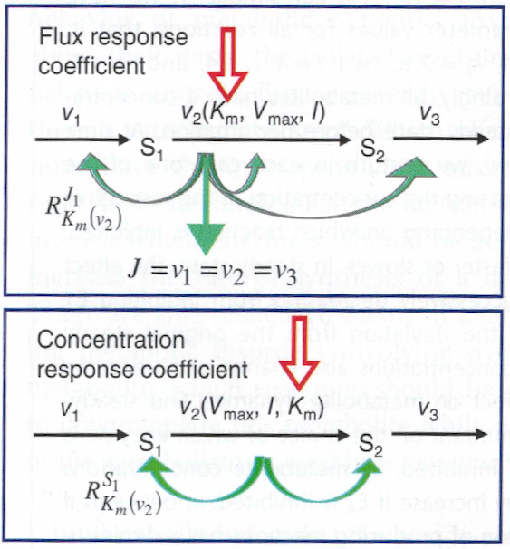

Sensitivity analysis
====================

**Review kinetic models of metabolism**

- System of reactions with rate laws :math:`v_k(\vec{x}, \vec{p}) = f(\vec{x}, \vec{p})` (:math:`k \in {1, ..., N_r}`) which depend on metabolites :math:`x_i` (:math:`i \in {1, ..., N_m}`) and parameters :math:`p_m` (:math:`i \in {1, ..., N_p})`
- Stochiometric matrix :math:`N \in I\!R(N_m, N_r)`
- Time evolution of :math:`\vec{x}(t)` via system of ordinary differential equations from initial state :math:`\vec{x}_0` via

.. math:: \frac{d}{dt} \vec{x} = N \cdot \vec{v}

- Steady state via

.. math:: N \cdot \vec{v} = 0

- Stability can be analysed using Jacobian matrix :math:`J = N \frac{d\vec{v}}{d\vec{x}}`

Sensitivity
-----------
A sensitivity quantifies how changes in a parameter or state variable affect results.

A key concept is hereby the sensitivity of a function :math:`y = f(x)` with respect to a parameter :math:`x` defined as derivative

.. math:: \lim_{\Delta x \to 0} \frac{\Delta f(x)}{\Delta x} = \frac{df(x)}{dx}

This sensitivity depends on the absolute value of the parameter: *absolute sensitivity*

**Logarithmic sensitivity**

Often the *relative sensitivity* or *logarithmic sensitivity*, which scales the sensitivity according to a given reference parameter :math:`x^0`.

.. math:: \frac{d \left( \frac{f(x)}{f(x^0)} \right)}{d \left( \frac{x}{x^0} \right)} = \frac{x^0}{f(x^0)} \cdot \frac{df(x)}{dx} = \frac{d \ln f(x)}{d \ln x}

An advantage is that logarithmic sensitivities are unit-less. But can be undefined for certain parameter/value combinations.

**Example**

For instance we can calculate the sensitivity of a Michaelis-Menten rate equation :math:`v(x)` on the metabolite concentrations `x` at a concentration :math:`x^0`

.. math:: v(x) = \frac{V_{m}\cdot x}{K_m + x}

.. math:: \frac{d \ln v(x)}{d \ln x} = \frac{x^0}{v(x^0)} \cdot \frac{dv}{dx}|_{X^0}

.. math:: \frac{dv}{dx} = \frac{V_m \cdot (K_m+x) - V_m \cdot x}{(K_m + x)^2} = \frac{V_m \cdot K_m}{(K_m + x)^2}

.. math:: \frac{d \ln v(x)}{d \ln x} = \frac{x^0}{\frac{V_m \cdot x^0}{K_m + x0}} \cdot \frac{V_m \cdot K_m}{(K_m + x)^2}= \frac{K_m}{K_m + x^0} = \frac{1}{1 + \frac{x^0}{K_m}} \in [0, 1)

The logarithmic sensitivities have an intuitive interpretation as the **kinetic order** of a reaction.
For a Michaelis-Menten function, the logarithmic sensititivity with respect to the substrates ranges from

**linear regime**

:math:`x^0 \ll K_m \Rightarrow \frac{\partial \ln v}{\partial \ln x} \to 1` (substrate concentration small compared to :math:`K_m`)

Compare to :math:`\frac{V_m \cdot x}{K_m + x} \to_{x << K_m} \frac{V_m}{K_m} \cdot x`

**saturation**

:math:`x^0 \gg K_m \Rightarrow \frac{\partial \ln v}{\partial \ln x} \to 0` (saturation, substrate concentration large compared to :math:`K_m`)

Metabolic Control Analysis (MCA)
--------------------------------

- In metabolic networks the steady state variables, that is the fluxes and metabolite concentrations, depend on the value of parameters such as enzyme concentrations, kinetic constants (like Michelis-Menten constants).
- The effect of perturbations depends the place of the perturbation.

- MCA considers how a perturbation propagates through a metabolic network. Typically: how a change in enzyme concentration (or other parameter) affects the steady state with respect to metabolite concentrations and flux values.
- framework for studying the relationship between steady-state properties of a network of biochemical reactions and the properties of the individual reactions
- tool for analysis of control and regulation
- originally developed for metabolic networks, MCA has found application in *signaling pathways*, *gene expression models*, and *hierarchical models*
- metabolic networks are complex systems

MCA is conceptionally similar to classic sensitivity or control theory (from engineering).

The relations between steady state variables and kinetic parameters are usually nonlinear.
MCA analyses small parameter changes around steady state.

Two distinct type of coefficients:

- *elasticity coefficients* are local coefficients pertaining to individual reactions. They can be calculated in any given state.

- *control coefficients* and *response coefficients* are global quantities. They refer to a given steady state of the entire system.

Elasticities
^^^^^^^^^^^^

An elasticity coefficient quantifies the sensitivity of a reaction rate to the change of a concentration or a parameter while all other arguments of the kinetic law are kept fixed.

In MCA, the partial derivative of a reaction rate with respect to its substrate is called :math:`\epsilon`-*elasticity*

.. math:: \epsilon^{v}_{x} = \frac{\partial v}{\partial x}

More general, the sensitivity of the rate :math:`v_k` of a reaction to the change of the concentration :math:`x_i` of a metabolite is calculated by

.. math:: \epsilon^{v_k}_{x_i} = \frac{\partial v_k}{\partial x_i}

The corresponding *scaled elasticities* are

.. math:: \epsilon^v_x = \frac{x}{v} \frac{\partial v}{\partial x} = \frac{\partial \ln v}{\partial \ln x}
.. math:: \epsilon^{v_k}_{x_i} = \frac{x_i}{v_k} \frac{\partial v_k}{\partial x_i} = \frac{\partial \ln v_k(x_i)}{\partial \ln x_i}

A set of reactions and a set of metabolites results in an elasticity matrix :math:`\epsilon`.
Note that the Jacobian matrix is :math:`J = N \cdot \epsilon`.

**Examples**

What are the logarithmic (normalized/scaled) sensitivities of the following functions with respect to the variable :math:`x`

.. math:: v(x) = \frac{V_m \cdot x}{K_m + x} \Rightarrow \frac{\partial \ln v(x)}{\partial \ln x} = \frac{1}{1 + \frac{x^0}{K_m}} \in [0, 1)

.. math:: v(x) = k \cdot x \Rightarrow \frac{\partial \ln v(x)}{\partial \ln x} = 1
.. math:: v(x) = k \cdot x^n \Rightarrow \frac{\partial \ln v(x)}{\partial \ln x} = n
.. math:: v(x) = \frac{V_m \cdot x^n}{K_m^n + x^n} \Rightarrow \frac{\partial \ln v(x)}{\partial \ln x} = n \cdot \left(\frac{1}{1 + \frac{x_0^n}{K_m^n}}\right) \in (0, 1]
.. math:: v(x) = \frac{Vv_m}{1 + \frac{1}{x^n/K_i^n}}

The :math:`\pi`-*elasticity* is defined with respect to parameters :math:`p_m` like kinetic constants, concentrations of enzymes, or concentrations of external metabolites

.. math:: \pi^{v_k}_{p_m} =  \frac{p}{v} \frac{\partial v}{\partial p} = \frac{\partial \ln v_k}{\partial \ln p_m}

Control coefficients
^^^^^^^^^^^^^^^^^^^^
A control coefficient measures the relative steady state change in a system variable, e.g. pathway flux :math:`J_k` or metabolite concentration :math:`x_i`.
The two main control coefficients are the *flux* and *concentration control coefficients*.

Control coefficients are defined in a stable steady state of the metabolic system, characterized by steady state :math:`x^{ss}` concentrations and fluxes :math:`\vec{J}`.

Any sufficiently small perturbation of an individual reaction rate :math:`v_k \to v_k + \Delta v_k` drives the system to a new steady state in close proximity with :math:`\vec{J} \to \vec{J} + \Delta \vec{J}` and :math:`\vec{x^{ss}} \to \vec{x^{ss}} + \Delta \vec{x^{ss}}`.

A measure of the change of fluxes and concentrations are the control coefficients.

**Flux control coefficients**

:math:`C^X`, the flux control coefficient denotes the changes in flux upon perturbations,

..math:: \frac{dv}{dp} = \frac{\delta v}{\delta p} + \frac{\delta v}{\delta x}\frac{dx}{dp} = \left[ 1 + \frac{\delta v}{\delta x} \cdot C^X] \frac{\delta v}{\delta p}

**Concentration control coefficient**

The (unscaled) concentration control coefficients specify how the concentrations change due to a perturbation of a parameter (typically an enzyme concentration) that effects one or more fluxes.
In terms of derivatives,

.. math:: C^x = \frac{\delta x}{\delta p} / \frac{\delta v}{\delta p} = \frac{\delta x}{\delta v}

However, in general no explicit function for the concentrations of the form :math:`x = f(p)` are known. Therefore we consider

.. math:: N \cdot v(x, p) = 0 \; \Rightarrow \; N \left[ \frac{\delta v}{\delta x}\frac{dx}{dp} + \frac{\delta v}{\delta p} \right] = 0

and obtain

.. math:: \frac{dx}{dp} = - \left[ N \cdot \frac{\delta v}{\delta x} \right]^{-1} \cdot N \cdot \frac{\delta v}{delta p} = C^X \cdot \frac{\delta v}{\delta p}

using the definition we get

.. math:: C^X = - \left[ N \cdot \frac{\delta v}{\delta x} \right] \cdot N = - J^{-1} \cdot N.

Response coefficients
^^^^^^^^^^^^^^^^^^^^^

- The steady state is determined by the values of the parameters.
- The response coefficients express the direct dependency of steady state variables on parameters

**Flux response coefficient**

Response of steady state flux to parameter perturbations

.. math:: R^j_m = \frac{p_m}{J_j}\cdot \frac{\partial J_j}{\partial p_m}

**Concentration response coefficient**
Response of steady state concentration to parameter perturbation

.. math:: R^i_m = \frac{p_m}{x^{ss}_i}\cdot \frac{\partial x^{ss}_i}{\partial p_m}

Theorems of MCA
^^^^^^^^^^^^^^^

**Summation Theorems**

The summation theorems make a statement about the total control over a certain steady-state flux or concentration.

The flux control coefficients fulfill

.. math:: \sum_{k=1}^r C_{v_k}^{J_j} = 1

That means that all enzymatic reactions can share the control over this flux.

The concentration control coefficients fulfill

.. math:: \sum_{k=1}^r C_{v_k}^{S_i} = 0

The control coefficients of a metabolic network for one steady-state concentration are balanced. Enzyme can share control, but some exert negative control while others exert positive control

**Connectivity Theorems**

References & further reading
-----------------------------
- https://en.wikipedia.org/wiki/Metabolic_control_analysis
- Klipp et al, Systems Biology - A textbook, chapter 4.2 - Metabolic control analysis
- Reder, C. “Metabolic control theory: a structural approach.” Journal of theoretical biology vol. 135,2 (1988): 175-201. doi:10.1016/s0022-5193(88)80073-0
- Kacser, H, and J A Burns. “The control of flux.” Symposia of the Society for Experimental Biology vol. 27 (1973): 65-104.
- Heinrich, R, and T A Rapoport. “A linear steady-state treatment of enzymatic chains. General properties, control and effector strength.” European journal of biochemistry vol. 42,1 (1974): 89-95. doi:10.1111/j.1432-1033.1974.tb03318.x
