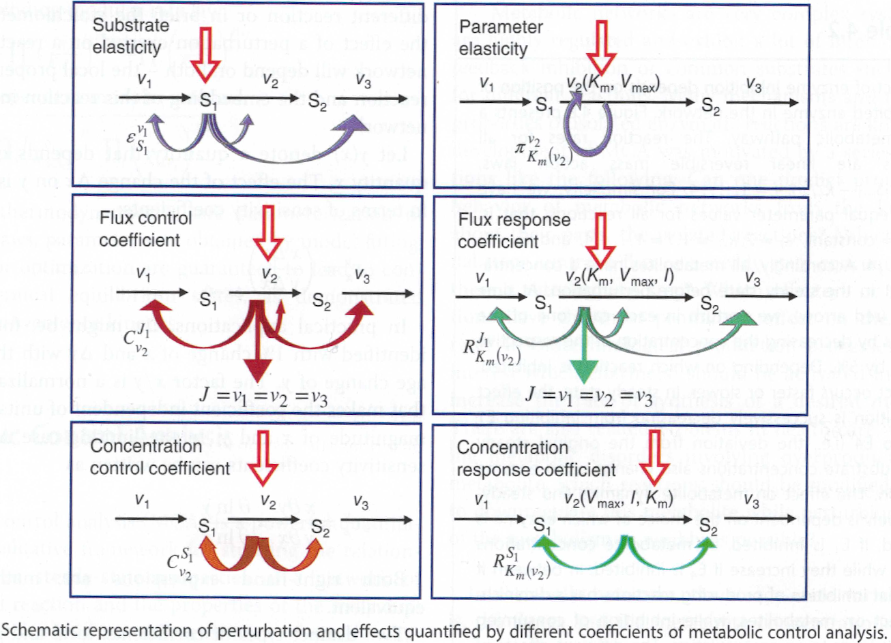

Sensitivity analysis
====================

Short review kinetic model of metabolism

- Reactions with rate laws :math:`v_k` with :math:`k \in {1, ..., N_r}` depending on metabolites :math:`x_i` with :math:`i \in {1, ..., N_m}` and parameters :math:`p_m` with :math:`i \in {1, ..., N_p}`
- Stochiometric matrix :math:`N \in I\!R(N_m, N_r)`
- Time evolution via system of ordinary differential equations from initial state :math:`x_0`

.. math:: \frac{d}{dt} \vec{x} = N \cdot \vec{v}

- Steady state via

.. math:: N \cdot \vec{v} = 0

Sensitivity
-----------
A sensitivity quantifies how changes in a parameter or state variable affect results.

A key concept is hereby the sensitivity of a function :math:`y = f(x)` with respect to a parameter :math:`x` defined as derivative

.. math:: \lim_{\Delta x \to 0} \frac{\Delta f(x)}{\Delta x} = \frac{df(x)}{dx}

This sensitivity depends on the absolute value of the parameter: *absolute sensitivity*

.. figure:: ./images/sensitivity.png
    :width: 400px
    :align: center
    :alt: escher-fba
    :figclass: align-center

**Logarithmic sensitivity**

Often the *relative sensitivity* or *logarithmic sensitivity*, which scales the sensitivity according to a given reference parameter :math:`x^0`.

.. math:: \frac{d \left( \frac{f(x)}{f(x^0)} \right)}{d \left( \frac{x}{x^0} \right)} = \frac{x^0}{f(x^0)} \cdot \frac{df(x)}{dx} = \frac{d \ln f(x)}{d \ln x}

An advantage is that logarithmic sensitivities are unit-less. But can be undefined for certain parameter/value combinations.

**Example**
For instance we can calculate the sensitivity of a Michaelis-Menten rate equation :math:`v(x)` on the metabolite concentrations `x`

.. math:: v(x) = \frac{V_{m}\cdot x}{K_m + x}

.. math:: \Rightarrow \; \frac{d \ln v(x)}{d \ln x} = \frac{1}{1 + \frac{x}{K_M}} \in (0,1]

The logarithmic sensitivities have an intuitive interpretation as the **kinetic order**.
For a Michaelis-Menten function, the logarithmic sensititivity with respect to the substrates ranges from :math:`1` (linear regime, substrate concentration small compared to :math:`Km`) to :math:`0` (saturation, substrate concentration large compared to :math:`Km`)

**Exercise**

What are the logarithmic (normalized/scaled) sensitivities of the following functions with respect to the variable :math:`x`

.. math:: v(x) = k \cdot x
.. math:: v(x) = k \cdot x^n
.. math:: v(x) = \frac{V_m \cdot x^n}{K_m^n + x^n}
.. math:: v(x) = \frac{Vv_m}{1 + \frac{1}{x^n/K_i^n}}

Metabolic Control Analysis (MCA)
--------------------------------
- framework for studying the relationship between steady-state properties of a network of biochemical reactions and the properties of the individual reactions
- investigates sensitivity of steady state properties to small parameter changes
- tool for analysis of control and regulation
- originally developed for metabolic networks, MCA has found application in *signaling pathways*, *gene expression models*, and *hierarchical models*
- metabolic networks are complex systems

In metabolic networks the steady state variables, that is the fluxes and metabolite concentrations, depend on the value of parameters such as enzyme concentrations, kinetic constants (like Michelis-Menten constants).

The effect of perturbations depends the place of the perturbation.

MCA considers how a perturbation propagates through a metabolic network. Typically: how a change in enzyme concentration (or other parameter) affects the steady state with respect to metabolite concentrations and flux values.

MCA is conceptionally similar to classic sensitivity or control theory (from engineering).

Similar to other sensitivities the formulation can be in absolute terms or scaled (i.e. relative sensitivities).

The relations between steady state variables and kinetic parameters are usually nonlinear.
MCA analyses small parameter changes around steady state.

Two Two distinct type of coefficients:

- *elasticity coefficients* are local coefficients pertaining to individual reactions. They can be calculated in any given state.

- *control coefficients* and *response coefficients* are global quantities. They refer to a given steady state of the entire system.

**Elasticities**
An elasticity coefficient quantifies the sensitivity of a reaction rate to the change of a concentration or a parameter while all other arguments of the kinetic law are kept fixed.

In MCA, the partial derivative of a reaction rate with respect to its substrate is called :math:`epsilon`-*elasticity*

.. math:: \epsilon^{v}_{x} = \frac{\partial v(x)}{\partial x}

More general, the sensitivity of the rate :math:`v_k` of a reaction to the change of the concentration :math:`x_i` of a metabolite is calculated by

.. math:: \epsilon^{v_k}_{x_i} = \frac{\partial v_k(x_i)}{\partial x_i}

The corresponding **scaled elasticities** are

.. math:: \epsilon^v_x = \frac{x}{v} \frac{}{} = \frac{\delta \ln v}{\delta \ln x} = \frac{\delta \ln v(x)}{\delta \ln x}
.. math:: \epsilon^{v_k}_{x_i} = \frac{\delta \ln v_k(x_i)}{\delta \ln x_i}

A set of reactions and a set of metabolites results in an elasticity matrix :math:`epsilon`.
Note that the Jacobian matrix is :math:`J = N \cdot \epsilon`.

The :math:`\pi`-*elasticity* is defined with respect to parameters :math:`p_m` like kinetic constants, concentrations of enzymes, or concentrations of external metabolites

.. math:: \pi^{v_k}_{p_m} = \frac{\delta \ln v_k}{\delta \ln p_m}

**Control coefficients**
A control coefficient measures the relative steady state change in a system variable, e.g. pathway flux :math:`J` or metabolite concentration :math:`S`
The two main control coefficients are the *flux* and *concentration control coefficients*.

**Concentration control coefficient**
The (unscaled) concentration control coefficients specify how the concentrations change due to a perturbation of a parameter (typically an enzyme concentration) that effects one or more fluxes.
In terms of derivatives,

.. math:: C^x = \frac{\delta x}{\delta p} / \frac{\delta v}{\delta p} = \frac{\delta x}{\delta v}

However, in general no explicit function for the concentrations of the form :math:`x = f(p)` are known. Therefore we consider

.. math:: N \cdot v(x, p) = 0 \; \Rightarrow \; N \left[ \frac{\delta v}{\delta x}\frac{dx}{dp} + \frac{\delta v}{\delta p} \right] = 0

and obtain

.. math:: \frac{dx}{dp} = - \left[ N \cdot \frac{\delta v}{\delta x} \right]^{-1} \cdot N \cdot \frac{\delta v}{delta p} = C^X \cdot \frac{\delta v}{\delta p}

using the definition we get

.. math:: C^X = - \left[ N \cdot \frac{\delta v}{\delta x} \right] \cdot N = - J^{-1} \cdot N.

The definition gets slightly more complicated if the Jacobian is not invertible (for example due to conserved moieties). In this case, a link matrix :math:`L` has to be introduced, see further reading.

**Summation theorem**
For a set of concentrations and a set of reactions (or enzymes), the concentration control coefficients are a matrix. Multiplication of the concentration control coefficient with (any) vector of the right nullspace of :math:`N` results in the summation theorem,

.. math:: C^X \cdot K = 0

**Connectivity theorem**
Likewise, multiplication of the concentration control coefficient with the elasticity matrix :math:`\epsilon` results in the conectivity theorem,

.. math:: C^X \cdot \epsilon = 1

**Flux control coefficients**
Similar to :math:`C^X`, the flux control coefficient denotes the changes in flux upon perturbations,

..math:: \frac{dv}{dp} = \frac{\delta v}{\delta p} + \frac{\delta v}{\delta x}\frac{dx}{dp} = \left[ 1 + \frac{\delta v}{\delta x} \cdot C^X] \frac{\delta v}{\delta p}

and

.. math:: C^v := 1 + \frac{\delta v}{\delta x} \cdot C^X

The corresponding summation theorem (for unscaled coefficient) is

.. math:: C^v \cdot K = K

**Scaled control coefficients**

Similar to the partial derivatives, it is often useful to consider scaled control coefficients. These provide a measure of the relative changes of concentrations and fluxes upon relative changes in parameters (that is, a scaled control coefficient of :math:`\hat{C}^v`, implies that if the corresponding enzyme is changed by 1% the respective flux changes by 1%).

We define *scaled elasticities*

.. math:: \hat{\epsilon} = D_{v^0}^{-1} \cdot \epsilon \cdot D_{x^0}

*scaled concentration control coefficients* :math:`\hat{C}^X`

.. math:: \hat{C}^X = D_{x^0}^{-1} \cdot C^X \cdot D_{v^0}

and *scaled flux control coefficients* :math:`\hat{C}^v`

.. math:: \hat{C}^v = D_{v^0}^{-1} \cdot C^v \cdot D_{v^0} \Longleftrightarrow \hat{C}^v = 1 + \hat{\epsilon}\cdot \hat{C}^X

where :math:`D_{x^0}` and :math:`D_{v^0}` denote diagonal matrices with :math:`x^0` and :math:`v^0` on the diagonal, respectively.

References & further reading
-----------------------------
- https://en.wikipedia.org/wiki/Metabolic_control_analysis
- Klipp et al, Systems Biology - A textbook, chapter 4.2 - Metabolic control analysis
- Reder, C. “Metabolic control theory: a structural approach.” Journal of theoretical biology vol. 135,2 (1988): 175-201. doi:10.1016/s0022-5193(88)80073-0
- Kacser, H, and J A Burns. “The control of flux.” Symposia of the Society for Experimental Biology vol. 27 (1973): 65-104.
- Heinrich, R, and T A Rapoport. “A linear steady-state treatment of enzymatic chains. General properties, control and effector strength.” European journal of biochemistry vol. 42,1 (1974): 89-95. doi:10.1111/j.1432-1033.1974.tb03318.x
