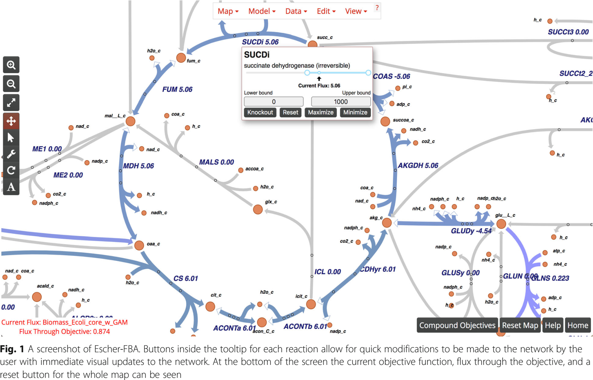

Constraint-based analysis (CBA)
===============================

Metabolic network reconstruction
---------------------------------
Contain:

- all metabolic reactions in an organism
- genes that encode each enzyme
- semi-automatic bottom-up methods have been developed (see Thiele2010)
- manual refinement (e.g. removal dead-ends)

Flux balance analysis (FBA)
---------------------------
Flux balance analysis is a mathematical approach for analyzing the flow of metabolites through a metabolic network, in particular in genome-scale metabolic networks.

Unknown fluxes are estimated using optimality principles. That is, the flux vector :math:`v^0` is assumed to be such that a given objective function is a maximized (such as ATP production of biomass formation).

FBA is based on steady state assumption

.. math:: N \cdot v^0 = 0

- :math:`v^0` is a vector of reaction rates
- :math:`v^0` is an element of the right nullspace (kernel) of the stoichiometric matrix.
- :math:`v^0` is typically underdetermined (fewer constraints than unknown fluxes, the number of unknown fluxes is :math:`r - rank(N)` )
- no need for kinetic information

**FBA steps**

- derive mass balance equations
- build up stoichiometric matrix :math:`N`
- apply constraints to limit feasible solution space
- maximize/minize an objective function to find an optimal solution

The most common objective is the biomass objective function (BOF), i.e., growth.
Alternatively energy based functions are often used.

**Optimization problem**

.. math::
    \max_{v^0} \; c^T \cdot v \\
    s.t. \; N \cdot v^0 = 0 \\
    \alpha_i \leq v_i^0 \leq \beta_i

Often a special biomass function is added to the model

.. math::
    \max_{v^0} v_{bio}

**Solving LP problems**

FBA is a linear programming (LP) problem which can be solved using the *simplex algorithm*.

A system of linear inequalities defines a polytope as a feasible region. The simplex algorithm begins at a starting vertex and moves along the edges of the polytope until it reaches the vertex of the optimal solution.

**Solvers**

- `GUROBI <https://www.gurobi.com/>`_
- `CPLEX <https://www.ibm.com/analytics/cplex-optimizer>`_
- `glpk <https://www.gnu.org/software/glpk/>`_ (GNU Linear Programming toolkit)

**Non-uniquness of solution**

The optimal solution is typically not unique. Typical steps of analysis are either *Flux variability analysis*, *Flux sampling*, or running FBA variants with additional constraints like *geometric FBA* or *parsimonious FBA*.

**Flux variability analysis (FVA)**

FBA will not give always give unique solution, because multiple flux states can achieve the same optimum. FVA (or flux variability analysis) finds the ranges of each metabolic flux at the optimum.

**Parsimonious FBA (pFBA)**

Parsimonious FBA finds a flux distribution which gives the optimal growth rate, but minimizes the total sum of flux. For more details on pFBA, see Lewis2010

**Geometric FBA (pFBA)**

Geometric FBA finds a unique optimal flux distribution which is central to the range of possible fluxes.

**Flux sampling**

- sampling of flux cone to evaluate possible solution space

**Simulating deletions**

In addition to species and reactions genes (protein products) are logically connected to reactions.
A typical analysis are *gene deletions*, knocking out genes by setting corresponding reaction fluxes to zero.

**Software for constraint-based analysis (CBA)**

Many tools exist for performing FBA analysis, e.g.,

- `COBRA toolbox <https://opencobra.github.io/cobratoolbox/stable/>`_ (Matlab, see Heirendt2019), The COnstraint-Based Reconstruction and Analysis Toolbox
- `cobrapy <https://cobrapy.readthedocs.io/en/latest/>`_ (python, see Ebrahim2013)
- `Escher-FBA <https://sbrg.github.io/escher-fba/#/>`_ (web app, see Rowe2010)

Elementary flux modes (EFM)
============================
Alternative analysis method using steady-state assumption :math:`N \cdot v^0 = 0`

- Enumeration of possible pathways.
- A flux mode is a set of reactions that can give rise to a steady state flux vector :math:`v^0`. An elementary flux mode is a flux mode where no reaction can be removed (=zero flux) and the resulting reactions can still be a flux mode.
- The set of EFMs is unique for a given stoichiometry.
- The number of EFMs is typically (much) higher then the dimension of the nullspace.

References
----------

- Heirendt, Laurent, et al. "Creation and analysis of biochemical constraint-based models using the COBRA Toolbox v. 3.0." Nature protocols 14.3 (2019): 639.
- Orth, Jeffrey D., Ines Thiele, and Bernhard Ø. Palsson. "What is flux balance analysis?." Nature biotechnology 28.3 (2010): 245.
- Lewis, Nathan E., et al. "Omic data from evolved E. coli are consistent with computed optimal growth from genome‐scale models." Molecular systems biology 6.1 (2010).
- Ebrahim, Ali, et al. "COBRApy: constraints-based reconstruction and analysis for python." BMC systems biology 7.1 (2013): 74.
- Rowe, Elliot, Bernhard O. Palsson, and Zachary A. King. "Escher-FBA: a web application for interactive flux balance analysis." BMC systems biology 12.1 (2018): 84.
- Thiele, Ines, and Bernhard Ø. Palsson. "A protocol for generating a high-quality genome-scale metabolic reconstruction." Nature protocols 5.1 (2010): 93.
- Schellenberger, Jan, et al. "Quantitative prediction of cellular metabolism with constraint-based models: the COBRA Toolbox v2. 0." Nature protocols 6.9 (2011): 1290.
- Lotz, Katrin, et al. "Elementary flux modes, flux balance analysis, and their application to plant metabolism." Plant Metabolism. Humana Press, Totowa, NJ, 2014. 231-252.
- Megchelenbrink, Wout, Martijn Huynen, and Elena Marchiori. "optGpSampler: an improved tool for uniformly sampling the solution-space of genome-scale metabolic networks." PloS one 9.2 (2014): e86587.
- Wikipedia Simplex Algorithm; https://en.wikipedia.org/wiki/Simplex_algorithm
