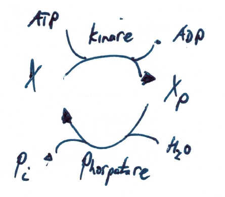

Signaling pathways
==================
Previously metabolism

.. math:: \frac{d}{dt} \vec{x} = N \cdot \vec{v}

describing *mass flow* and metabolic flux

Signaling
-------------------

In signal transduction we focus on *information transfer* from input signal (internal or external) to output, i.e. cellular response.

General principle of activation of response regulator :math:`R` by signal :math:`S`: signal binds to receptors activating a signal transduction cascade/path which ultimately results in a cellular response.

Main biological steps

- receptor binding
- complex formation
- protein modification (phosphorylation & dephosphorylation)
- activation of gene transcription

Typical signals are: growth hormones, pheromones, heat, osmotic pressure, oxidative stress or substances.

Phosphorylation cycle
---------------------

One of the most important signaling motives are protein phosphorylation cycles, i.e., a post-translational modification of a protein in which an amino acid residue is phosphorylated by a protein kinase, and dephosphorylated by a protein phosphatase.

Phosphorylation is a very common mechanism for regulating the activity of enzymes and is the most common post-translational modification. Other modifications are for instance glycosylation, acetylation or lipidation and can be modelled in a very similar manner.

Phosphorylation changes the structural conformation of the protein, the phosphorylated protein has a modified function (e.g. phosphorylation may activate or deactivate a protein)

Important examples are *two-component* signaling systems and mitogen-activated protein kinase (MAPK or MAP kinase) systems (as well as many others, e.g., phosphorylation of enzymes).

Simple models follow mass-action kinetics. For example the following simple phosphorylation cycle where the kinase activity represents the signal :math:`S`, and the activity of the phosphatase is assumed to be constant (and included in the rate constant :math:`k_2`.)

.. math:: v_1 = k_1 \cdot S \cdot R
.. math:: v_2 = k_2 \cdot R_p
.. math:: \frac{dR_p}{dt} = v_1 - v_2 = k_1 \cdot S \cdot R - k_2 \cdot R_p.
.. math:: \frac{dR}{dt} = -v_1 + v_2 = -\frac{dR}{dt}

The system exhibits mass conservation :math:`R_p + R = R^T`, where :math:`R^T` denotes the amount of total protein.

.. math:: \frac{d (R + R_p)}{dt} = 0

**Steady state**

Steady state of the system is given by

.. math:: \frac{dR_p}{dt} = k_1 \cdot S \cdot R - k_2 \cdot R_p = k1 \cdot S \cdot (R^T - R_p) - k_2 \cdot R_p = 0

.. math:: R_p^0 = R^T \cdot \frac{S}{S + \frac{k_2}{k_1}}

.. math:: R^0 = R^T - R_p^0 = R^T \cdot \left(1- \frac{S}{S + \frac{k_2}{k_1}} \right)

which is a Michaelis-Menten like response

Note that the dependence on the kinase activity (signal) is hyperbolic, whereas the dependence on total protein is linear.

**Sensitivity of steady state**

Dependency on signal

.. math:: \frac{\partial R_p^0}{\partial S} |_{S^*} = \frac{R^T(S+\frac{k_2}{k_1}) - R^T \cdot S}{\left(S + \frac{k_2}{k_1}\right)^2}|_{S^*} = \frac{ \frac{k_2}{k_1} \cdot R^T}{ \left(S^* + \frac{k_2}{k_1}\right)^2}

.. math:: \frac{\partial \ln R_p^0}{\partial ln S} |_{S^*} = \frac{S}{R_p^0}\cdot \frac{\partial R_p^0}{\partial S}|_{S^*} = \frac{S^*}{R^T \cdot \left(1- \frac{S^*}{S^* + \frac{k_2}{k_1}}\right)} \cdot \frac{\frac{k_2}{k_1} R^T}{\left(S^* + \frac{k_2}{k_1} \right)^2} = \frac{\frac{k_2}{k_1}}{S^* + \frac{k_2}{k_1}} = \frac{1}{1 + \frac{S^*}{\frac{k_2}{k_1}}}

Dependency on total response regulator

.. math:: \frac{\partial R_p^0}{\partial R^T} |_{R^T*} = \frac{S}{S+\frac{k_2}{k_1}} = \frac{1}{1 + \frac{k_2/k_1}{S}}

Two-component system
--------------------
A two-component regulatory system serves as a basic stimulus-response coupling mechanism to allow organisms to sense and respond to changes in many different environmental conditions.

Two-component signaling systems typically consist of

- (membrane-bound) *histidine kinase* (HK) that senses a specific environmental stimulus (typically homodimeric transmembrane proteins containing a histidine phosphotransfer domain and an ATP binding domain)
- two-component systems serve as a basic stimulus-response coupling mechanism to allow organism to sense and response to changes in many different environmental conditions.
- corresponding *response regulator* that mediates the cellular response, mostly through differential expression of target genes (may consist only of receiver domain, but mostly receiver and output domain, often involved in DNA binding)
- overall level of phosphorylated response regulator ultimately controls its activity
- many HKs are bifunctional and possess phosphatase activity against response regulator
- most common in bacteria

Important examples

- bacterial chemotaxis
- *E.coli* osmoregulation (EnvZ/OmpR)
- *B.subtilis* sporulation

| The chemistry of 2-component system involves
| 1. **Autophosphorylation**: HK-His + ATP <-> HK-His-P + ADP
| 2. **Phosphotransfer**: HK-His-P + RR-Asp <-> HK-His + RR-Asp-P
| 3. **Dephosphorylation**: RR-Asp-P + H20 <-> RR-Asp + Pi

**Robustness of two-component systems**

The cellular environment fluctuates and protein expression is stochastic. Cells evolved mechanisms to cope with such fluctuations. A well known example is the robustness of (some) two-component systems with respect to fluctuations in the total amounts of proteins.

To model a two-component system (using mass-action kinetics), we consider the dynamics of the histidine kinase :math:`H` and the response regulator :math:`R`. Both exist in phosphorylated and unphosphorylated form. The ODEs are

- mass action kinetics
- :math:`H`: histidine kinase
- :math:`R`: response regulator

.. math:: v_1 = k_1 \cdot S \cdot H
.. math:: v_2 = k_2 \cdot R \cdot H_p
.. math:: v_3 = k_3 \cdot R_p

.. math:: \frac{dH_p}{dt} = v_1 - v_2 = k_1 \cdot S \cdot H - k_2 \cdot R \cdot H_p

.. math:: \frac{dR_p}{dt} = v_2 - v_3 =  k_2 \cdot R \cdot H_p - k_3 \cdot R_p

mass conservation: :math:`H + H_p = H^T` and :math:`R + R_p = R^T`

.. math:: \frac{dH_p}{dt} = k_1 \cdot S \cdot (H^T - H_p) - k_2 \cdot (R^T-R_p) \cdot H_p = k_1 \cdot S \cdot H^T - (k_1 \cdot S + k_2 \cdot R^T)\cdot H^T + k_2 \cdot R_p \cdot H_p

.. math:: \frac{dR_p}{dt} = k_2 \cdot (R^T - R_p) - k_3 \cdot R_p = k_2 \cdot R^T - (k_2 + k_3) \cdot R_p

steady state solution can be calculated, but lengthy quadratic equation.

In many 2 component systems, the (unphosphorylated) sensor kinase also acts as a phosphatase for the response regulator.
This results in *redundancy* in the system: the phosphorylated form *activates* the response regulator, the unphosphorylated form *deactivates* the response regulator.

A possible reason was to prevent residual (auto- or unspecific) activation of the response regulator. The equations, however, show that the effect is more profound.

At steady state we know that :math:`v1 = v3`. Hence, if the dephosphorylation reaction is

.. math:: v_3 = k_3 \cdot R_p \cdot H

the steady state solution for the response regulator is

.. math:: R_p^0 = \frac{k_1}{k_3} \cdot S

The resulting expression is independent of the expression of the proteins :math:`R` and :math:`P`. This is often termed *perfect adaption* or *integral* feedback.

Ultra-sensitivity
-----------------
An ultrasensitive response describes a response that is more sensitive to changes in input than the hyperbolic Michaelis-Menten response.

Ultrasensitivity was first (heuristically) described by A. Hill in 1910 to describe the sigmoidal O2 binding curve of haemoglobin. The hill equation is

.. math:: y = \frac{k_p \cdot L^n}{K_A^n + L^n}

:math:`y` denotes some output (such as the fractional binding), :math:`L` the concentration of a ligand, :math:`k_p` a proportionality constant, :math:`K_A` the half-saturation constant, and :math:`n` the *Hill coefficient*.

Increasing n results in steeper sigmoidal response.

What is the logarithmic sensitivity of the output with respect to the ligand concentration?

.. math:: \frac{\partial \ln y}{\partial \ln L} |_{L^*} = \frac{L}{y} \cdot \frac{\partial y}{\partial L} |_{L^*}

A **mechanistic** model for ultrasensitivity was proposed by Goldbeter and Koshland, the Goldbeter-Koshland switch. The switch arises if the reactions in a protein phosphorylation cycle are close to saturation. Similar to equation

.. math:: \frac{dR_p}{dt} = v1 - v2 = \frac{k1 \cdot S \cdot R}{K_{m1} + R} - \frac{k2 \cdot R_p}{K_{m2} + R_p}

The solution provides the *Goldbeter-Koshland* function, a sigmoidal response curve in steady state.

To calculate the steady-state solution :math:`R_p^0 = f(S)` is straight-forward but lengthy. It is much simpler to calculate the inverse function :math:`S = g(R_p^0)` and plot this function.

There are now several other known mechanisms that result in ultrasensitivity (see articles by Ferrel and Ha).

References & further reading
-----------------------------
- https://en.wikipedia.org/wiki/Post-translational_modification
- https://en.wikipedia.org/wiki/Two-component_regulatory_system
- https://en.wikipedia.org/wiki/Goldbeter%E2%80%93Koshland_kinetics
- Stock, Ann M., Victoria L. Robinson, and Paul N. Goudreau. "Two-component signal transduction." Annual review of biochemistry 69.1 (2000): 183-215.
- Klipp et al, Systems Biology - A textbook, chapter 12.2 - Signaling pathways
- Batchelor, Eric, and Mark Goulian. "Robustness and the cycle of phosphorylation and dephosphorylation in a two-component regulatory system." Proceedings of the National Academy of Sciences 100.2 (2003): 691-696.
- Ferrell Jr, James E., and Sang Hoon Ha. "Ultrasensitivity part I: Michaelian responses and zero-order ultrasensitivity." Trends in biochemical sciences 39.10 (2014): 496-503.
- Ferrell, James E., and Sang Hoon Ha. "Ultrasensitivity part II: multisite phosphorylation, stoichiometric inhibitors, and positive feedback." Trends in biochemical sciences 39.11 (2014): 556-569.
- Ferrell Jr, James E., and Sang Hoon Ha. "Ultrasensitivity part III: cascades, bistable switches, and oscillators." Trends in biochemical sciences 39.12 (2014): 612-618.
