Boolean networks code
---------------------

Jupyter notebook available at
`docs/notebooks/01\_boolean\_networks.ipynb <https://github.com/matthiaskoenig/mcp/blob/master/docs/notebooks/01_boolean_networks.ipynb>`__

Short introduction to python
~~~~~~~~~~~~~~~~~~~~~~~~~~~~

Most of the examples will be based on ``python``. A basic understanding
of programming and the python language will be sufficient to follow the
examples.

Many good basic python tutorials and introductions exist, for instance
see

-  https://www.learnpython.org/ - interactive python tutorial
-  https://docs.python.org/3/tutorial/index.html - official tutorial,
   more in depth

This tutorial and all information related to it is available online at
https://github.com/matthiaskoenig/mcp

To follow the tutorial a basic ``python3`` installation with the
packages listed in ``requirements.txt`` is needed.

If you have any questions or need help please contact
konigmatt@googlemail.com

Boolean networks in a nutshell
~~~~~~~~~~~~~~~~~~~~~~~~~~~~~~

-  A boolean network consists of nodes (which have a boolean state) and
   connections between the states (inputs for nodes).
-  The boolean states can be either 0 or 1.
-  Every node (state) in the boolean network has a rule which specifies
   the output of the node (state) for all possible combinations of
   inputs.
-  Based on the given rule for a node the node state is updated.
-  Simulations start from an initial state of the network. This is the
   state of all nodes at the begin of the simulation.

General Properties of Boolean Networks:

-  Fixed topology (doesn’t change with time)
-  Dynamic (states evolve over time, updates happen at discrete time
   steps)
-  Synchronous (update of all states occurs at the same time)
-  Node States: Deterministic (based on rules), discrete (binary)
-  Gate Function: Boolean (rules which calculate the update for the
   state, return discrete new state)
-  Flow: Information

For one dimensional input of a given node in a boolean network the
possible unary boolean operators are

-  IDENTITY (``[0]->[0], [1]->[1]``)
-  INVERSE (``[0]->[1], [1]->[0]``)
-  ZERO (``[0]->[0], [1]->[0]``)
-  ONE (``[0]->[1], [1]->[1]``)

For two dimensional inputs possible logical operations (rules) are for
instance

-  AND (``[1,1]->[1], [1,0]->[0], [0,1]->[1], [0,0]->[0]``)
-  OR
-  XOR
-  NOR
-  ...

An overview over the truth tables (boolean rules) for unary and binary
operations can be found here https://en.wikipedia.org/wiki/Truth\_table

Example 1
~~~~~~~~~

Within this task we will simulate a boolean network by applying the
rules repeatedly starting from an intial state, thereby updating the
state vector ``[X1, X2]``.

-  Write a computer program which simulates the simple boolean networks
   consisting of the two nodes ``X1`` and ``X2`` with the initial state
   ``[X1, X2](0) = [0, 1]``. The boolean rules for updating ``X1`` based
   on the input from ``X2``, and for updating X2 based on the input of
   ``X1`` are the unary ``INVERSE`` rule. Simulate the model for 20
   steps. What is the final state of the boolean network?
-  What are the possible trajectories of the boolean network, i.e. which
   sequence of states are possible? (hint: simulate the network for all
   possible initial states)

Simple solution
^^^^^^^^^^^^^^^

-  translate problem into code (just follow the problem description)
-  use what you know about the problem domain
-  boolean states, discrete time evolution, synchronous updates

.. code:: ipython3

    from pprint import pprint
    N = 20  # number of time steps
    states = [[False, True]]  # initial state
    for k in range(N):
        # get state of last step
        x = states[k]
        print(f'{k:<3} : {x}')
        
        # update state by applying rules
        x_new = [not x[1], not x[0]]
        
        # store new state
        states.append(x_new)
        
    print('-' * 80)
    print(states)

.. parsed-literal::

    0   : [False, True]
    1   : [False, True]
    2   : [False, True]
    3   : [False, True]
    4   : [False, True]
    5   : [False, True]
    6   : [False, True]
    7   : [False, True]
    8   : [False, True]
    9   : [False, True]
    10  : [False, True]
    11  : [False, True]
    12  : [False, True]
    13  : [False, True]
    14  : [False, True]
    15  : [False, True]
    16  : [False, True]
    17  : [False, True]
    18  : [False, True]
    19  : [False, True]
    --------------------------------------------------------------------------------
    [[False, True], [False, True], [False, True], [False, True], [False, True], [False, True], [False, True], [False, True], [False, True], [False, True], [False, True], [False, True], [False, True], [False, True], [False, True], [False, True], [False, True], [False, True], [False, True], [False, True], [False, True]]

Analyse trajectories
^^^^^^^^^^^^^^^^^^^^

Now analyse all possible states of the network. For this we have to
start the network from all possible initial states. \* define recurring
code as functions \* generalize solution so it can be applied to a
broader application field

.. code:: ipython3

    state_init = [
        [True, True],
        [True, False],
        [False, True],
        [False, False],
    ]
    
    def f_example1(x):
        """Rule for single input which is inversed."""
        assert len(x) == 2
        return [not x[1], not x[0]]
    
    def simulate(x0, f_rules, steps=10):
        """ Simulates the boolean network from initial state by applying given rules."""
        states = [x0]
        for k in range(steps):
            # synchronous updates
            x = states[k]
            states.append(f_rules(x))
        return states
    
    # run network from all initial states
    for x0 in state_init:
        states = simulate(x0, f_rules=f_example1)
        pprint(states)
        print('-' * 40)

.. parsed-literal::

    [[True, True],
     [False, False],
     [True, True],
     [False, False],
     [True, True],
     [False, False],
     [True, True],
     [False, False],
     [True, True],
     [False, False],
     [True, True]]
    ----------------------------------------
    [[True, False],
     [True, False],
     [True, False],
     [True, False],
     [True, False],
     [True, False],
     [True, False],
     [True, False],
     [True, False],
     [True, False],
     [True, False]]
    ----------------------------------------
    [[False, True],
     [False, True],
     [False, True],
     [False, True],
     [False, True],
     [False, True],
     [False, True],
     [False, True],
     [False, True],
     [False, True],
     [False, True]]
    ----------------------------------------
    [[False, False],
     [True, True],
     [False, False],
     [True, True],
     [False, False],
     [True, True],
     [False, False],
     [True, True],
     [False, False],
     [True, True],
     [False, False]]
    ----------------------------------------

Improve solution
^^^^^^^^^^^^^^^^

-  use appropriate data structures (appending to a list is not very
   efficient; data structure which simplifies analysis)
-  plot results

.. code:: ipython3

    %matplotlib inline
    
    import numpy as np
    from matplotlib import pylab as plt
    
    ndstate_init = [
        np.array([True, True]),
        np.array([True, False]),
        np.array([False, True]),
        np.array([False, False]),
    ]
    
    def f_example1(x):
        """Inverse of given state."""
        return np.array([not x[1], not x[0]])
    
    
    def ndsimulate(x0, f_rules, steps=10):
        """ Simulates the boolean network from initial state by applying given rules."""
        states = np.zeros(shape=((steps+1), x0.size), dtype=bool)
        
        print("-" * 40)
        pprint("x0 = {}".format(x0.astype(np.int)))
        states[0, :] = x0
        for k in range(steps):
            x = states[k]
            states[k+1, :] = f_rules(states[k, :])
            
        # pprint(states.astype(np.int))
        return states
    
    def plot_states(states, figsize=(5,3), ylabel="time step"):
        """Plot the states."""
        Nt, Nx = states.shape
        fig = plt.figure(figsize=figsize)
        plt.imshow(states.astype(np.double), cmap="binary")
        plt.colorbar()
        plt.ylabel(ylabel)
        plt.xlabel("state")
        ax = plt.gca()
        ax.set_xticks(range(Nx))
        ax.set_xticklabels(['x{}'.format(k) for k in range(Nx)])
        plt.show()
    
    for x0 in ndstate_init:
        states = ndsimulate(x0, f_rules=f_example1)
        plot_states(states)

.. parsed-literal::

    ----------------------------------------
    'x0 = [1 1]'

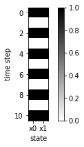

.. parsed-literal::

    ----------------------------------------
    'x0 = [1 0]'

.. image:: 01_boolean_networks_files/01_boolean_networks_10_3.png

.. parsed-literal::

    ----------------------------------------
    'x0 = [0 1]'

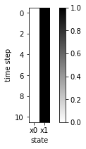

.. parsed-literal::

    ----------------------------------------
    'x0 = [0 0]'

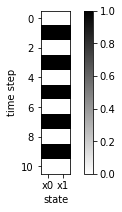

Example 2
~~~~~~~~~

-  Simulate the following more complex boolean network consisting of 5
   nodes (reuse the code from task 1)
-  The update rules are given by

::

    X1 = NOT(X4)
    X5 = IDENTIY(X4)
    X2 = OR(X1, X5)
    X3 = OR(X1, X5)
    X4 = XOR(X3, X2)

-  What are the possible trajectories of the boolean network, i.e. which
   final states (or cycles of states) are reached? (hint: simulate the
   network for all possible initial states)

***Automatize*** \* if you have to do it once, you have to do it 1000
times

.. code:: ipython3

    states_init = [
        [0,0,0,0,0],
        [1,0,0,0,0],
        [0,1,0,0,0],
        ...
    ]

.. code:: ipython3

    states_init = np.linspace(0, 31, num=32, dtype=np.uint8)  # (32,)
    states_init = np.reshape(states_init, (32,1))
    ndstates_init = np.unpackbits(states_init, axis=1)
    ndstates_init = ndstates_init[:, 3:]
    # print(ndstates_init)
    plot_states(ndstates_init, figsize=(10,10), ylabel="init state")

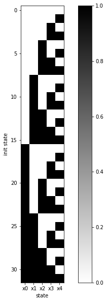

.. code:: ipython3

    def f_task2(x):
        """
        X0 = INVERSE(X3)
        X4 = IDENTIY(X3)
        X1 = OR(X0, X4)
        X2 = OR(X0, X4)
        X3 = XOR(X2, X1)
        """
        y = np.zeros_like(x)
        y[0] = np.invert(x[3])
        y[4] = x[3]
        y[1] = x[0] or x[4]
        y[2] = x[0] or x[4]
        
        # xor hack
        y[3] = x[2] or x[1]
        if (x[2] and x[1]):
            y[3] = False
        
        return y
    
    for x0 in ndstates_init:
        states = ndsimulate(x0, f_rules=f_task2)
        plot_states(states)

.. parsed-literal::

    ----------------------------------------
    'x0 = [0 0 0 0 0]'

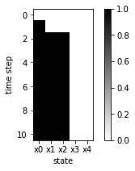

.. parsed-literal::

    ----------------------------------------
    'x0 = [0 0 0 0 1]'

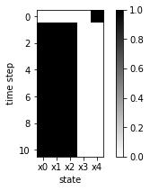

.. parsed-literal::

    ----------------------------------------
    'x0 = [0 0 0 1 0]'

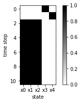

.. parsed-literal::

    ----------------------------------------
    'x0 = [0 0 0 1 1]'

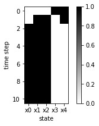

.. parsed-literal::

    ----------------------------------------
    'x0 = [0 0 1 0 0]'

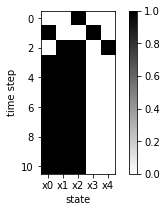

.. parsed-literal::

    ----------------------------------------
    'x0 = [0 0 1 0 1]'

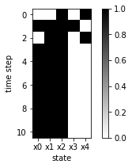

.. parsed-literal::

    ----------------------------------------
    'x0 = [0 0 1 1 0]'

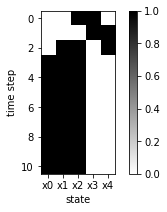

.. parsed-literal::

    ----------------------------------------
    'x0 = [0 0 1 1 1]'

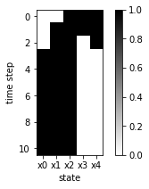

.. parsed-literal::

    ----------------------------------------
    'x0 = [0 1 0 0 0]'

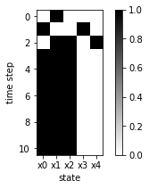

.. parsed-literal::

    ----------------------------------------
    'x0 = [0 1 0 0 1]'

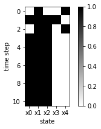

.. parsed-literal::

    ----------------------------------------
    'x0 = [0 1 0 1 0]'

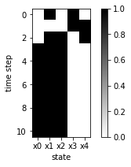

.. parsed-literal::

    ----------------------------------------
    'x0 = [0 1 0 1 1]'

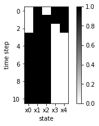

.. parsed-literal::

    ----------------------------------------
    'x0 = [0 1 1 0 0]'

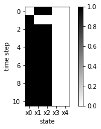

.. parsed-literal::

    ----------------------------------------
    'x0 = [0 1 1 0 1]'

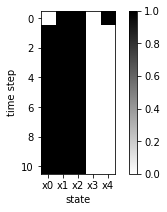

.. parsed-literal::

    ----------------------------------------
    'x0 = [0 1 1 1 0]'

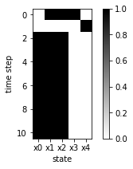

.. parsed-literal::

    ----------------------------------------
    'x0 = [0 1 1 1 1]'

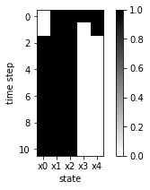

.. parsed-literal::

    ----------------------------------------
    'x0 = [1 0 0 0 0]'

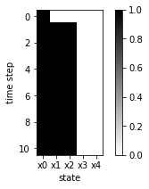

.. parsed-literal::

    ----------------------------------------
    'x0 = [1 0 0 0 1]'

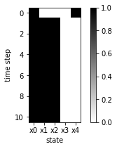

.. parsed-literal::

    ----------------------------------------
    'x0 = [1 0 0 1 0]'

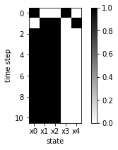

.. parsed-literal::

    ----------------------------------------
    'x0 = [1 0 0 1 1]'

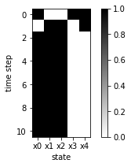

.. parsed-literal::

    ----------------------------------------
    'x0 = [1 0 1 0 0]'

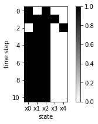

.. parsed-literal::

    ----------------------------------------
    'x0 = [1 0 1 0 1]'

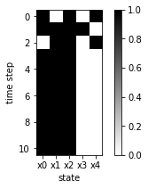

.. parsed-literal::

    ----------------------------------------
    'x0 = [1 0 1 1 0]'

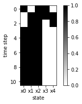

.. parsed-literal::

    ----------------------------------------
    'x0 = [1 0 1 1 1]'

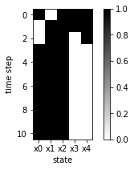

.. parsed-literal::

    ----------------------------------------
    'x0 = [1 1 0 0 0]'

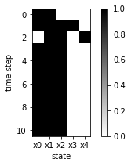

.. parsed-literal::

    ----------------------------------------
    'x0 = [1 1 0 0 1]'

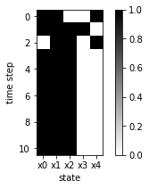

.. parsed-literal::

    ----------------------------------------
    'x0 = [1 1 0 1 0]'

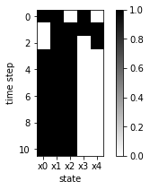

.. parsed-literal::

    ----------------------------------------
    'x0 = [1 1 0 1 1]'

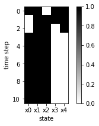

.. parsed-literal::

    ----------------------------------------
    'x0 = [1 1 1 0 0]'

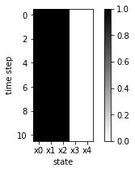

.. parsed-literal::

    ----------------------------------------
    'x0 = [1 1 1 0 1]'

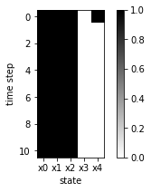

.. parsed-literal::

    ----------------------------------------
    'x0 = [1 1 1 1 0]'

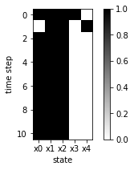

.. parsed-literal::

    ----------------------------------------
    'x0 = [1 1 1 1 1]'

.. image:: 01_boolean_networks_files/01_boolean_networks_15_63.png

.. code:: ipython3

    ### Trajectory graph
    # TODO: see https://plot.ly/python/network-graphs/
    

.. code:: ipython3

    def ndsimulate(x0, f_rules, steps=10):
        """ Simulates the boolean network from initial state by applying given rules."""
        states = np.zeros(shape=((steps+1), x0.size), dtype=bool)
        
        print("-" * 40)
        pprint("x0 = {}".format(x0.astype(np.int)))
        states[0, :] = x0
        for k in range(steps):
            x = states[k]
            states[k+1, :] = f_rules(states[k, :])
            
        # pprint(states.astype(np.int))
        return states
