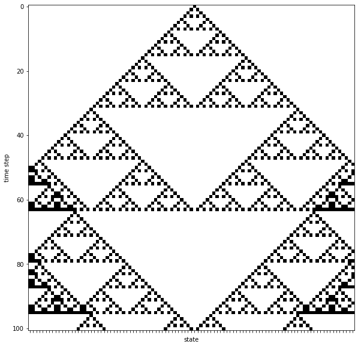

Cellular automata code
======================

Cellular automata in a nutshell
-------------------------------

A cellular automaton is a discrete model studied in computer science,
mathematics, physics, complexity science, theoretical biology and
microstructure modeling.

-  A cellular automaton consists of a regular grid of cells, each in one
   of a finite number of states, such as on and off.
-  For each cell, a set of cells called its neighborhood is defined
   relative to the specified cell.
-  An initial state (time t = 0) is selected by assigning a state for
   each cell.
-  A new generation is created (advancing t by 1), according to some
   fixed rule (generally, a mathematical function) that determines the
   new state of each cell in terms of the current state of the cell and
   the states of the cells in its neighborhood.
-  Typically, the rule for updating the state of cells is the same for
   each cell and does not change over time, and is applied to the whole
   grid simultaneously.

For more information see
https://en.wikipedia.org/wiki/Cellular\_automaton.

A more in depth introduction with hints how to solve the task is given
in https://natureofcode.com/book/chapter-7-cellular-automata/

Example: 1-dim cellular automaton
---------------------------------

Build and simulate the simple cellular automaton with the following
characteristics:

-  **Grid**: We will use the simplest possible grid, which is
   one-dimensional: a line of cells.
-  **States**: The simplest set of states (beyond having only one state)
   are the two possible states per cell: 0 or 1.
-  **Neighborhood**: The simplest neighborhood in one dimension for any
   given cell would be the cell itself and its two adjacent neighbors:
   one to the left and one to the right.
-  **Rules**: Define how a cell is updated based on its neighborhood.
   The simplest rules are identical rules for every cell.

For the update rules we need to define an outcome (new state value 0 or
1) for a cell based on its current neighborhood. The following rules are
applied:

::

    neighborhood (with cell in the center) -> new state of cell
    000 -> 0
    001 -> 1
    010 -> 0
    011 -> 1
    100 -> 1
    101 -> 0
    110 -> 1
    111 -> 0

-  the one dimensional grid contains ``101`` cells
-  the initial state of all cells is 0, with exception of the cell in
   the middle of the grid which starts with state 1

Cellular automaton as a special boolean network
^^^^^^^^^^^^^^^^^^^^^^^^^^^^^^^^^^^^^^^^^^^^^^^

-  reuse our simulator

.. code:: ipython3

    %matplotlib inline
    from matplotlib import pyplot as plt
    import numpy as np
    from pprint import pprint
    
    def ndsimulate(x0, f_rules, steps=10):
        """ Simulates the boolean network from initial state by applying given rules."""
        states = np.zeros(shape=((steps+1), x0.size), dtype=bool)
        
        print("-" * 40)
        pprint("x0 = {}".format(x0.astype(np.int)))
        states[0, :] = x0
        for k in range(steps):
            x = states[k]
            states[k+1, :] = f_rules(states[k, :])
            
        # pprint(states.astype(np.int))
        return states
    
    def plot_states(states, figsize=(5,3), ylabel="time step"):
        """Plot the states."""
        Nt, Nx = states.shape
        fig = plt.figure(figsize=figsize)
        plt.imshow(states.astype(np.double), cmap="binary")
        # plt.colorbar()
        plt.ylabel(ylabel)
        plt.xlabel("state")
        ax = plt.gca()
        ax.set_xticks(range(Nx))
        #ax.set_xticklabels(['x{}'.format(k) for k in range(Nx)])
        ax.set_xticklabels([''.format(k) for k in range(Nx)])
        plt.show()
        return fig

.. code:: ipython3

    def f_automaton(x):
        """ New state based on neighborhood (cell in center)
        000 -> 0  [0]
        001 -> 1  [1]
        010 -> 0  [2]
        011 -> 1  [3]
        100 -> 1  [4]
        101 -> 0  [5]
        110 -> 1  [6]
        111 -> 0  [7]
        """
        Nx = x.size
        y = np.zeros_like(x)
        for k in range(Nx):
            
            s = np.zeros(shape=(3,))
            # get the neighborhood
            if k==0:
                s[0] = x[-1]
                s[1] = x[0]
                s[2] = x[1]
            elif k==(Nx-1):
                s[0] = x[Nx-2]
                s[1] = x[Nx-1]
                s[2] = x[0]
            else:
                s = x[(k-1):(k+2)]
        
            s = ''.join(s.astype(np.uint8).astype(str))
        
            # update based on neighborhood
            if s == '000':
                y[k] = 0
            elif s == '001':
                y[k] = 1
            elif s == '010':
                y[k] = 0
            elif s == '011':
                y[k] = 1
            elif s == '100':
                y[k] = 1
            elif s == '101':
                y[k] = 0
            elif s == '110':
                y[k] = 1
            elif s == '111':
                y[k] = 0
        return y
    
    # initial condition
    Nx = 101  # 101
    x0 = np.zeros(Nx, dtype=bool)
    x0[int((Nx-1)/2 + 1)] = 1
    
    states = ndsimulate(x0, f_rules=f_automaton, steps=100)
    f = plot_states(states, figsize=(10,10))
    f.savefig("./images/cellular_automaton.png", dpi=150, bbox_inches="tight")

.. parsed-literal::

    ----------------------------------------
    ('x0 = [0 0 0 0 0 0 0 0 0 0 0 0 0 0 0 0 0 0 0 0 0 0 0 0 0 0 0 0 0 0 0 0 0 0 0 '
     '0 0\n'
     ' 0 0 0 0 0 0 0 0 0 0 0 0 0 0 1 0 0 0 0 0 0 0 0 0 0 0 0 0 0 0 0 0 0 0 0 0 0\n'
     ' 0 0 0 0 0 0 0 0 0 0 0 0 0 0 0 0 0 0 0 0 0 0 0 0 0 0 0]')

Create animation
^^^^^^^^^^^^^^^^

In the following we animate the cellular automaton over time. Let the
Game of Life begin.

.. code:: ipython3

    # Create animation
    Nt, Nx = states.shape
    filenames = []
    for k in range(Nt):
        filename = "./results/automaton/a_{:04}.png".format(k)
        # print(filename)
        
        fig = plt.figure(figsize=(10,4))
        data = states[k,:].astype(np.double)
        data = data.reshape((1, Nx))
        
        plt.imshow(data, cmap="binary")
        plt.title("time: {}".format(k))
        # plt.ylabel("time: {}".format(k))
        # plt.xlabel("state")
        ax = plt.gca()
        ax.set_xticks([])
        ax.set_xticklabels([])
        ax.set_yticks([])
        ax.set_yticklabels([])
        
        fig.savefig(filename, bbox_inches="tight")
        plt.close()
        filenames.append(filename)

.. code:: ipython3

    import imageio
    
    def create_gif(output_file, filenames, duration):
        images = []
        for filename in filenames:
            images.append(imageio.imread(filename))
        imageio.mimsave(output_file, images, duration=duration)
    
    create_gif('./images/automaton.gif', filenames, duration=0.2)

