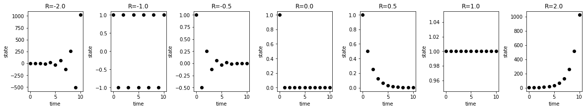

Finite difference equations & maps
==================================

.. code:: ipython3

    %matplotlib inline
    
    from matplotlib import pyplot as plt
    import numpy as np
    import pandas as pd
    from pprint import pprint
    
    
    def map_simulate(x0, f_rules, steps=10):
        """ simulates map. """
        states = np.zeros(shape=((steps+1), x0.size), dtype=float)
        
        
        pprint("x0 = {}".format(x0.astype(np.float)))
        states[0, :] = x0
        for k in range(steps):
            x = states[k]
            states[k+1, :] = f_rules(states[k, :])
            
        # convert to pandas data frame
        names = [f"S{k}" for k in range(x0.size)]
        df = pd.DataFrame(states, columns=names)
        # add time column
        df.insert(0, "time", range(steps+1))
        
        print(df)
        print("-" * 40)
        return df
    
    def f_linear_factory(R=1.0):
        print(f"Creating f_linear: 'x(t+1) = {R} * x'")
        
        def f_linear(x, R=R):
            """ Linear map. """
            x_new = R * x
            return x_new
        
        return f_linear

.. code:: ipython3

    df1 = map_simulate(x0 = np.array([1.0]), f_rules=f_linear_factory(R=1.0))
    df2 = map_simulate(x0 = np.array([1.0]), f_rules=f_linear_factory(R=0.8))
    
    # this works also for maps with multiple state variables
    df2 = map_simulate(x0 = np.array([1.0, 2.0, 3.0]), f_rules=f_linear_factory(R=1.5))

.. parsed-literal::

    Creating f_linear: 'x(t+1) = 1.0 * x'
    'x0 = [1.]'
        time   S0
    0      0  1.0
    1      1  1.0
    2      2  1.0
    3      3  1.0
    4      4  1.0
    5      5  1.0
    6      6  1.0
    7      7  1.0
    8      8  1.0
    9      9  1.0
    10    10  1.0
    ----------------------------------------
    Creating f_linear: 'x(t+1) = 0.8 * x'
    'x0 = [1.]'
        time        S0
    0      0  1.000000
    1      1  0.800000
    2      2  0.640000
    3      3  0.512000
    4      4  0.409600
    5      5  0.327680
    6      6  0.262144
    7      7  0.209715
    8      8  0.167772
    9      9  0.134218
    10    10  0.107374
    ----------------------------------------
    Creating f_linear: 'x(t+1) = 1.5 * x'
    'x0 = [1. 2. 3.]'
        time         S0          S1          S2
    0      0   1.000000    2.000000    3.000000
    1      1   1.500000    3.000000    4.500000
    2      2   2.250000    4.500000    6.750000
    3      3   3.375000    6.750000   10.125000
    4      4   5.062500   10.125000   15.187500
    5      5   7.593750   15.187500   22.781250
    6      6  11.390625   22.781250   34.171875
    7      7  17.085938   34.171875   51.257812
    8      8  25.628906   51.257812   76.886719
    9      9  38.443359   76.886719  115.330078
    10    10  57.665039  115.330078  172.995117
    ----------------------------------------

.. code:: ipython3

    # simulate the various R values
    R_values = [-2.0, -1.0, -0.5, 0.0, 0.5, 1.0, 2.0]
    results = []
    for R in R_values:
        results.append(
            map_simulate(x0 = np.array([1.0]), f_rules=f_linear_factory(R=R))
        )
    
    # plot results
    f, axes = plt.subplots(nrows=1, ncols=len(R_values), figsize=(20, 3))
    f.subplots_adjust(wspace=0.5)
    for k, R in enumerate(R_values):
        ax = axes[k]
        df = results[k]
        ax.plot(df.time, df.S0, 'o', color="black")
        ax.set_title(f"R={R}")
        ax.set_ylabel("state")
        ax.set_xlabel("time")
    
    plt.show()
    f.savefig("./images/linear_map.png", bbox_inches="tight")

.. parsed-literal::

    Creating f_linear: 'x(t+1) = -2.0 * x'
    'x0 = [1.]'
        time      S0
    0      0     1.0
    1      1    -2.0
    2      2     4.0
    3      3    -8.0
    4      4    16.0
    5      5   -32.0
    6      6    64.0
    7      7  -128.0
    8      8   256.0
    9      9  -512.0
    10    10  1024.0
    ----------------------------------------
    Creating f_linear: 'x(t+1) = -1.0 * x'
    'x0 = [1.]'
        time   S0
    0      0  1.0
    1      1 -1.0
    2      2  1.0
    3      3 -1.0
    4      4  1.0
    5      5 -1.0
    6      6  1.0
    7      7 -1.0
    8      8  1.0
    9      9 -1.0
    10    10  1.0
    ----------------------------------------
    Creating f_linear: 'x(t+1) = -0.5 * x'
    'x0 = [1.]'
        time        S0
    0      0  1.000000
    1      1 -0.500000
    2      2  0.250000
    3      3 -0.125000
    4      4  0.062500
    5      5 -0.031250
    6      6  0.015625
    7      7 -0.007812
    8      8  0.003906
    9      9 -0.001953
    10    10  0.000977
    ----------------------------------------
    Creating f_linear: 'x(t+1) = 0.0 * x'
    'x0 = [1.]'
        time   S0
    0      0  1.0
    1      1  0.0
    2      2  0.0
    3      3  0.0
    4      4  0.0
    5      5  0.0
    6      6  0.0
    7      7  0.0
    8      8  0.0
    9      9  0.0
    10    10  0.0
    ----------------------------------------
    Creating f_linear: 'x(t+1) = 0.5 * x'
    'x0 = [1.]'
        time        S0
    0      0  1.000000
    1      1  0.500000
    2      2  0.250000
    3      3  0.125000
    4      4  0.062500
    5      5  0.031250
    6      6  0.015625
    7      7  0.007812
    8      8  0.003906
    9      9  0.001953
    10    10  0.000977
    ----------------------------------------
    Creating f_linear: 'x(t+1) = 1.0 * x'
    'x0 = [1.]'
        time   S0
    0      0  1.0
    1      1  1.0
    2      2  1.0
    3      3  1.0
    4      4  1.0
    5      5  1.0
    6      6  1.0
    7      7  1.0
    8      8  1.0
    9      9  1.0
    10    10  1.0
    ----------------------------------------
    Creating f_linear: 'x(t+1) = 2.0 * x'
    'x0 = [1.]'
        time      S0
    0      0     1.0
    1      1     2.0
    2      2     4.0
    3      3     8.0
    4      4    16.0
    5      5    32.0
    6      6    64.0
    7      7   128.0
    8      8   256.0
    9      9   512.0
    10    10  1024.0
    ----------------------------------------

.. code:: ipython3

    # Create animation
    Nt, Nx = states.shape
    filenames = []
    for k in range(Nt):
        filename = "./results/automaton/a_{:04}.png".format(k)
        # print(filename)
        
        fig = plt.figure(figsize=(10,4))
        data = states[k,:].astype(np.double)
        data = data.reshape((1, Nx))
        
        plt.imshow(data, cmap="binary")
        plt.title("time: {}".format(k))
        # plt.ylabel("time: {}".format(k))
        # plt.xlabel("state")
        ax = plt.gca()
        ax.set_xticks([])
        ax.set_xticklabels([])
        ax.set_yticks([])
        ax.set_yticklabels([])
        
        fig.savefig(filename, bbox_inches="tight")
        plt.close()
        filenames.append(filename)

::

    ---------------------------------------------------------------------------

    NameError                                 Traceback (most recent call last)

    <ipython-input-4-488526c77254> in <module>
          1 # Create animation
    ----> 2 Nt, Nx = states.shape
          3 filenames = []
          4 for k in range(Nt):
          5     filename = "./results/automaton/a_{:04}.png".format(k)

    NameError: name 'states' is not defined

.. code:: ipython3

    import imageio
    
    def create_gif(output_file, filenames, duration):
        images = []
        for filename in filenames:
            images.append(imageio.imread(filename))
        imageio.mimsave(output_file, images, duration=duration)
    
    create_gif('./images/automaton.gif', filenames, duration=0.2)

::

    ---------------------------------------------------------------------------

    NameError                                 Traceback (most recent call last)

    <ipython-input-5-d712d6b1d849> in <module>
          7     imageio.mimsave(output_file, images, duration=duration)
          8 
    ----> 9 create_gif('./images/automaton.gif', filenames, duration=0.2)
    

    NameError: name 'filenames' is not defined

