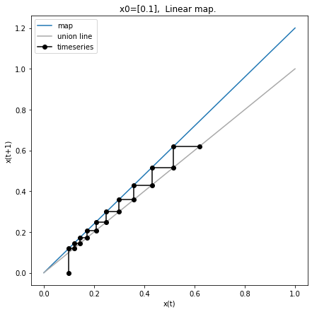
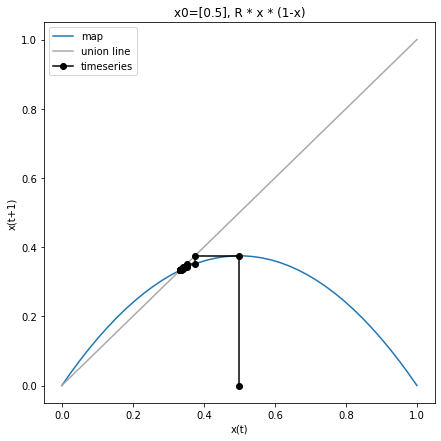
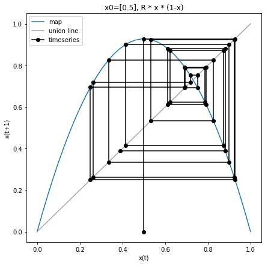

Finite difference equations code
================================

Finite difference equations (also known as maps) are simple
time-discrete dynamical systems. In every time step the rules
(mathematical functions) are applied which give the updated state for
the next time point.

-  discrete time
-  rules which update state(s)

.. math:: x_{t+1} = f(x_{t})

Simulator for maps
------------------

To be able to analyze maps, we first have to write a simulator which
allows to simulate the time evolution from a given initial state
:math:`x0`. The simulator looks very similar to the boolean networks,
only that we now can have any state (``float``) not just binary state
(``bool``). Again we iterate over a loop (simulation steps) and in every
loop we apply the rules ``f``. Maps are like boolean networks discrete
in time and update states via rules/functions.

.. code:: ipython3

    %matplotlib inline
    
    from matplotlib import pyplot as plt
    import numpy as np
    import pandas as pd
    from pprint import pprint
    
    def map_simulate(x0, f_rules, steps=10, print_results=True):
        """ simulates map. """
        states = np.zeros(shape=((steps+1), x0.size), dtype=float)
        
        
        pprint("x0 = {}".format(x0.astype(np.float)))
        states[0, :] = x0
        for k in range(steps):
            x = states[k]
            states[k+1, :] = f_rules(states[k, :])
            
        # convert to pandas data frame
        names = [f"S{k}" for k in range(x0.size)]
        index = [f"x{k}" for k in range(steps+1)]
        df = pd.DataFrame(states, columns=names, index=index)
        # add time column
        df["time"] = range(steps+1)
        
        if print_results:
            print(df)
            print("-" * 40)
        return df

Linear map
----------

We can use our simulator to run the the linear map example from the
lecture. We use a function generator which creates us our map function
for a given R parameter.

.. code:: ipython3

    def f_linear_factory(R=1.0):
        """x(t+1) = R * x"""
        print(f"Creating f_linear: 'x(t+1) = {R} * x'")
        
        def f_linear(x, R=R):
            """ Linear map. """
            x_new = R * x
            return x_new
        
        return f_linear

Now we run the map starting from 1.0 with different ``R`` values

.. code:: ipython3

    df1 = map_simulate(x0=np.array([1.0]), f_rules=f_linear_factory(R=0.8), steps=10)

.. parsed-literal::

    Creating f_linear: 'x(t+1) = 0.8 * x'
    'x0 = [1.]'
               S0  time
    x0   1.000000     0
    x1   0.800000     1
    x2   0.640000     2
    x3   0.512000     3
    x4   0.409600     4
    x5   0.327680     5
    x6   0.262144     6
    x7   0.209715     7
    x8   0.167772     8
    x9   0.134218     9
    x10  0.107374    10
    ----------------------------------------

For R values in ``0 < R < 1`` our state is decaying towards zero, but
for R values ``R>1.0`` we see exponential growth

.. code:: ipython3

    df2 = map_simulate(x0 = np.array([1.0]), f_rules=f_linear_factory(R=1.5))

.. parsed-literal::

    Creating f_linear: 'x(t+1) = 1.5 * x'
    'x0 = [1.]'
                S0  time
    x0    1.000000     0
    x1    1.500000     1
    x2    2.250000     2
    x3    3.375000     3
    x4    5.062500     4
    x5    7.593750     5
    x6   11.390625     6
    x7   17.085938     7
    x8   25.628906     8
    x9   38.443359     9
    x10  57.665039    10
    ----------------------------------------

Our simulator also works for multiple states:

.. code:: ipython3

    # this works also for maps with multiple state variables
    df2 = map_simulate(x0 = np.array([1.0, 2.0, 3.0]), f_rules=f_linear_factory(R=-0.8))

.. parsed-literal::

    Creating f_linear: 'x(t+1) = -0.8 * x'
    'x0 = [1. 2. 3.]'
               S0        S1        S2  time
    x0   1.000000  2.000000  3.000000     0
    x1  -0.800000 -1.600000 -2.400000     1
    x2   0.640000  1.280000  1.920000     2
    x3  -0.512000 -1.024000 -1.536000     3
    x4   0.409600  0.819200  1.228800     4
    x5  -0.327680 -0.655360 -0.983040     5
    x6   0.262144  0.524288  0.786432     6
    x7  -0.209715 -0.419430 -0.629146     7
    x8   0.167772  0.335544  0.503316     8
    x9  -0.134218 -0.268435 -0.402653     9
    x10  0.107374  0.214748  0.322123    10
    ----------------------------------------

.. code:: ipython3

    # simulate the various R values
    R_values = [-2.0, -1.0, -0.5, 0.0, 0.5, 1.0, 2.0]
    results = []
    for R in R_values:
        results.append(
            map_simulate(x0 = np.array([1.0]), f_rules=f_linear_factory(R=R))
        )
    
    # plot results
    f, axes = plt.subplots(nrows=1, ncols=len(R_values), figsize=(20, 3))
    f.subplots_adjust(wspace=0.5)
    for k, R in enumerate(R_values):
        ax = axes[k]
        df = results[k]
        ax.plot(df.time, df.S0, 'o', color="black")
        ax.set_title(f"R={R}")
        ax.set_ylabel("state")
        ax.set_xlabel("time")
    
    plt.show()
    f.savefig("./images/linear_map.png", bbox_inches="tight", dpi=150)

.. parsed-literal::

    Creating f_linear: 'x(t+1) = -2.0 * x'
    'x0 = [1.]'
             S0  time
    x0      1.0     0
    x1     -2.0     1
    x2      4.0     2
    x3     -8.0     3
    x4     16.0     4
    x5    -32.0     5
    x6     64.0     6
    x7   -128.0     7
    x8    256.0     8
    x9   -512.0     9
    x10  1024.0    10
    ----------------------------------------
    Creating f_linear: 'x(t+1) = -1.0 * x'
    'x0 = [1.]'
          S0  time
    x0   1.0     0
    x1  -1.0     1
    x2   1.0     2
    x3  -1.0     3
    x4   1.0     4
    x5  -1.0     5
    x6   1.0     6
    x7  -1.0     7
    x8   1.0     8
    x9  -1.0     9
    x10  1.0    10
    ----------------------------------------
    Creating f_linear: 'x(t+1) = -0.5 * x'
    'x0 = [1.]'
               S0  time
    x0   1.000000     0
    x1  -0.500000     1
    x2   0.250000     2
    x3  -0.125000     3
    x4   0.062500     4
    x5  -0.031250     5
    x6   0.015625     6
    x7  -0.007812     7
    x8   0.003906     8
    x9  -0.001953     9
    x10  0.000977    10
    ----------------------------------------
    Creating f_linear: 'x(t+1) = 0.0 * x'
    'x0 = [1.]'
          S0  time
    x0   1.0     0
    x1   0.0     1
    x2   0.0     2
    x3   0.0     3
    x4   0.0     4
    x5   0.0     5
    x6   0.0     6
    x7   0.0     7
    x8   0.0     8
    x9   0.0     9
    x10  0.0    10
    ----------------------------------------
    Creating f_linear: 'x(t+1) = 0.5 * x'
    'x0 = [1.]'
               S0  time
    x0   1.000000     0
    x1   0.500000     1
    x2   0.250000     2
    x3   0.125000     3
    x4   0.062500     4
    x5   0.031250     5
    x6   0.015625     6
    x7   0.007812     7
    x8   0.003906     8
    x9   0.001953     9
    x10  0.000977    10
    ----------------------------------------
    Creating f_linear: 'x(t+1) = 1.0 * x'
    'x0 = [1.]'
          S0  time
    x0   1.0     0
    x1   1.0     1
    x2   1.0     2
    x3   1.0     3
    x4   1.0     4
    x5   1.0     5
    x6   1.0     6
    x7   1.0     7
    x8   1.0     8
    x9   1.0     9
    x10  1.0    10
    ----------------------------------------
    Creating f_linear: 'x(t+1) = 2.0 * x'
    'x0 = [1.]'
             S0  time
    x0      1.0     0
    x1      2.0     1
    x2      4.0     2
    x3      8.0     3
    x4     16.0     4
    x5     32.0     5
    x6     64.0     6
    x7    128.0     7
    x8    256.0     8
    x9    512.0     9
    x10  1024.0    10
    ----------------------------------------

.. image:: 03_maps_files/03_maps_10_1.png

Web plot
--------

We can analyze the behavior of maps visually by using web plots. These
plots show the time evolution from a given initial state for
1-dimensional maps.

.. code:: ipython3

    def web_plot(x0, f_rules, steps=10):
        """Web plot for given map."""
    
        # get time series values
        df = map_simulate(x0, f_rules, steps=steps)
        x_series = df.S0.values
        
        xvec = np.linspace(0, max(1, max(x_series)), num=40)
        f, ax = plt.subplots(nrows=1, ncols=1, figsize=(7, 7))
        ax.plot(xvec, f_rules(xvec), label="map")   # plot map
        ax.plot(xvec, xvec, color="darkgrey", label="union line")  # union line    
        
        x_web = []
        y_web = []
        for k in range(len(x_series)):
            if k==0:
                x_web.append(x_series[0])
                y_web.append(0)
            else:
                x_web.append(x_series[k-1])
                y_web.append(x_series[k])
    
                x_web.append(x_series[k])
                y_web.append(x_series[k])
        ax.set_title(f"x0={x0}, {f_rules.__doc__}")
        ax.plot(x_web, y_web, 'o-', color="black", label="timeseries")
        ax.legend()
        ax.set_xlabel("x(t)")
        ax.set_ylabel("x(t+1)")
        
        return f

.. code:: ipython3

    f = web_plot(x0=np.array([0.1]), f_rules=f_linear_factory(R=1.2))
    plt.show()
    f.savefig("./images/web_plot_linear.png", dpi=150, bbox_inches="tight")

.. parsed-literal::

    Creating f_linear: 'x(t+1) = 1.2 * x'
    'x0 = [0.1]'
               S0  time
    x0   0.100000     0
    x1   0.120000     1
    x2   0.144000     2
    x3   0.172800     3
    x4   0.207360     4
    x5   0.248832     5
    x6   0.298598     6
    x7   0.358318     7
    x8   0.429982     8
    x9   0.515978     9
    x10  0.619174    10
    ----------------------------------------

Logistic map
------------

In the following we will look at a non-linear 1-dimensional map in more
detail, the famous logistic map.

Again we define a function factory which gives us our logistic map for a
defined R.

.. code:: ipython3

    def f_logistic_factory(R=1.0):
        
        def f_logistic(x, R=R):
            """R * x * (1-x)"""
            return R * x * (1-x)
            
        return f_logistic

.. code:: ipython3

    df1 = map_simulate(x0 = np.array([0.5]), f_rules=f_logistic_factory(R=1.5), steps=10)

.. parsed-literal::

    'x0 = [0.5]'
               S0  time
    x0   0.500000     0
    x1   0.375000     1
    x2   0.351562     2
    x3   0.341949     3
    x4   0.337530     4
    x5   0.335405     5
    x6   0.334363     6
    x7   0.333847     7
    x8   0.333590     8
    x9   0.333461     9
    x10  0.333397    10
    ----------------------------------------

We found that for ``R=1.5`` the steady state is ``1/3``. We can check
this by starting from the steady state value.

.. code:: ipython3

    # start in steady state
    df1 = map_simulate(x0 = np.array([1.0/3.0]), f_rules=f_logistic_factory(R=1.5))

.. parsed-literal::

    'x0 = [0.33333333]'
               S0  time
    x0   0.333333     0
    x1   0.333333     1
    x2   0.333333     2
    x3   0.333333     3
    x4   0.333333     4
    x5   0.333333     5
    x6   0.333333     6
    x7   0.333333     7
    x8   0.333333     8
    x9   0.333333     9
    x10  0.333333    10
    ----------------------------------------

.. code:: ipython3

    f = web_plot(x0=np.array([0.5]), f_rules=f_logistic_factory(R=1.5), steps=10)
    plt.show()
    # f.savefig("./images/web_plot_logistic.png", dpi=150, bbox_inches="tight")

.. parsed-literal::

    'x0 = [0.5]'
               S0  time
    x0   0.500000     0
    x1   0.375000     1
    x2   0.351562     2
    x3   0.341949     3
    x4   0.337530     4
    x5   0.335405     5
    x6   0.334363     6
    x7   0.333847     7
    x8   0.333590     8
    x9   0.333461     9
    x10  0.333397    10
    ----------------------------------------

For R>3 we see interesting behavior of the logistic map.

.. code:: ipython3

    f = web_plot(x0=np.array([0.5]), f_rules=f_logistic_factory(R=3.71), steps=20)
    plt.show()

.. parsed-literal::

    'x0 = [0.5]'
               S0  time
    x0   0.500000     0
    x1   0.927500     1
    x2   0.249474     2
    x3   0.694649     3
    x4   0.786935     4
    x5   0.622050     5
    x6   0.872235     6
    x7   0.413445     7
    x8   0.899706     8
    x9   0.334773     9
    x10  0.826217    10
    x11  0.532690    11
    x12  0.923535    12
    x13  0.261992    13
    x14  0.717337    14
    x15  0.752257    15
    x16  0.691420    16
    x17  0.791559    17
    x18  0.612124    18
    x19  0.880858    19
    x20  0.389353    20
    ----------------------------------------

