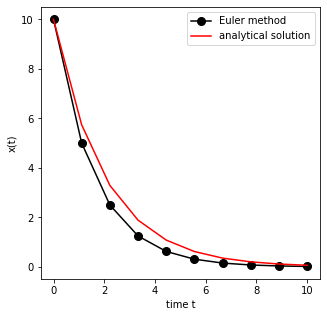
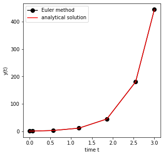
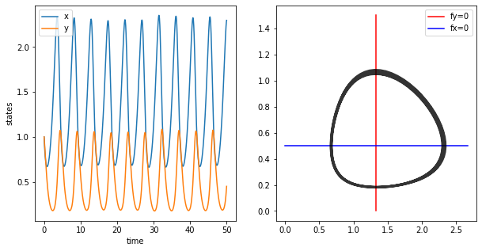
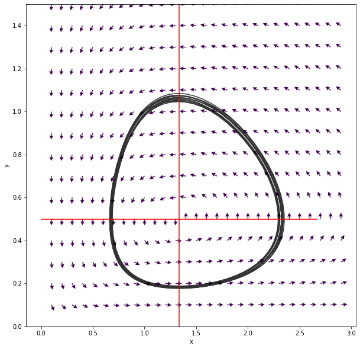

Ordinary differential equations (ODE) code
==========================================

Euler method
------------

We will mainly use ordinary differential equations of the form.

.. raw:: latex

   \begin{equation}
   \frac{d\vec{x}}{dt} = \vec{f}(\vec{x},\vec{p},t)
   \end{equation}

Here :math:`\vec{x}` is a vector of state variables at time :math:`t`.
The parameters of the system are represented by the vector
:math:`\vec{p}`.

In one dimension, the system is written as

.. raw:: latex

   \begin{equation} \label{eq:SimpleEq}
   \frac{dx}{dt} = f(x) \quad \mbox{with} \quad x(t=0) := x_0
   \end{equation}

And the time-invariant steady states are

.. raw:: latex

   \begin{equation}
   \frac{dx}{dt} = 0 \quad \Leftrightarrow \quad f(x^*) = 0
   \end{equation}

The stability of the steady state is determined by the derivative:

.. raw:: latex

   \begin{equation}
   f'(x^*)<0
   \end{equation}

The simplest way to solve the equation numerically is the Euler
integration

.. raw:: latex

   \begin{equation}
   f(x) = \frac{dx}{dt} \approx \frac{x(t+\Delta t) - x(t)}{\Delta t}
   \end{equation}

We obtain

.. raw:: latex

   \begin{equation}
   x(t+\Delta t) \; = \;  x(t) \; + \; \Delta t \;   f(x(t)) \; + \;  {\cal O}(\Delta t^2)
   \end{equation}

Starting from an initial value :math:`x_0` at time :math:`t=0` the
solution can now be determined for later time points.

It is of importance to consider the error of the method. The Euler
method introduces an error of :math:`{\cal O}(\Delta t^2)` per
integration step. To obtain the solution :math:`x(t)` at a time
:math:`t=T`, :math:`N=T/\Delta t` integration steps have to be
performed. The total error is therefore of the order
:math:`{\cal O}(T \Delta t)` and decreases with decreasing
:math:`\Delta t`. Euler integration is a first-order method. The method
is rarely used in real life (too inefficient).

Example Euler Method
--------------------

We now solve a simple example system with the Euler Method

.. raw:: latex

   \begin{equation} \label{eq:EulerSimpleEquation}
   \frac{dx}{dt} = f(x) = -k x \quad \mbox{with} \quad x(0) = x_0
   \end{equation}

For :math:`k>0` the equation has a stable fix-point at :math:`x=0`.

The analytical solution at time :math:`t` is

.. raw:: latex

   \begin{equation} \label{eq:EulerBeispiel}
   x(t) = x_0 \exp(-k t)
   \end{equation}

We now write a simple function that compares the numerical integration
of the simple system with the (known) analytical solution.

.. code:: ipython3

    %matplotlib inline

.. code:: ipython3

    import numpy as np
    from matplotlib import pyplot as plt
    
    def EulerIntegrator(f_dydt, y0, t_span, N):
        """ The function integrates the simple
        system dx/dt = -k x to a time T using the  
        Euler method (N Steps) and initial condition x0.
        
        param f_dydt: ode system as f(y,t) which returns dy/dt
        param y0: initial values
        param t_span: 2-tuple of floats, interval of integration
        param N: number of time points
    
        usage: x = SimpleEuler(f, y0, [t_start, t_end], N)
        """
        k = 1 # set parameter k
    
        # some parameters
        T = float(t_span[1] - t_span[0])
        dt = T/N
        time_vec = np.linspace(t_span[0], t_span[1], num=N)
        x = [float(y0)]
    
        # integration
        y_vec = []
        for k, t in enumerate(time_vec):
            if k == 0:
                y = y0
            else:
                y = y + dt * f_dydt(y,t)
            y_vec.append(y)
        
        return y_vec, time_vec
    
    
    def exponential_decay(y, t):
        """ Linear 1 dimensional ODE"""
        dydt = -0.5 * y
        return dydt
    
    y0 = 10.0
    
    y, t = EulerIntegrator(exponential_decay, y0=y0, t_span=[0,10], N=10)
    
    # plot Euler and exact solution
    fig, ax = plt.subplots(nrows=1, ncols=1, figsize=(5,5))
    
    ax.plot(t, y, 'ko-', markersize=8, label='Euler method')
    ax.plot(t, y0*np.exp(-0.5*t),'r-',label='analytical solution')
    
    ax.set_xlabel('time t')
    ax.set_ylabel('x(t)')
    ax.legend(loc='upper right')
    plt.show()

Numerical integration in python
-------------------------------

The module ``scipy.integrate`` offers a variety of build-in functions
for numerical integration. We will mainly ``solve_ivp`` (formerly
``odeint``) for numerical integration.

See also:
https://docs.scipy.org/doc/scipy/reference/generated/scipy.integrate.solve\_ivp.html

.. code:: ipython3

    from scipy.integrate import solve_ivp

.. code:: ipython3

    help(solve_ivp)

.. parsed-literal::

    Help on function solve_ivp in module scipy.integrate._ivp.ivp:
    
    solve_ivp(fun, t_span, y0, method='RK45', t_eval=None, dense_output=False, events=None, vectorized=False, args=None, **options)
        Solve an initial value problem for a system of ODEs.
        
        This function numerically integrates a system of ordinary differential
        equations given an initial value::
        
            dy / dt = f(t, y)
            y(t0) = y0
        
        Here t is a one-dimensional independent variable (time), y(t) is an
        n-dimensional vector-valued function (state), and an n-dimensional
        vector-valued function f(t, y) determines the differential equations.
        The goal is to find y(t) approximately satisfying the differential
        equations, given an initial value y(t0)=y0.
        
        Some of the solvers support integration in the complex domain, but note
        that for stiff ODE solvers, the right-hand side must be
        complex-differentiable (satisfy Cauchy-Riemann equations [11]_).
        To solve a problem in the complex domain, pass y0 with a complex data type.
        Another option always available is to rewrite your problem for real and
        imaginary parts separately.
        
        Parameters
        ----------
        fun : callable
            Right-hand side of the system. The calling signature is ``fun(t, y)``.
            Here `t` is a scalar, and there are two options for the ndarray `y`:
            It can either have shape (n,); then `fun` must return array_like with
            shape (n,). Alternatively it can have shape (n, k); then `fun`
            must return an array_like with shape (n, k), i.e. each column
            corresponds to a single column in `y`. The choice between the two
            options is determined by `vectorized` argument (see below). The
            vectorized implementation allows a faster approximation of the Jacobian
            by finite differences (required for stiff solvers).
        t_span : 2-tuple of floats
            Interval of integration (t0, tf). The solver starts with t=t0 and
            integrates until it reaches t=tf.
        y0 : array_like, shape (n,)
            Initial state. For problems in the complex domain, pass `y0` with a
            complex data type (even if the initial value is purely real).
        method : string or `OdeSolver`, optional
            Integration method to use:
        
                * 'RK45' (default): Explicit Runge-Kutta method of order 5(4) [1]_.
                  The error is controlled assuming accuracy of the fourth-order
                  method, but steps are taken using the fifth-order accurate
                  formula (local extrapolation is done). A quartic interpolation
                  polynomial is used for the dense output [2]_. Can be applied in
                  the complex domain.
                * 'RK23': Explicit Runge-Kutta method of order 3(2) [3]_. The error
                  is controlled assuming accuracy of the second-order method, but
                  steps are taken using the third-order accurate formula (local
                  extrapolation is done). A cubic Hermite polynomial is used for the
                  dense output. Can be applied in the complex domain.
                * 'DOP853': Explicit Runge-Kutta method of order 8 [13]_.
                  Python implementation of the "DOP853" algorithm originally
                  written in Fortran [14]_. A 7-th order interpolation polynomial
                  accurate to 7-th order is used for the dense output.
                  Can be applied in the complex domain.
                * 'Radau': Implicit Runge-Kutta method of the Radau IIA family of
                  order 5 [4]_. The error is controlled with a third-order accurate
                  embedded formula. A cubic polynomial which satisfies the
                  collocation conditions is used for the dense output.
                * 'BDF': Implicit multi-step variable-order (1 to 5) method based
                  on a backward differentiation formula for the derivative
                  approximation [5]_. The implementation follows the one described
                  in [6]_. A quasi-constant step scheme is used and accuracy is
                  enhanced using the NDF modification. Can be applied in the
                  complex domain.
                * 'LSODA': Adams/BDF method with automatic stiffness detection and
                  switching [7]_, [8]_. This is a wrapper of the Fortran solver
                  from ODEPACK.
        
            Explicit Runge-Kutta methods ('RK23', 'RK45', 'DOP853') should be used
            for non-stiff problems and implicit methods ('Radau', 'BDF') for
            stiff problems [9]_. Among Runge-Kutta methods, 'DOP853' is recommended
            for solving with high precision (low values of `rtol` and `atol`).
        
            If not sure, first try to run 'RK45'. If it makes unusually many
            iterations, diverges, or fails, your problem is likely to be stiff and
            you should use 'Radau' or 'BDF'. 'LSODA' can also be a good universal
            choice, but it might be somewhat less convenient to work with as it
            wraps old Fortran code.
        
            You can also pass an arbitrary class derived from `OdeSolver` which
            implements the solver.
        t_eval : array_like or None, optional
            Times at which to store the computed solution, must be sorted and lie
            within `t_span`. If None (default), use points selected by the solver.
        dense_output : bool, optional
            Whether to compute a continuous solution. Default is False.
        events : callable, or list of callables, optional
            Events to track. If None (default), no events will be tracked.
            Each event occurs at the zeros of a continuous function of time and
            state. Each function must have the signature ``event(t, y)`` and return
            a float. The solver will find an accurate value of `t` at which
            ``event(t, y(t)) = 0`` using a root-finding algorithm. By default, all
            zeros will be found. The solver looks for a sign change over each step,
            so if multiple zero crossings occur within one step, events may be
            missed. Additionally each `event` function might have the following
            attributes:
        
                terminal: bool, optional
                    Whether to terminate integration if this event occurs.
                    Implicitly False if not assigned.
                direction: float, optional
                    Direction of a zero crossing. If `direction` is positive,
                    `event` will only trigger when going from negative to positive,
                    and vice versa if `direction` is negative. If 0, then either
                    direction will trigger event. Implicitly 0 if not assigned.
        
            You can assign attributes like ``event.terminal = True`` to any
            function in Python. 
        vectorized : bool, optional
            Whether `fun` is implemented in a vectorized fashion. Default is False.
        args : tuple, optional
            Additional arguments to pass to the user-defined functions.  If given,
            the additional arguments are passed to all user-defined functions.
            So if, for example, `fun` has the signature ``fun(t, y, a, b, c)``,
            then `jac` (if given) and any event functions must have the same
            signature, and `args` must be a tuple of length 3.
        options
            Options passed to a chosen solver. All options available for already
            implemented solvers are listed below.
        first_step : float or None, optional
            Initial step size. Default is `None` which means that the algorithm
            should choose.
        max_step : float, optional
            Maximum allowed step size. Default is np.inf, i.e. the step size is not
            bounded and determined solely by the solver.
        rtol, atol : float or array_like, optional
            Relative and absolute tolerances. The solver keeps the local error
            estimates less than ``atol + rtol * abs(y)``. Here `rtol` controls a
            relative accuracy (number of correct digits). But if a component of `y`
            is approximately below `atol`, the error only needs to fall within
            the same `atol` threshold, and the number of correct digits is not
            guaranteed. If components of y have different scales, it might be
            beneficial to set different `atol` values for different components by
            passing array_like with shape (n,) for `atol`. Default values are
            1e-3 for `rtol` and 1e-6 for `atol`.
        jac : array_like, sparse_matrix, callable or None, optional
            Jacobian matrix of the right-hand side of the system with respect
            to y, required by the 'Radau', 'BDF' and 'LSODA' method. The
            Jacobian matrix has shape (n, n) and its element (i, j) is equal to
            ``d f_i / d y_j``.  There are three ways to define the Jacobian:
        
                * If array_like or sparse_matrix, the Jacobian is assumed to
                  be constant. Not supported by 'LSODA'.
                * If callable, the Jacobian is assumed to depend on both
                  t and y; it will be called as ``jac(t, y)`` as necessary.
                  For 'Radau' and 'BDF' methods, the return value might be a
                  sparse matrix.
                * If None (default), the Jacobian will be approximated by
                  finite differences.
        
            It is generally recommended to provide the Jacobian rather than
            relying on a finite-difference approximation.
        jac_sparsity : array_like, sparse matrix or None, optional
            Defines a sparsity structure of the Jacobian matrix for a finite-
            difference approximation. Its shape must be (n, n). This argument
            is ignored if `jac` is not `None`. If the Jacobian has only few
            non-zero elements in *each* row, providing the sparsity structure
            will greatly speed up the computations [10]_. A zero entry means that
            a corresponding element in the Jacobian is always zero. If None
            (default), the Jacobian is assumed to be dense.
            Not supported by 'LSODA', see `lband` and `uband` instead.
        lband, uband : int or None, optional
            Parameters defining the bandwidth of the Jacobian for the 'LSODA'
            method, i.e., ``jac[i, j] != 0 only for i - lband <= j <= i + uband``.
            Default is None. Setting these requires your jac routine to return the
            Jacobian in the packed format: the returned array must have ``n``
            columns and ``uband + lband + 1`` rows in which Jacobian diagonals are
            written. Specifically ``jac_packed[uband + i - j , j] = jac[i, j]``.
            The same format is used in `scipy.linalg.solve_banded` (check for an
            illustration).  These parameters can be also used with ``jac=None`` to
            reduce the number of Jacobian elements estimated by finite differences.
        min_step : float, optional
            The minimum allowed step size for 'LSODA' method. 
            By default `min_step` is zero.
        
        Returns
        -------
        Bunch object with the following fields defined:
        t : ndarray, shape (n_points,)
            Time points.
        y : ndarray, shape (n, n_points)
            Values of the solution at `t`.
        sol : `OdeSolution` or None
            Found solution as `OdeSolution` instance; None if `dense_output` was
            set to False.
        t_events : list of ndarray or None
            Contains for each event type a list of arrays at which an event of
            that type event was detected. None if `events` was None.
        y_events : list of ndarray or None
            For each value of `t_events`, the corresponding value of the solution.
            None if `events` was None.
        nfev : int
            Number of evaluations of the right-hand side.
        njev : int
            Number of evaluations of the Jacobian.
        nlu : int
            Number of LU decompositions.
        status : int
            Reason for algorithm termination:
        
                * -1: Integration step failed.
                *  0: The solver successfully reached the end of `tspan`.
                *  1: A termination event occurred.
        
        message : string
            Human-readable description of the termination reason.
        success : bool
            True if the solver reached the interval end or a termination event
            occurred (``status >= 0``).
        
        References
        ----------
        .. [1] J. R. Dormand, P. J. Prince, "A family of embedded Runge-Kutta
               formulae", Journal of Computational and Applied Mathematics, Vol. 6,
               No. 1, pp. 19-26, 1980.
        .. [2] L. W. Shampine, "Some Practical Runge-Kutta Formulas", Mathematics
               of Computation,, Vol. 46, No. 173, pp. 135-150, 1986.
        .. [3] P. Bogacki, L.F. Shampine, "A 3(2) Pair of Runge-Kutta Formulas",
               Appl. Math. Lett. Vol. 2, No. 4. pp. 321-325, 1989.
        .. [4] E. Hairer, G. Wanner, "Solving Ordinary Differential Equations II:
               Stiff and Differential-Algebraic Problems", Sec. IV.8.
        .. [5] `Backward Differentiation Formula
                <https://en.wikipedia.org/wiki/Backward_differentiation_formula>`_
                on Wikipedia.
        .. [6] L. F. Shampine, M. W. Reichelt, "THE MATLAB ODE SUITE", SIAM J. SCI.
               COMPUTE., Vol. 18, No. 1, pp. 1-22, January 1997.
        .. [7] A. C. Hindmarsh, "ODEPACK, A Systematized Collection of ODE
               Solvers," IMACS Transactions on Scientific Computation, Vol 1.,
               pp. 55-64, 1983.
        .. [8] L. Petzold, "Automatic selection of methods for solving stiff and
               nonstiff systems of ordinary differential equations", SIAM Journal
               on Scientific and Statistical Computing, Vol. 4, No. 1, pp. 136-148,
               1983.
        .. [9] `Stiff equation <https://en.wikipedia.org/wiki/Stiff_equation>`_ on
               Wikipedia.
        .. [10] A. Curtis, M. J. D. Powell, and J. Reid, "On the estimation of
                sparse Jacobian matrices", Journal of the Institute of Mathematics
                and its Applications, 13, pp. 117-120, 1974.
        .. [11] `Cauchy-Riemann equations
                 <https://en.wikipedia.org/wiki/Cauchy-Riemann_equations>`_ on
                 Wikipedia.
        .. [12] `Lotka-Volterra equations
                <https://en.wikipedia.org/wiki/Lotka%E2%80%93Volterra_equations>`_
                on Wikipedia.
        .. [13] E. Hairer, S. P. Norsett G. Wanner, "Solving Ordinary Differential
                Equations I: Nonstiff Problems", Sec. II.
        .. [14] `Page with original Fortran code of DOP853
                <http://www.unige.ch/~hairer/software.html>`_.
        
        Examples
        --------
        Basic exponential decay showing automatically chosen time points.
        
        >>> from scipy.integrate import solve_ivp
        >>> def exponential_decay(t, y): return -0.5 * y
        >>> sol = solve_ivp(exponential_decay, [0, 10], [2, 4, 8])
        >>> print(sol.t)
        [ 0.          0.11487653  1.26364188  3.06061781  4.81611105  6.57445806
          8.33328988 10.        ]
        >>> print(sol.y)
        [[2.         1.88836035 1.06327177 0.43319312 0.18017253 0.07483045
          0.03107158 0.01350781]
         [4.         3.7767207  2.12654355 0.86638624 0.36034507 0.14966091
          0.06214316 0.02701561]
         [8.         7.5534414  4.25308709 1.73277247 0.72069014 0.29932181
          0.12428631 0.05403123]]
        
        Specifying points where the solution is desired.
        
        >>> sol = solve_ivp(exponential_decay, [0, 10], [2, 4, 8],
        ...                 t_eval=[0, 1, 2, 4, 10])
        >>> print(sol.t)
        [ 0  1  2  4 10]
        >>> print(sol.y)
        [[2.         1.21305369 0.73534021 0.27066736 0.01350938]
         [4.         2.42610739 1.47068043 0.54133472 0.02701876]
         [8.         4.85221478 2.94136085 1.08266944 0.05403753]]
        
        Cannon fired upward with terminal event upon impact. The ``terminal`` and
        ``direction`` fields of an event are applied by monkey patching a function.
        Here ``y[0]`` is position and ``y[1]`` is velocity. The projectile starts
        at position 0 with velocity +10. Note that the integration never reaches
        t=100 because the event is terminal.
        
        >>> def upward_cannon(t, y): return [y[1], -0.5]
        >>> def hit_ground(t, y): return y[0]
        >>> hit_ground.terminal = True
        >>> hit_ground.direction = -1
        >>> sol = solve_ivp(upward_cannon, [0, 100], [0, 10], events=hit_ground)
        >>> print(sol.t_events)
        [array([40.])]
        >>> print(sol.t)
        [0.00000000e+00 9.99900010e-05 1.09989001e-03 1.10988901e-02
         1.11088891e-01 1.11098890e+00 1.11099890e+01 4.00000000e+01]
        
        Use `dense_output` and `events` to find position, which is 100, at the apex
        of the cannonball's trajectory. Apex is not defined as terminal, so both
        apex and hit_ground are found. There is no information at t=20, so the sol
        attribute is used to evaluate the solution. The sol attribute is returned
        by setting ``dense_output=True``. Alternatively, the `y_events` attribute
        can be used to access the solution at the time of the event.
        
        >>> def apex(t, y): return y[1]
        >>> sol = solve_ivp(upward_cannon, [0, 100], [0, 10], 
        ...                 events=(hit_ground, apex), dense_output=True)
        >>> print(sol.t_events)
        [array([40.]), array([20.])]
        >>> print(sol.t)
        [0.00000000e+00 9.99900010e-05 1.09989001e-03 1.10988901e-02
         1.11088891e-01 1.11098890e+00 1.11099890e+01 4.00000000e+01]
        >>> print(sol.sol(sol.t_events[1][0]))
        [100.   0.]
        >>> print(sol.y_events)
        [array([[-5.68434189e-14, -1.00000000e+01]]), array([[1.00000000e+02, 1.77635684e-15]])]
        
        As an example of a system with additional parameters, we'll implement
        the Lotka-Volterra equations [12]_.
        
        >>> def lotkavolterra(t, z, a, b, c, d):
        ...     x, y = z
        ...     return [a*x - b*x*y, -c*y + d*x*y]
        ...
        
        We pass in the parameter values a=1.5, b=1, c=3 and d=1 with the `args`
        argument.
        
        >>> sol = solve_ivp(lotkavolterra, [0, 15], [10, 5], args=(1.5, 1, 3, 1),
        ...                 dense_output=True)
        
        Compute a dense solution and plot it.
        
        >>> t = np.linspace(0, 15, 300)
        >>> z = sol.sol(t)
        >>> import matplotlib.pyplot as plt
        >>> plt.plot(t, z.T)
        >>> plt.xlabel('t')
        >>> plt.legend(['x', 'y'], shadow=True)
        >>> plt.title('Lotka-Volterra System')
        >>> plt.show()
    

We first consider a simple linear ODE of the form

.. raw:: latex

   \begin{equation}
   \frac{dx}{dt} = c - k \cdot x ~~,
   \end{equation}

where :math:`c` and :math:`k` are parameters. The steady state
:math:`x^0` of the system can be straightforwardly calculated

.. raw:: latex

   \begin{equation}
   \frac{dx}{dt} =0 \quad \leftrightarrow \quad x^0 = \frac{c}{k}
   \end{equation}

To solve the system numerically, we must implement the function
:math:`f(x,t) = c - k \cdot x` into a user-defined
{:raw-latex:`\tt `python} function.

.. code:: ipython3

    def exponential_growth(t, y):
        """
        The function implements the simple linear
        ODE dydt = k*y
        """
        return 2.0 * y

To integrate the system numerically, we need to specify the initial
condition :math:`x^0 = x(t=0)` and a timespan.

.. code:: ipython3

    from scipy.integrate import solve_ivp
    import numpy as np
    
    # solve the ODE
    y0 = 1.1
    sol = solve_ivp(fun=exponential_growth, y0=np.array([y0]), t_span=[0, 3])
    
    # plot both solutions
    fig, ax = plt.subplots(nrows=1, ncols=1, figsize=(5,5))
    
    ax.plot(sol.t, sol.y[0], 'ko-', markersize=8, label='Euler method')
    ax.plot(sol.t, y0*np.exp(2.0*sol.t),'r-',label='analytical solution')
    ax.set_xlabel('time t')
    ax.set_ylabel('y(t)')
    ax.legend(loc='upper left')
    plt.show()

The Lotka-Volterra System
-------------------------

We want to implement the two-dimensional Lotka-Volterra System. A
suitable function is

.. code:: ipython3

    def lotka_volterra(t, x):
        """
        Implements the Lotka-Volterra System x is a two-dimensional vector
        """
    
        # define parameters
        X = x[0]
        Y = x[1]
    
        a = 1
        b = 2
        g = 1.5
        d = 2
    
        dxdt = a*X - b*X*Y
        dydt = g*X*Y - d*Y
    
        # the function returns the vector [fx, fy]
        return [dxdt, dydt]

First we have a look at state variables over time, i.e. we are looking
at the oscillations of x and y through time.

The isoclines can be plotted as follows

.. code:: ipython3

    import pandas as pd
    
    # parameters for lotka volterra
    a = 1
    b = 2
    g = 1.5
    d = 2
    
    # solve the ODE
    y0 = [1, 1]
    sol = solve_ivp(lotka_volterra, y0=y0, t_span=[0, 50], t_eval=np.linspace(0,50, num=1001))
    # store solution in dataframe
    s = pd.DataFrame(np.transpose(sol.y), columns=['x', 'y'])
    s['time'] = sol.t
    
    # plot solution
    fig, (ax1, ax2) = plt.subplots(nrows=1, ncols=2, figsize=(10,5))
    
    # plot timecourse
    ax1.plot(s.time, s.x, label='x')
    ax1.plot(s.time, s.y, label='y')
    
    ax1.set_xlabel('time')
    ax1.set_ylabel('states')
    ax1.legend(loc='upper left')
    
    # plot state space with nullklines
    
    ax2.plot([d/g, d/g],[0, 3*a/b],'r-', label="fy=0")
    ax2.plot([0, 2*d/g],[a/b, a/b],'b-', label="fx=0")
    ax2.plot(s.x, s.y, 'k', alpha=0.8)
    ax2.legend()
    plt.show()

We can also have a more detailed look on the phase plane. A suitable
method are quiver plots (``help(plt.quiver)``.

.. code:: ipython3

    # solve the ODE
    y0 = [1.0, 1.0]
    sol = solve_ivp(lotka_volterra, y0=y0, t_span=[0, 50], t_eval=np.linspace(0,50, num=1001))
    # store solution in dataframe
    s = pd.DataFrame(np.transpose(sol.y), columns=['x', 'y'])
    s['time'] = sol.t
    
    x = np.arange(0.1,3,0.1); y = np.arange(0.1,3,0.1)
    [xg,yg] = np.meshgrid(x,y)
    n = np.size(x); m = np.size(x)
    u = np.zeros([n,m])
    v = np.zeros([n,m])
    
    for i in range(n):
        for j in range(m):
            df = lotka_volterra(1, [xg[i,j],yg[i,j]])
            df = df/np.linalg.norm(df)
            u[i,j] = df[0]
            v[i,j] = df[1]
    
    fig, ax = plt.subplots(nrows=1, ncols=1, figsize=(10,10))
            
    h = ax.quiver(xg,yg,u,v,0.5, headwidth=5)
    ax.plot(s.x, s.y, 'k-', alpha=0.8)
    ax.plot([d/g, d/g],[0, 3*a/b],'r-')
    ax.plot([0, 2*d/g],[a/b, a/b],'r-')
    ax.set_ylim(0, 1.5)
    ax.set_xlabel("x")
    ax.set_ylabel("y")
    
    plt.show()

