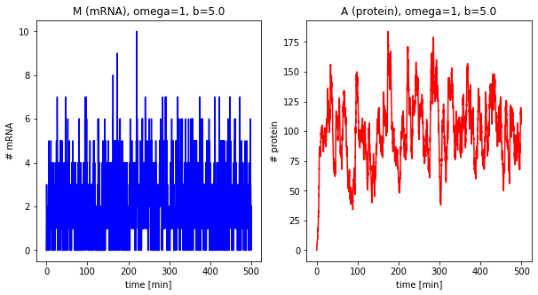
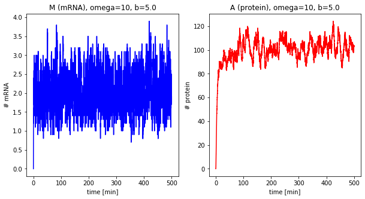
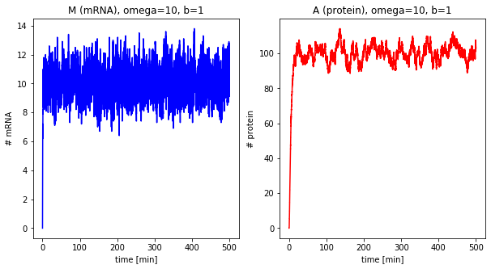
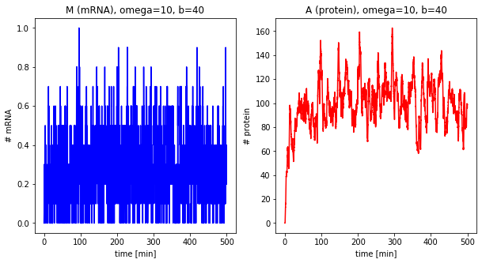
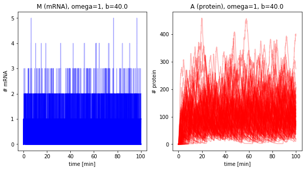
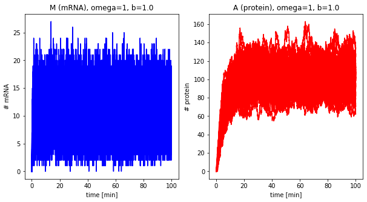

Stochastic processes
====================

Gillespie Algorithm
-------------------

-  By solving the master equation the time evolution of the probability
   distribution can be calculated.
-  Unfortunately, the master equation is very difficult to solve, either
   numerically or analytically.
-  In most cases, we therefore do not aim to solve the master equation.
   Rather a trajectory of individual transitions that is consistent with
   the master equation is simulated.

The most well known algorithm was proposed by D. Gillespie:

1. The system is in :math:`x` at time :math:`t`
2. Estimate probabilities :math:`w_i` for all feasible transitions from
   this state :math:`x → x´`
3. Estimate the time :math:`\Delta t` until which the transition happens
4. Estimate which transition happens. The probability for an individual
   transition is proportional to :math:`w_i`.
5. Update the state :math:`x` and time :math:`t`:
   :math:`t → t + \Delta t`

.. code:: ipython3

    """
    Stochastic simulation of gene expression using Gillespie.
    """
    import numpy as np
    import pandas as pd
    from matplotlib import pyplot as plt
    
    def stochastic(tend: float=100, omega: float=1, b: float=5.0, info: bool=True) -> pd.DataFrame:
        """
        The parameters are b, dp, dm and the mean number of proteins A0.
        omega is a system size parameter (volume). In the case of omega=1, the concentration
        corresponds to the number of molecules
    
        :param tend: end time of simulation
        :param omega: system size parameter
        :Param b: burst size, average number of proteins per mRNA
        
        :return: stochastic gillespie timecourse
        """
    
        # parameter
        A0 = 100.0  # steady state value of protein
        
        dm = 2.0
        dp = 0.2
        kp = b * dm
        km = A0 * dp/b
    
        M0 = km/dm  # steady state value of mRNA
        if info:
            print("[M0]={}; [A0]={}".format(M0, A0))
    
        # initial conditions
        M = 0
        A = 0
    
        # simulation
        t = 0  # [min]
        ix = 0
        res = []
        while t<tend:
            res.append([t, M/omega, A/omega])
            ix = ix + 1
    
            # calculate the rates for all transitions
            w1 = omega * km  # transcription (M,A) -> (M+1, A)
            w2 = dm * M      # decay mRNA    (M,A) -> (M-1, A)
            w3 = kp * M      # translation   (M,A) -> (M, A+1)
            w4 = dp * A      # decay protein (M,A) -> (M, A-1)
    
            rate = w1 + w2 + w3 + w4
    
            # estimate time
            eps1 = 1-np.random.random()  # np.random: Uniformly distributed floats over [0, 1)
            dt = -np.log(eps1)/rate
            t = t + dt
    
            # which transition was selected
            rate_rand = rate * np.random.random()
            if rate_rand < w1:
                M = M + 1  # transcription
            elif rate_rand < w1 + w2:
                M = M - 1  # decay mRNA
            elif rate_rand < w1 + w2 + w3:
                A = A + 1  # translation
            elif rate_rand < w1 + w2 + w3 + w4:
                A = A - 1  # decay protein
    
        return pd.DataFrame(res, columns=["time", "M", "A"])

.. code:: ipython3

    def plot_results(dfs, omega, b, **kwargs):
        """ Helper function for plotting.
    
        :param df:
        :return:
        """
        fig, (ax1, ax2) = plt.subplots(nrows=1, ncols=2, figsize=(10,5))
    
        ax1.set_title("M (mRNA), omega={}, b={}".format(omega, b))
        ax1.set_ylabel("# mRNA")
        ax2.set_title("A (protein), omega={}, b={}".format(omega, b))
        ax2.set_ylabel("# protein")
    
        if not isinstance(dfs, list):
            dfs = [dfs]
        for df in dfs:
            ax1.plot(df.time, df.M, color="blue", **kwargs)
            ax2.plot(df.time, df.A, color="red", **kwargs)
    
        for ax in (ax1, ax2):
            ax.set_xlabel("time [min]")
        plt.show()

Single trajectories
-------------------

.. code:: ipython3

    df = stochastic(tend=500, omega=1, b=5.0)
    plot_results(df, omega=1, b=5.0)

.. parsed-literal::

    [M0]=2.0; [A0]=100.0

Effect of system size
---------------------

Now we change the system size parameter :math:`\Omega`.

.. code:: ipython3

    dfs_omega = []
    for omega in [1, 5, 10, 25]:
        df = stochastic(500, omega=omega, b=5.0)
        plot_results(df, omega=omega, b=5.0)
        dfs_omega.append(df)

.. parsed-literal::

    [M0]=2.0; [A0]=100.0

.. parsed-literal::

    [M0]=2.0; [A0]=100.0

.. parsed-literal::

    [M0]=2.0; [A0]=100.0

.. parsed-literal::

    [M0]=2.0; [A0]=100.0

Effect of the burst size
------------------------

The next step is looking at the burst size of the system, i.e., how many
proteins are translated per mRNA.

.. code:: ipython3

    df_b = []
    for b in [1, 5, 40]:
        df = stochastic(500, omega=10, b=b)
        plot_results(df, omega=10, b=b)

.. parsed-literal::

    [M0]=10.0; [A0]=100.0

.. parsed-literal::

    [M0]=2.0; [A0]=100.0

.. image:: 10_stochastic_processes_files/10_stochastic_processes_8_3.png

.. parsed-literal::

    [M0]=0.25; [A0]=100.0

Sampling trajectories from master equation
------------------------------------------

.. code:: ipython3

    omega = 1
    b = 40.0
    dfs = []
    for k in range(100):
        df = stochastic(100, omega=omega, b=b, info=False)
        dfs.append(df)
    plot_results(dfs, omega=omega, b=b, alpha=0.3)

.. code:: ipython3

    omega = 1
    b = 1.0
    dfs = []
    for k in range(100):
        df = stochastic(100, omega=omega, b=b, info=False)
        dfs.append(df)
    plot_results(dfs, omega=omega, b=b)

