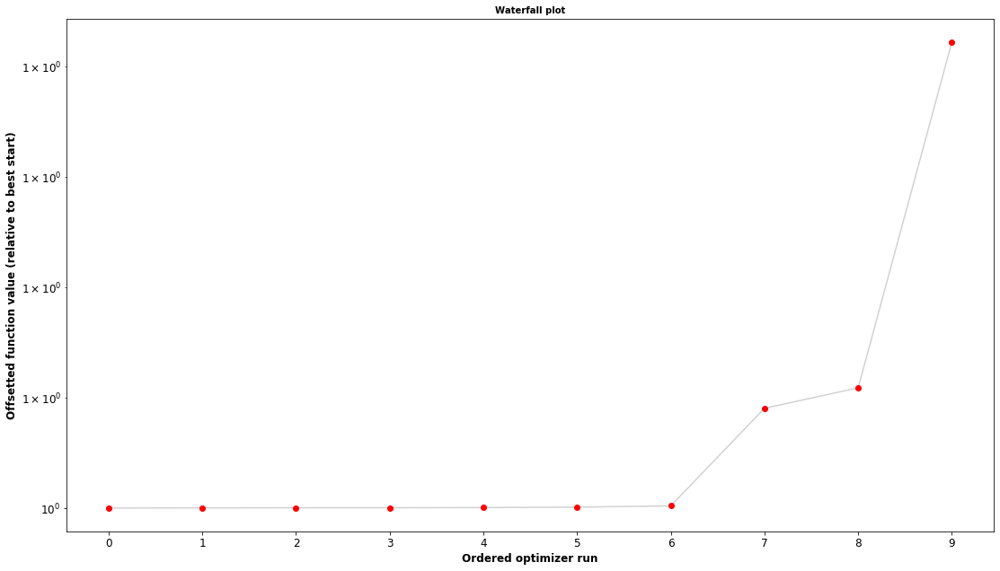
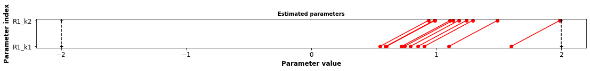

Parameter fitting code
======================

.. code:: ipython3

    import numpy as np
    from matplotlib import pyplot as plt
    
    # global settings for plots
    plt.rcParams.update({
        'axes.labelsize': 'large',
        'axes.labelweight': 'bold',
        'axes.titlesize': 'medium',
        'axes.titleweight': 'bold',
        'legend.fontsize': 'small',
        'xtick.labelsize': 'large',
        'ytick.labelsize': 'large',
        'figure.facecolor': '1.00'
    })

1. Particle Swarm Optimization (PSO)
------------------------------------

Particle swarm optimization solves a problem by - having a population of
candidate solutions, here dubbed particles - moving these particles
around in the search-space according to simple mathematical formulae
over the particle's position and velocity. - Each particle's movement is
influenced by its local best known position, but is also guided toward
the best known positions in the search-space, which are updated as
better positions are found by other particles.

https://en.wikipedia.org/wiki/Particle\_swarm\_optimization

-  PSO is a metaheuristic: makes few or no assumptions about the problem
   being optimized
-  can search very large spaces of candidate solutions.
-  However, metaheuristics such as PSO do not guarantee an optimal
   solution is ever found.
-  PSO does not use the gradient of the problem being optimized, which
   means PSO does not require that the optimization problem be
   differentiable as is required by classic optimization methods such as
   gradient descent and quasi-newton methods.

2. Steepest descent (gradient descent)
--------------------------------------

In the following example we apply the gradient descent algorithm to find
a local minima in a 1 dimensional function:

Function :math:`F{(x)}=x^{4}-3x^{3}+2`,

with derivative :math:`F'{(x)}=4x^{3}-9x^{2}`

and second derivative :math:`F''{(x)}=12x^{2}-18x`

https://en.wikipedia.org/wiki/Gradient\_descent

2.1 Analytical solution
~~~~~~~~~~~~~~~~~~~~~~~

We can easily calculate the minima analytically via :math:`F(x)=0` as
:math:`x_1=0` and :math:`x_2=9/4=2.25`.

:math:`F''{(x_2)} = 12 \cdot (9/4)^2 - 18 \cdot 9/4 =20.25> 0`

.. code:: ipython3

    # calculate functions
    x = np.linspace(-3, 4, num=100)
    F = np.power(x, 4) - 3*np.power(x, 3) +2
    Fdx = 4*np.power(x, 3) - 9*np.power(x, 2)
    Fdx2 = 12*np.power(x, 2) - 18*x
    
    # figure
    fig, (ax1, ax2, ax3) = plt.subplots(nrows=1, ncols=3, figsize=(15,5))
    fig.subplots_adjust(wspace=0.3)
    
    ax1.set_title("$F(x)= x^4 -3x^3 +2$")
    ax1.set_ylabel("F(x)")
    ax2.set_title("$F'(x)= 4x^3 -9x^2$")
    ax2.set_ylabel("F'(x)")
    ax3.set_title("$F''(x)= 12x^2 -18x$")
    ax3.set_ylabel("F''(x)")
    
    ax1.plot(x, F, color="black", label="F(x)")
    ax2.plot(x, Fdx, color="blue", label="F'(x)")
    ax3.plot(x, Fdx2, color="darkorange", label="F''(x)")
    for ax in (ax1, ax2, ax3):
        ax.axhline(0, color="gray")
        ax.axvline(0, color="gray", linestyle="--")
        ax.axvline(9/4, color="gray", linestyle="--")
    
    for ax in (ax1, ax2, ax3):
        ax.set_xlabel("x [-]")
        
    plt.show()

2.2 Numerical calculation
~~~~~~~~~~~~~~~~~~~~~~~~~

Now we implement a simple gradient descent algorithm to find the minimas
numerically

.. code:: ipython3

    x_new = 6.0  # The algorithm starts at x=6
    gamma = 0.01  # step size multiplier
    precision = 0.00001  # stop criteria
    max_iters = 10000  # maximum number of iterations (stop criteria)
    
    # definition of functions
    fun = lambda x: np.power(x,4) - 3*np.power(x,3) + 2
    df = lambda x: 4 * np.power(x,3) - 9 * np.power(x, 2)
    
    # running algorithm
    k = 0  # iteration counter
    previous_step_size = 1 
    x_vals = [x_new]
    print(f"Start, {x_new}")
    while previous_step_size > precision and k < max_iters:
        x_old = x_new
        
        # update with stepsize and gradient
        x_new -= gamma * df(x_old)
        
        # calculate precision (change)
        previous_step_size = abs(x_new - x_old)
        
        # update counters
        k += 1
        print(f"Step {k}, {x_new}")
        x_vals.append(x_new)
    
    print("The local minimum occurs at", x_new)

.. parsed-literal::

    Start, 6.0
    Step 1, 0.5999999999999996
    Step 2, 0.6237599999999996
    Step 3, 0.6490692731402646
    Step 4, 0.6760475763767438
    Step 5, 0.704821965498881
    Step 6, 0.7355261366038248
    Step 7, 0.7682992721113444
    Step 8, 0.8032842278686305
    Step 9, 0.840624861847519
    Step 10, 0.8804622684298664
    Step 11, 0.9229296507309586
    Step 12, 0.9681455460305634
    Step 13, 1.016205130521792
    Step 14, 1.067169389942697
    Step 15, 1.1210520795330405
    Step 16, 1.1778046421472836
    Step 17, 1.237299637824332
    Step 18, 1.2993137782331108
    Step 19, 1.3635123370474889
    Step 20, 1.429437442158506
    Step 21, 1.4965033788967752
    Step 22, 1.5640022802344904
    Step 23, 1.6311231270849003
    Step 24, 1.6969855549473505
    Step 25, 1.7606875094969714
    Step 26, 1.821362659674955
    Step 27, 1.8782404675959476
    Step 28, 1.930700009196379
    Step 29, 1.9783089472809865
    Step 30, 2.0208417065692057
    Step 31, 2.0582751831448975
    Step 32, 2.090764845528107
    Step 33, 2.118607415721545
    Step 34, 2.1421976265432066
    Step 35, 2.1619858762300224
    Step 36, 2.178441640823547
    Step 37, 2.1920251576443675
    Step 38, 2.203167862727841
    Step 39, 2.2122606942724694
    Step 40, 2.2196486877629633
    Step 41, 2.2256301304909205
    Step 42, 2.2304587076907274
    Step 43, 2.234347382687595
    Step 44, 2.2374730902946083
    Step 45, 2.239981621916576
    Step 46, 2.2419923174775156
    Step 47, 2.243602351591089
    Step 48, 2.2448905184851697
    Step 49, 2.2459204946033684
    Step 50, 2.2467436015363202
    Step 51, 2.2474011148628947
    Step 52, 2.2479261740485823
    Step 53, 2.2483453500247714
    Step 54, 2.2486799240099864
    Step 55, 2.2489469258218673
    Step 56, 2.2491599737759116
    Step 57, 2.2493299520940697
    Step 58, 2.249465555993498
    Step 59, 2.24957372949745
    Step 60, 2.249660016570137
    Step 61, 2.2497288424102844
    Step 62, 2.24978373858824
    Step 63, 2.2498275231061067
    Step 64, 2.249862444322635
    Step 65, 2.249890295941524
    Step 66, 2.2499125088471215
    Step 67, 2.24993022442776
    Step 68, 2.249944353104799
    Step 69, 2.2499556210437
    Step 70, 2.2499646074278457
    The local minimum occurs at 2.2499646074278457

.. code:: ipython3

    x_vals = np.array(x_vals)
    x_range = np.arange(0,7,0.1)
    
    from matplotlib import pyplot as plt
    f, (ax1, ax2) = plt.subplots(nrows=1, ncols=2, figsize=(10,5))
    
    ax1.plot(x_range, fun(x_range), '-', color="blue", label="f")
    ax1.plot(x_vals, fun(x_vals), 'o--', color="black")
    ax2.plot(x_range, df(x_range), '-', color="blue", label="df")
    ax2.plot(x_vals, df(x_vals), 'o--', color="black", label="df")
    ax2.set_xlim(0, 3.0)
    ax2.set_ylim(-10, 10)

.. parsed-literal::

    (-10, 10)

Gradient descent has problems with pathological functions (zig-zag
behavior) The "Zig-Zagging" nature of the method is also evident below,
where the gradient descent method is applied to
:math:`F\left(x,y\right)=\sin \left({\frac {1}{2}}x^{2}-{\frac {1}{4}}y^{2}+3\right)\cos \left(2x+1-e^{y}\right)`.

3. Model fitting
----------------

Multiple tools for parameter fitting in models exist. Most of these
tools can work with models in SBML description. Examples are - COPASI
(http://copasi.org/,
http://copasi.org/Support/User\_Manual/Tasks/Parameter\_Estimation/) -
data2dynamics (https://github.com/Data2Dynamics/d2d) - pyPESTO (with
AMICI) (https://pypesto.readthedocs.io) - AMICI
(https://github.com/ICB-DCM/AMICI)

In the following we are running some example parameter fits with pyPESTO
and AMICI.

For installation of AMICI the following is required

::

    sudo apt-get install libatlas-base-dev
    sudo apt-get install libhdf5-dev libhdf5-serial-dev

3.1 Example model (conversion reaction)
~~~~~~~~~~~~~~~~~~~~~~~~~~~~~~~~~~~~~~~

For our example we use a simple model with a single reversible
conversion reaction with mass-action kinetics

::

    R1: A <-> B; v = R1_k1 * A - R1_k2*B

The model is available as SBML model which we will use in the following
for simulation and parameter fitting.

.. code:: ipython3

    # sbml file we want to import
    sbml_file = './fitting/model_conversion_reaction.xml'
    
    # convert to human readable description
    import antimony
    antimony.loadSBMLFile(sbml_file)
    astr = antimony.getAntimonyString("model_conversion_reaction")
    print(astr)

.. parsed-literal::

    // Created by libAntimony v2.11.0
    model *model_conversion_reaction()
    
      // Compartments and Species:
      compartment compartment_;
      species A in compartment_, B in compartment_;
    
      // Reactions:
      R1: A -> B; compartment_*(R1_k1*A - R1_k2*B);
    
      // Species initializations:
      A = 1;
      A has substance_per_volume;
      B = 0;
      B has substance_per_volume;
    
      // Compartment initializations:
      compartment_ = 1;
      compartment_ has volume;
    
      // Variable initializations:
      R1_k1 = 0.3;
      R1_k2 = 0.5;
    
      // Other declarations:
      const compartment_;
    
      // Unit definitions:
      unit length = metre;
      unit area = metre^2;
      unit volume = 1e-3 litre;
      unit time_unit = time_unit;
      unit substance = 1e-3 mole;
      unit extent = substance;
      unit substance_per_volume = 1e-3 mole / 1e-3 litre;
    
      // Display Names:
      time_unit is "time";
    end
    
    model_conversion_reaction is "New Model"
    

.. code:: ipython3

    # run a simulation with roadrunner
    import roadrunner 
    model = roadrunner.RoadRunner(sbml_file)
    s = model.simulate(start=0, end=100, steps=200)
    model.plot(s)

.. parsed-literal::

    [[<matplotlib.lines.Line2D at 0x7ff3e12e3b10>],
     [<matplotlib.lines.Line2D at 0x7ff3e12e3090>]]

3.2 Compile AMICI model
~~~~~~~~~~~~~~~~~~~~~~~

Parameter fitting is numerically very expensive so the model is compiled
to C++ code with AMICI.

.. code:: ipython3

    import importlib
    import os
    import sys
    import numpy as np
    import amici
    import amici.plotting
    import pypesto
    
    
    # name of the model that will also be the name of the python module
    model_name = 'model_conversion_reaction'
    # directory to which the generated model code is written
    model_output_dir = 'tmp/' + model_name
    
    # import sbml model, compile and generate amici module
    sbml_importer = amici.SbmlImporter(sbml_file)
    
    sbml_importer.sbml2amici(model_name,
                             model_output_dir,
                             verbose=False)

.. parsed-literal::

    running build_ext
    building 'model_conversion_reaction._model_conversion_reaction' extension
    swigging swig/model_conversion_reaction.i to swig/model_conversion_reaction_wrap.cpp
    swig -python -c++ -modern -outdir model_conversion_reaction -I/home/mkoenig/envs/mcp/lib/python3.7/site-packages/amici/swig -I/home/mkoenig/envs/mcp/lib/python3.7/site-packages/amici/include -o swig/model_conversion_reaction_wrap.cpp swig/model_conversion_reaction.i
    x86_64-linux-gnu-gcc -pthread -Wno-unused-result -Wsign-compare -DNDEBUG -g -fwrapv -O2 -Wall -g -fdebug-prefix-map=/build/python3.7-WA8NgD/python3.7-3.7.6=. -fstack-protector-strong -Wformat -Werror=format-security -g -fdebug-prefix-map=/build/python3.7-WA8NgD/python3.7-3.7.6=. -fstack-protector-strong -Wformat -Werror=format-security -Wdate-time -D_FORTIFY_SOURCE=2 -fPIC -I/home/mkoenig/git/mcp/docs/notebooks/tmp/model_conversion_reaction -I/home/mkoenig/envs/mcp/lib/python3.7/site-packages/amici/include -I/home/mkoenig/envs/mcp/lib/python3.7/site-packages/amici/ThirdParty/gsl -I/home/mkoenig/envs/mcp/lib/python3.7/site-packages/amici/ThirdParty/sundials/include -I/home/mkoenig/envs/mcp/lib/python3.7/site-packages/amici/ThirdParty/SuiteSparse/include -I/usr/include/openmpi -I/usr/include/hdf5/openmpi -I/usr/include/python3.7m -I/home/mkoenig/envs/mcp/include/python3.7m -c swig/model_conversion_reaction_wrap.cpp -o build/temp.linux-x86_64-3.7/swig/model_conversion_reaction_wrap.o -std=c++11
    x86_64-linux-gnu-gcc -pthread -Wno-unused-result -Wsign-compare -DNDEBUG -g -fwrapv -O2 -Wall -g -fdebug-prefix-map=/build/python3.7-WA8NgD/python3.7-3.7.6=. -fstack-protector-strong -Wformat -Werror=format-security -g -fdebug-prefix-map=/build/python3.7-WA8NgD/python3.7-3.7.6=. -fstack-protector-strong -Wformat -Werror=format-security -Wdate-time -D_FORTIFY_SOURCE=2 -fPIC -I/home/mkoenig/git/mcp/docs/notebooks/tmp/model_conversion_reaction -I/home/mkoenig/envs/mcp/lib/python3.7/site-packages/amici/include -I/home/mkoenig/envs/mcp/lib/python3.7/site-packages/amici/ThirdParty/gsl -I/home/mkoenig/envs/mcp/lib/python3.7/site-packages/amici/ThirdParty/sundials/include -I/home/mkoenig/envs/mcp/lib/python3.7/site-packages/amici/ThirdParty/SuiteSparse/include -I/usr/include/openmpi -I/usr/include/hdf5/openmpi -I/usr/include/python3.7m -I/home/mkoenig/envs/mcp/include/python3.7m -c model_conversion_reaction_dydx.cpp -o build/temp.linux-x86_64-3.7/model_conversion_reaction_dydx.o -std=c++11
    x86_64-linux-gnu-gcc -pthread -Wno-unused-result -Wsign-compare -DNDEBUG -g -fwrapv -O2 -Wall -g -fdebug-prefix-map=/build/python3.7-WA8NgD/python3.7-3.7.6=. -fstack-protector-strong -Wformat -Werror=format-security -g -fdebug-prefix-map=/build/python3.7-WA8NgD/python3.7-3.7.6=. -fstack-protector-strong -Wformat -Werror=format-security -Wdate-time -D_FORTIFY_SOURCE=2 -fPIC -I/home/mkoenig/git/mcp/docs/notebooks/tmp/model_conversion_reaction -I/home/mkoenig/envs/mcp/lib/python3.7/site-packages/amici/include -I/home/mkoenig/envs/mcp/lib/python3.7/site-packages/amici/ThirdParty/gsl -I/home/mkoenig/envs/mcp/lib/python3.7/site-packages/amici/ThirdParty/sundials/include -I/home/mkoenig/envs/mcp/lib/python3.7/site-packages/amici/ThirdParty/SuiteSparse/include -I/usr/include/openmpi -I/usr/include/hdf5/openmpi -I/usr/include/python3.7m -I/home/mkoenig/envs/mcp/include/python3.7m -c model_conversion_reaction_dydp.cpp -o build/temp.linux-x86_64-3.7/model_conversion_reaction_dydp.o -std=c++11
    x86_64-linux-gnu-gcc -pthread -Wno-unused-result -Wsign-compare -DNDEBUG -g -fwrapv -O2 -Wall -g -fdebug-prefix-map=/build/python3.7-WA8NgD/python3.7-3.7.6=. -fstack-protector-strong -Wformat -Werror=format-security -g -fdebug-prefix-map=/build/python3.7-WA8NgD/python3.7-3.7.6=. -fstack-protector-strong -Wformat -Werror=format-security -Wdate-time -D_FORTIFY_SOURCE=2 -fPIC -I/home/mkoenig/git/mcp/docs/notebooks/tmp/model_conversion_reaction -I/home/mkoenig/envs/mcp/lib/python3.7/site-packages/amici/include -I/home/mkoenig/envs/mcp/lib/python3.7/site-packages/amici/ThirdParty/gsl -I/home/mkoenig/envs/mcp/lib/python3.7/site-packages/amici/ThirdParty/sundials/include -I/home/mkoenig/envs/mcp/lib/python3.7/site-packages/amici/ThirdParty/SuiteSparse/include -I/usr/include/openmpi -I/usr/include/hdf5/openmpi -I/usr/include/python3.7m -I/home/mkoenig/envs/mcp/include/python3.7m -c model_conversion_reaction_dwdx_colptrs.cpp -o build/temp.linux-x86_64-3.7/model_conversion_reaction_dwdx_colptrs.o -std=c++11
    x86_64-linux-gnu-gcc -pthread -Wno-unused-result -Wsign-compare -DNDEBUG -g -fwrapv -O2 -Wall -g -fdebug-prefix-map=/build/python3.7-WA8NgD/python3.7-3.7.6=. -fstack-protector-strong -Wformat -Werror=format-security -g -fdebug-prefix-map=/build/python3.7-WA8NgD/python3.7-3.7.6=. -fstack-protector-strong -Wformat -Werror=format-security -Wdate-time -D_FORTIFY_SOURCE=2 -fPIC -I/home/mkoenig/git/mcp/docs/notebooks/tmp/model_conversion_reaction -I/home/mkoenig/envs/mcp/lib/python3.7/site-packages/amici/include -I/home/mkoenig/envs/mcp/lib/python3.7/site-packages/amici/ThirdParty/gsl -I/home/mkoenig/envs/mcp/lib/python3.7/site-packages/amici/ThirdParty/sundials/include -I/home/mkoenig/envs/mcp/lib/python3.7/site-packages/amici/ThirdParty/SuiteSparse/include -I/usr/include/openmpi -I/usr/include/hdf5/openmpi -I/usr/include/python3.7m -I/home/mkoenig/envs/mcp/include/python3.7m -c model_conversion_reaction_total_cl.cpp -o build/temp.linux-x86_64-3.7/model_conversion_reaction_total_cl.o -std=c++11
    x86_64-linux-gnu-gcc -pthread -Wno-unused-result -Wsign-compare -DNDEBUG -g -fwrapv -O2 -Wall -g -fdebug-prefix-map=/build/python3.7-WA8NgD/python3.7-3.7.6=. -fstack-protector-strong -Wformat -Werror=format-security -g -fdebug-prefix-map=/build/python3.7-WA8NgD/python3.7-3.7.6=. -fstack-protector-strong -Wformat -Werror=format-security -Wdate-time -D_FORTIFY_SOURCE=2 -fPIC -I/home/mkoenig/git/mcp/docs/notebooks/tmp/model_conversion_reaction -I/home/mkoenig/envs/mcp/lib/python3.7/site-packages/amici/include -I/home/mkoenig/envs/mcp/lib/python3.7/site-packages/amici/ThirdParty/gsl -I/home/mkoenig/envs/mcp/lib/python3.7/site-packages/amici/ThirdParty/sundials/include -I/home/mkoenig/envs/mcp/lib/python3.7/site-packages/amici/ThirdParty/SuiteSparse/include -I/usr/include/openmpi -I/usr/include/hdf5/openmpi -I/usr/include/python3.7m -I/home/mkoenig/envs/mcp/include/python3.7m -c model_conversion_reaction_dxdotdp_explicit.cpp -o build/temp.linux-x86_64-3.7/model_conversion_reaction_dxdotdp_explicit.o -std=c++11
    x86_64-linux-gnu-gcc -pthread -Wno-unused-result -Wsign-compare -DNDEBUG -g -fwrapv -O2 -Wall -g -fdebug-prefix-map=/build/python3.7-WA8NgD/python3.7-3.7.6=. -fstack-protector-strong -Wformat -Werror=format-security -g -fdebug-prefix-map=/build/python3.7-WA8NgD/python3.7-3.7.6=. -fstack-protector-strong -Wformat -Werror=format-security -Wdate-time -D_FORTIFY_SOURCE=2 -fPIC -I/home/mkoenig/git/mcp/docs/notebooks/tmp/model_conversion_reaction -I/home/mkoenig/envs/mcp/lib/python3.7/site-packages/amici/include -I/home/mkoenig/envs/mcp/lib/python3.7/site-packages/amici/ThirdParty/gsl -I/home/mkoenig/envs/mcp/lib/python3.7/site-packages/amici/ThirdParty/sundials/include -I/home/mkoenig/envs/mcp/lib/python3.7/site-packages/amici/ThirdParty/SuiteSparse/include -I/usr/include/openmpi -I/usr/include/hdf5/openmpi -I/usr/include/python3.7m -I/home/mkoenig/envs/mcp/include/python3.7m -c model_conversion_reaction_dwdp_rowvals.cpp -o build/temp.linux-x86_64-3.7/model_conversion_reaction_dwdp_rowvals.o -std=c++11
    x86_64-linux-gnu-gcc -pthread -Wno-unused-result -Wsign-compare -DNDEBUG -g -fwrapv -O2 -Wall -g -fdebug-prefix-map=/build/python3.7-WA8NgD/python3.7-3.7.6=. -fstack-protector-strong -Wformat -Werror=format-security -g -fdebug-prefix-map=/build/python3.7-WA8NgD/python3.7-3.7.6=. -fstack-protector-strong -Wformat -Werror=format-security -Wdate-time -D_FORTIFY_SOURCE=2 -fPIC -I/home/mkoenig/git/mcp/docs/notebooks/tmp/model_conversion_reaction -I/home/mkoenig/envs/mcp/lib/python3.7/site-packages/amici/include -I/home/mkoenig/envs/mcp/lib/python3.7/site-packages/amici/ThirdParty/gsl -I/home/mkoenig/envs/mcp/lib/python3.7/site-packages/amici/ThirdParty/sundials/include -I/home/mkoenig/envs/mcp/lib/python3.7/site-packages/amici/ThirdParty/SuiteSparse/include -I/usr/include/openmpi -I/usr/include/hdf5/openmpi -I/usr/include/python3.7m -I/home/mkoenig/envs/mcp/include/python3.7m -c model_conversion_reaction_x_solver.cpp -o build/temp.linux-x86_64-3.7/model_conversion_reaction_x_solver.o -std=c++11
    x86_64-linux-gnu-gcc -pthread -Wno-unused-result -Wsign-compare -DNDEBUG -g -fwrapv -O2 -Wall -g -fdebug-prefix-map=/build/python3.7-WA8NgD/python3.7-3.7.6=. -fstack-protector-strong -Wformat -Werror=format-security -g -fdebug-prefix-map=/build/python3.7-WA8NgD/python3.7-3.7.6=. -fstack-protector-strong -Wformat -Werror=format-security -Wdate-time -D_FORTIFY_SOURCE=2 -fPIC -I/home/mkoenig/git/mcp/docs/notebooks/tmp/model_conversion_reaction -I/home/mkoenig/envs/mcp/lib/python3.7/site-packages/amici/include -I/home/mkoenig/envs/mcp/lib/python3.7/site-packages/amici/ThirdParty/gsl -I/home/mkoenig/envs/mcp/lib/python3.7/site-packages/amici/ThirdParty/sundials/include -I/home/mkoenig/envs/mcp/lib/python3.7/site-packages/amici/ThirdParty/SuiteSparse/include -I/usr/include/openmpi -I/usr/include/hdf5/openmpi -I/usr/include/python3.7m -I/home/mkoenig/envs/mcp/include/python3.7m -c model_conversion_reaction_JDiag.cpp -o build/temp.linux-x86_64-3.7/model_conversion_reaction_JDiag.o -std=c++11
    x86_64-linux-gnu-gcc -pthread -Wno-unused-result -Wsign-compare -DNDEBUG -g -fwrapv -O2 -Wall -g -fdebug-prefix-map=/build/python3.7-WA8NgD/python3.7-3.7.6=. -fstack-protector-strong -Wformat -Werror=format-security -g -fdebug-prefix-map=/build/python3.7-WA8NgD/python3.7-3.7.6=. -fstack-protector-strong -Wformat -Werror=format-security -Wdate-time -D_FORTIFY_SOURCE=2 -fPIC -I/home/mkoenig/git/mcp/docs/notebooks/tmp/model_conversion_reaction -I/home/mkoenig/envs/mcp/lib/python3.7/site-packages/amici/include -I/home/mkoenig/envs/mcp/lib/python3.7/site-packages/amici/ThirdParty/gsl -I/home/mkoenig/envs/mcp/lib/python3.7/site-packages/amici/ThirdParty/sundials/include -I/home/mkoenig/envs/mcp/lib/python3.7/site-packages/amici/ThirdParty/SuiteSparse/include -I/usr/include/openmpi -I/usr/include/hdf5/openmpi -I/usr/include/python3.7m -I/home/mkoenig/envs/mcp/include/python3.7m -c model_conversion_reaction_w.cpp -o build/temp.linux-x86_64-3.7/model_conversion_reaction_w.o -std=c++11
    x86_64-linux-gnu-gcc -pthread -Wno-unused-result -Wsign-compare -DNDEBUG -g -fwrapv -O2 -Wall -g -fdebug-prefix-map=/build/python3.7-WA8NgD/python3.7-3.7.6=. -fstack-protector-strong -Wformat -Werror=format-security -g -fdebug-prefix-map=/build/python3.7-WA8NgD/python3.7-3.7.6=. -fstack-protector-strong -Wformat -Werror=format-security -Wdate-time -D_FORTIFY_SOURCE=2 -fPIC -I/home/mkoenig/git/mcp/docs/notebooks/tmp/model_conversion_reaction -I/home/mkoenig/envs/mcp/lib/python3.7/site-packages/amici/include -I/home/mkoenig/envs/mcp/lib/python3.7/site-packages/amici/ThirdParty/gsl -I/home/mkoenig/envs/mcp/lib/python3.7/site-packages/amici/ThirdParty/sundials/include -I/home/mkoenig/envs/mcp/lib/python3.7/site-packages/amici/ThirdParty/SuiteSparse/include -I/usr/include/openmpi -I/usr/include/hdf5/openmpi -I/usr/include/python3.7m -I/home/mkoenig/envs/mcp/include/python3.7m -c model_conversion_reaction_dxdotdw.cpp -o build/temp.linux-x86_64-3.7/model_conversion_reaction_dxdotdw.o -std=c++11
    x86_64-linux-gnu-gcc -pthread -Wno-unused-result -Wsign-compare -DNDEBUG -g -fwrapv -O2 -Wall -g -fdebug-prefix-map=/build/python3.7-WA8NgD/python3.7-3.7.6=. -fstack-protector-strong -Wformat -Werror=format-security -g -fdebug-prefix-map=/build/python3.7-WA8NgD/python3.7-3.7.6=. -fstack-protector-strong -Wformat -Werror=format-security -Wdate-time -D_FORTIFY_SOURCE=2 -fPIC -I/home/mkoenig/git/mcp/docs/notebooks/tmp/model_conversion_reaction -I/home/mkoenig/envs/mcp/lib/python3.7/site-packages/amici/include -I/home/mkoenig/envs/mcp/lib/python3.7/site-packages/amici/ThirdParty/gsl -I/home/mkoenig/envs/mcp/lib/python3.7/site-packages/amici/ThirdParty/sundials/include -I/home/mkoenig/envs/mcp/lib/python3.7/site-packages/amici/ThirdParty/SuiteSparse/include -I/usr/include/openmpi -I/usr/include/hdf5/openmpi -I/usr/include/python3.7m -I/home/mkoenig/envs/mcp/include/python3.7m -c model_conversion_reaction_dwdp_colptrs.cpp -o build/temp.linux-x86_64-3.7/model_conversion_reaction_dwdp_colptrs.o -std=c++11
    x86_64-linux-gnu-gcc -pthread -Wno-unused-result -Wsign-compare -DNDEBUG -g -fwrapv -O2 -Wall -g -fdebug-prefix-map=/build/python3.7-WA8NgD/python3.7-3.7.6=. -fstack-protector-strong -Wformat -Werror=format-security -g -fdebug-prefix-map=/build/python3.7-WA8NgD/python3.7-3.7.6=. -fstack-protector-strong -Wformat -Werror=format-security -Wdate-time -D_FORTIFY_SOURCE=2 -fPIC -I/home/mkoenig/git/mcp/docs/notebooks/tmp/model_conversion_reaction -I/home/mkoenig/envs/mcp/lib/python3.7/site-packages/amici/include -I/home/mkoenig/envs/mcp/lib/python3.7/site-packages/amici/ThirdParty/gsl -I/home/mkoenig/envs/mcp/lib/python3.7/site-packages/amici/ThirdParty/sundials/include -I/home/mkoenig/envs/mcp/lib/python3.7/site-packages/amici/ThirdParty/SuiteSparse/include -I/usr/include/openmpi -I/usr/include/hdf5/openmpi -I/usr/include/python3.7m -I/home/mkoenig/envs/mcp/include/python3.7m -c wrapfunctions.cpp -o build/temp.linux-x86_64-3.7/wrapfunctions.o -std=c++11
    x86_64-linux-gnu-gcc -pthread -Wno-unused-result -Wsign-compare -DNDEBUG -g -fwrapv -O2 -Wall -g -fdebug-prefix-map=/build/python3.7-WA8NgD/python3.7-3.7.6=. -fstack-protector-strong -Wformat -Werror=format-security -g -fdebug-prefix-map=/build/python3.7-WA8NgD/python3.7-3.7.6=. -fstack-protector-strong -Wformat -Werror=format-security -Wdate-time -D_FORTIFY_SOURCE=2 -fPIC -I/home/mkoenig/git/mcp/docs/notebooks/tmp/model_conversion_reaction -I/home/mkoenig/envs/mcp/lib/python3.7/site-packages/amici/include -I/home/mkoenig/envs/mcp/lib/python3.7/site-packages/amici/ThirdParty/gsl -I/home/mkoenig/envs/mcp/lib/python3.7/site-packages/amici/ThirdParty/sundials/include -I/home/mkoenig/envs/mcp/lib/python3.7/site-packages/amici/ThirdParty/SuiteSparse/include -I/usr/include/openmpi -I/usr/include/hdf5/openmpi -I/usr/include/python3.7m -I/home/mkoenig/envs/mcp/include/python3.7m -c model_conversion_reaction_JB.cpp -o build/temp.linux-x86_64-3.7/model_conversion_reaction_JB.o -std=c++11
    x86_64-linux-gnu-gcc -pthread -Wno-unused-result -Wsign-compare -DNDEBUG -g -fwrapv -O2 -Wall -g -fdebug-prefix-map=/build/python3.7-WA8NgD/python3.7-3.7.6=. -fstack-protector-strong -Wformat -Werror=format-security -g -fdebug-prefix-map=/build/python3.7-WA8NgD/python3.7-3.7.6=. -fstack-protector-strong -Wformat -Werror=format-security -Wdate-time -D_FORTIFY_SOURCE=2 -fPIC -I/home/mkoenig/git/mcp/docs/notebooks/tmp/model_conversion_reaction -I/home/mkoenig/envs/mcp/lib/python3.7/site-packages/amici/include -I/home/mkoenig/envs/mcp/lib/python3.7/site-packages/amici/ThirdParty/gsl -I/home/mkoenig/envs/mcp/lib/python3.7/site-packages/amici/ThirdParty/sundials/include -I/home/mkoenig/envs/mcp/lib/python3.7/site-packages/amici/ThirdParty/SuiteSparse/include -I/usr/include/openmpi -I/usr/include/hdf5/openmpi -I/usr/include/python3.7m -I/home/mkoenig/envs/mcp/include/python3.7m -c model_conversion_reaction_Jy.cpp -o build/temp.linux-x86_64-3.7/model_conversion_reaction_Jy.o -std=c++11
    x86_64-linux-gnu-gcc -pthread -Wno-unused-result -Wsign-compare -DNDEBUG -g -fwrapv -O2 -Wall -g -fdebug-prefix-map=/build/python3.7-WA8NgD/python3.7-3.7.6=. -fstack-protector-strong -Wformat -Werror=format-security -g -fdebug-prefix-map=/build/python3.7-WA8NgD/python3.7-3.7.6=. -fstack-protector-strong -Wformat -Werror=format-security -Wdate-time -D_FORTIFY_SOURCE=2 -fPIC -I/home/mkoenig/git/mcp/docs/notebooks/tmp/model_conversion_reaction -I/home/mkoenig/envs/mcp/lib/python3.7/site-packages/amici/include -I/home/mkoenig/envs/mcp/lib/python3.7/site-packages/amici/ThirdParty/gsl -I/home/mkoenig/envs/mcp/lib/python3.7/site-packages/amici/ThirdParty/sundials/include -I/home/mkoenig/envs/mcp/lib/python3.7/site-packages/amici/ThirdParty/SuiteSparse/include -I/usr/include/openmpi -I/usr/include/hdf5/openmpi -I/usr/include/python3.7m -I/home/mkoenig/envs/mcp/include/python3.7m -c model_conversion_reaction_x0.cpp -o build/temp.linux-x86_64-3.7/model_conversion_reaction_x0.o -std=c++11
    x86_64-linux-gnu-gcc -pthread -Wno-unused-result -Wsign-compare -DNDEBUG -g -fwrapv -O2 -Wall -g -fdebug-prefix-map=/build/python3.7-WA8NgD/python3.7-3.7.6=. -fstack-protector-strong -Wformat -Werror=format-security -g -fdebug-prefix-map=/build/python3.7-WA8NgD/python3.7-3.7.6=. -fstack-protector-strong -Wformat -Werror=format-security -Wdate-time -D_FORTIFY_SOURCE=2 -fPIC -I/home/mkoenig/git/mcp/docs/notebooks/tmp/model_conversion_reaction -I/home/mkoenig/envs/mcp/lib/python3.7/site-packages/amici/include -I/home/mkoenig/envs/mcp/lib/python3.7/site-packages/amici/ThirdParty/gsl -I/home/mkoenig/envs/mcp/lib/python3.7/site-packages/amici/ThirdParty/sundials/include -I/home/mkoenig/envs/mcp/lib/python3.7/site-packages/amici/ThirdParty/SuiteSparse/include -I/usr/include/openmpi -I/usr/include/hdf5/openmpi -I/usr/include/python3.7m -I/home/mkoenig/envs/mcp/include/python3.7m -c model_conversion_reaction_dwdx.cpp -o build/temp.linux-x86_64-3.7/model_conversion_reaction_dwdx.o -std=c++11
    x86_64-linux-gnu-gcc -pthread -Wno-unused-result -Wsign-compare -DNDEBUG -g -fwrapv -O2 -Wall -g -fdebug-prefix-map=/build/python3.7-WA8NgD/python3.7-3.7.6=. -fstack-protector-strong -Wformat -Werror=format-security -g -fdebug-prefix-map=/build/python3.7-WA8NgD/python3.7-3.7.6=. -fstack-protector-strong -Wformat -Werror=format-security -Wdate-time -D_FORTIFY_SOURCE=2 -fPIC -I/home/mkoenig/git/mcp/docs/notebooks/tmp/model_conversion_reaction -I/home/mkoenig/envs/mcp/lib/python3.7/site-packages/amici/include -I/home/mkoenig/envs/mcp/lib/python3.7/site-packages/amici/ThirdParty/gsl -I/home/mkoenig/envs/mcp/lib/python3.7/site-packages/amici/ThirdParty/sundials/include -I/home/mkoenig/envs/mcp/lib/python3.7/site-packages/amici/ThirdParty/SuiteSparse/include -I/usr/include/openmpi -I/usr/include/hdf5/openmpi -I/usr/include/python3.7m -I/home/mkoenig/envs/mcp/include/python3.7m -c model_conversion_reaction_dxdotdw_rowvals.cpp -o build/temp.linux-x86_64-3.7/model_conversion_reaction_dxdotdw_rowvals.o -std=c++11
    x86_64-linux-gnu-gcc -pthread -Wno-unused-result -Wsign-compare -DNDEBUG -g -fwrapv -O2 -Wall -g -fdebug-prefix-map=/build/python3.7-WA8NgD/python3.7-3.7.6=. -fstack-protector-strong -Wformat -Werror=format-security -g -fdebug-prefix-map=/build/python3.7-WA8NgD/python3.7-3.7.6=. -fstack-protector-strong -Wformat -Werror=format-security -Wdate-time -D_FORTIFY_SOURCE=2 -fPIC -I/home/mkoenig/git/mcp/docs/notebooks/tmp/model_conversion_reaction -I/home/mkoenig/envs/mcp/lib/python3.7/site-packages/amici/include -I/home/mkoenig/envs/mcp/lib/python3.7/site-packages/amici/ThirdParty/gsl -I/home/mkoenig/envs/mcp/lib/python3.7/site-packages/amici/ThirdParty/sundials/include -I/home/mkoenig/envs/mcp/lib/python3.7/site-packages/amici/ThirdParty/SuiteSparse/include -I/usr/include/openmpi -I/usr/include/hdf5/openmpi -I/usr/include/python3.7m -I/home/mkoenig/envs/mcp/include/python3.7m -c model_conversion_reaction_dJydsigmay.cpp -o build/temp.linux-x86_64-3.7/model_conversion_reaction_dJydsigmay.o -std=c++11
    x86_64-linux-gnu-gcc -pthread -Wno-unused-result -Wsign-compare -DNDEBUG -g -fwrapv -O2 -Wall -g -fdebug-prefix-map=/build/python3.7-WA8NgD/python3.7-3.7.6=. -fstack-protector-strong -Wformat -Werror=format-security -g -fdebug-prefix-map=/build/python3.7-WA8NgD/python3.7-3.7.6=. -fstack-protector-strong -Wformat -Werror=format-security -Wdate-time -D_FORTIFY_SOURCE=2 -fPIC -I/home/mkoenig/git/mcp/docs/notebooks/tmp/model_conversion_reaction -I/home/mkoenig/envs/mcp/lib/python3.7/site-packages/amici/include -I/home/mkoenig/envs/mcp/lib/python3.7/site-packages/amici/ThirdParty/gsl -I/home/mkoenig/envs/mcp/lib/python3.7/site-packages/amici/ThirdParty/sundials/include -I/home/mkoenig/envs/mcp/lib/python3.7/site-packages/amici/ThirdParty/SuiteSparse/include -I/usr/include/openmpi -I/usr/include/hdf5/openmpi -I/usr/include/python3.7m -I/home/mkoenig/envs/mcp/include/python3.7m -c model_conversion_reaction_dJydy.cpp -o build/temp.linux-x86_64-3.7/model_conversion_reaction_dJydy.o -std=c++11
    x86_64-linux-gnu-gcc -pthread -Wno-unused-result -Wsign-compare -DNDEBUG -g -fwrapv -O2 -Wall -g -fdebug-prefix-map=/build/python3.7-WA8NgD/python3.7-3.7.6=. -fstack-protector-strong -Wformat -Werror=format-security -g -fdebug-prefix-map=/build/python3.7-WA8NgD/python3.7-3.7.6=. -fstack-protector-strong -Wformat -Werror=format-security -Wdate-time -D_FORTIFY_SOURCE=2 -fPIC -I/home/mkoenig/git/mcp/docs/notebooks/tmp/model_conversion_reaction -I/home/mkoenig/envs/mcp/lib/python3.7/site-packages/amici/include -I/home/mkoenig/envs/mcp/lib/python3.7/site-packages/amici/ThirdParty/gsl -I/home/mkoenig/envs/mcp/lib/python3.7/site-packages/amici/ThirdParty/sundials/include -I/home/mkoenig/envs/mcp/lib/python3.7/site-packages/amici/ThirdParty/SuiteSparse/include -I/usr/include/openmpi -I/usr/include/hdf5/openmpi -I/usr/include/python3.7m -I/home/mkoenig/envs/mcp/include/python3.7m -c model_conversion_reaction_dxdotdp_explicit_rowvals.cpp -o build/temp.linux-x86_64-3.7/model_conversion_reaction_dxdotdp_explicit_rowvals.o -std=c++11
    x86_64-linux-gnu-gcc -pthread -Wno-unused-result -Wsign-compare -DNDEBUG -g -fwrapv -O2 -Wall -g -fdebug-prefix-map=/build/python3.7-WA8NgD/python3.7-3.7.6=. -fstack-protector-strong -Wformat -Werror=format-security -g -fdebug-prefix-map=/build/python3.7-WA8NgD/python3.7-3.7.6=. -fstack-protector-strong -Wformat -Werror=format-security -Wdate-time -D_FORTIFY_SOURCE=2 -fPIC -I/home/mkoenig/git/mcp/docs/notebooks/tmp/model_conversion_reaction -I/home/mkoenig/envs/mcp/lib/python3.7/site-packages/amici/include -I/home/mkoenig/envs/mcp/lib/python3.7/site-packages/amici/ThirdParty/gsl -I/home/mkoenig/envs/mcp/lib/python3.7/site-packages/amici/ThirdParty/sundials/include -I/home/mkoenig/envs/mcp/lib/python3.7/site-packages/amici/ThirdParty/SuiteSparse/include -I/usr/include/openmpi -I/usr/include/hdf5/openmpi -I/usr/include/python3.7m -I/home/mkoenig/envs/mcp/include/python3.7m -c model_conversion_reaction_sx0_fixedParameters.cpp -o build/temp.linux-x86_64-3.7/model_conversion_reaction_sx0_fixedParameters.o -std=c++11
    x86_64-linux-gnu-gcc -pthread -Wno-unused-result -Wsign-compare -DNDEBUG -g -fwrapv -O2 -Wall -g -fdebug-prefix-map=/build/python3.7-WA8NgD/python3.7-3.7.6=. -fstack-protector-strong -Wformat -Werror=format-security -g -fdebug-prefix-map=/build/python3.7-WA8NgD/python3.7-3.7.6=. -fstack-protector-strong -Wformat -Werror=format-security -Wdate-time -D_FORTIFY_SOURCE=2 -fPIC -I/home/mkoenig/git/mcp/docs/notebooks/tmp/model_conversion_reaction -I/home/mkoenig/envs/mcp/lib/python3.7/site-packages/amici/include -I/home/mkoenig/envs/mcp/lib/python3.7/site-packages/amici/ThirdParty/gsl -I/home/mkoenig/envs/mcp/lib/python3.7/site-packages/amici/ThirdParty/sundials/include -I/home/mkoenig/envs/mcp/lib/python3.7/site-packages/amici/ThirdParty/SuiteSparse/include -I/usr/include/openmpi -I/usr/include/hdf5/openmpi -I/usr/include/python3.7m -I/home/mkoenig/envs/mcp/include/python3.7m -c model_conversion_reaction_x0_fixedParameters.cpp -o build/temp.linux-x86_64-3.7/model_conversion_reaction_x0_fixedParameters.o -std=c++11
    x86_64-linux-gnu-gcc -pthread -Wno-unused-result -Wsign-compare -DNDEBUG -g -fwrapv -O2 -Wall -g -fdebug-prefix-map=/build/python3.7-WA8NgD/python3.7-3.7.6=. -fstack-protector-strong -Wformat -Werror=format-security -g -fdebug-prefix-map=/build/python3.7-WA8NgD/python3.7-3.7.6=. -fstack-protector-strong -Wformat -Werror=format-security -Wdate-time -D_FORTIFY_SOURCE=2 -fPIC -I/home/mkoenig/git/mcp/docs/notebooks/tmp/model_conversion_reaction -I/home/mkoenig/envs/mcp/lib/python3.7/site-packages/amici/include -I/home/mkoenig/envs/mcp/lib/python3.7/site-packages/amici/ThirdParty/gsl -I/home/mkoenig/envs/mcp/lib/python3.7/site-packages/amici/ThirdParty/sundials/include -I/home/mkoenig/envs/mcp/lib/python3.7/site-packages/amici/ThirdParty/SuiteSparse/include -I/usr/include/openmpi -I/usr/include/hdf5/openmpi -I/usr/include/python3.7m -I/home/mkoenig/envs/mcp/include/python3.7m -c model_conversion_reaction_xdot.cpp -o build/temp.linux-x86_64-3.7/model_conversion_reaction_xdot.o -std=c++11
    x86_64-linux-gnu-gcc -pthread -Wno-unused-result -Wsign-compare -DNDEBUG -g -fwrapv -O2 -Wall -g -fdebug-prefix-map=/build/python3.7-WA8NgD/python3.7-3.7.6=. -fstack-protector-strong -Wformat -Werror=format-security -g -fdebug-prefix-map=/build/python3.7-WA8NgD/python3.7-3.7.6=. -fstack-protector-strong -Wformat -Werror=format-security -Wdate-time -D_FORTIFY_SOURCE=2 -fPIC -I/home/mkoenig/git/mcp/docs/notebooks/tmp/model_conversion_reaction -I/home/mkoenig/envs/mcp/lib/python3.7/site-packages/amici/include -I/home/mkoenig/envs/mcp/lib/python3.7/site-packages/amici/ThirdParty/gsl -I/home/mkoenig/envs/mcp/lib/python3.7/site-packages/amici/ThirdParty/sundials/include -I/home/mkoenig/envs/mcp/lib/python3.7/site-packages/amici/ThirdParty/SuiteSparse/include -I/usr/include/openmpi -I/usr/include/hdf5/openmpi -I/usr/include/python3.7m -I/home/mkoenig/envs/mcp/include/python3.7m -c model_conversion_reaction_JSparseB_colptrs.cpp -o build/temp.linux-x86_64-3.7/model_conversion_reaction_JSparseB_colptrs.o -std=c++11
    x86_64-linux-gnu-gcc -pthread -Wno-unused-result -Wsign-compare -DNDEBUG -g -fwrapv -O2 -Wall -g -fdebug-prefix-map=/build/python3.7-WA8NgD/python3.7-3.7.6=. -fstack-protector-strong -Wformat -Werror=format-security -g -fdebug-prefix-map=/build/python3.7-WA8NgD/python3.7-3.7.6=. -fstack-protector-strong -Wformat -Werror=format-security -Wdate-time -D_FORTIFY_SOURCE=2 -fPIC -I/home/mkoenig/git/mcp/docs/notebooks/tmp/model_conversion_reaction -I/home/mkoenig/envs/mcp/lib/python3.7/site-packages/amici/include -I/home/mkoenig/envs/mcp/lib/python3.7/site-packages/amici/ThirdParty/gsl -I/home/mkoenig/envs/mcp/lib/python3.7/site-packages/amici/ThirdParty/sundials/include -I/home/mkoenig/envs/mcp/lib/python3.7/site-packages/amici/ThirdParty/SuiteSparse/include -I/usr/include/openmpi -I/usr/include/hdf5/openmpi -I/usr/include/python3.7m -I/home/mkoenig/envs/mcp/include/python3.7m -c model_conversion_reaction_dwdx_rowvals.cpp -o build/temp.linux-x86_64-3.7/model_conversion_reaction_dwdx_rowvals.o -std=c++11
    x86_64-linux-gnu-gcc -pthread -Wno-unused-result -Wsign-compare -DNDEBUG -g -fwrapv -O2 -Wall -g -fdebug-prefix-map=/build/python3.7-WA8NgD/python3.7-3.7.6=. -fstack-protector-strong -Wformat -Werror=format-security -g -fdebug-prefix-map=/build/python3.7-WA8NgD/python3.7-3.7.6=. -fstack-protector-strong -Wformat -Werror=format-security -Wdate-time -D_FORTIFY_SOURCE=2 -fPIC -I/home/mkoenig/git/mcp/docs/notebooks/tmp/model_conversion_reaction -I/home/mkoenig/envs/mcp/lib/python3.7/site-packages/amici/include -I/home/mkoenig/envs/mcp/lib/python3.7/site-packages/amici/ThirdParty/gsl -I/home/mkoenig/envs/mcp/lib/python3.7/site-packages/amici/ThirdParty/sundials/include -I/home/mkoenig/envs/mcp/lib/python3.7/site-packages/amici/ThirdParty/SuiteSparse/include -I/usr/include/openmpi -I/usr/include/hdf5/openmpi -I/usr/include/python3.7m -I/home/mkoenig/envs/mcp/include/python3.7m -c model_conversion_reaction_sigmay.cpp -o build/temp.linux-x86_64-3.7/model_conversion_reaction_sigmay.o -std=c++11
    x86_64-linux-gnu-gcc -pthread -Wno-unused-result -Wsign-compare -DNDEBUG -g -fwrapv -O2 -Wall -g -fdebug-prefix-map=/build/python3.7-WA8NgD/python3.7-3.7.6=. -fstack-protector-strong -Wformat -Werror=format-security -g -fdebug-prefix-map=/build/python3.7-WA8NgD/python3.7-3.7.6=. -fstack-protector-strong -Wformat -Werror=format-security -Wdate-time -D_FORTIFY_SOURCE=2 -fPIC -I/home/mkoenig/git/mcp/docs/notebooks/tmp/model_conversion_reaction -I/home/mkoenig/envs/mcp/lib/python3.7/site-packages/amici/include -I/home/mkoenig/envs/mcp/lib/python3.7/site-packages/amici/ThirdParty/gsl -I/home/mkoenig/envs/mcp/lib/python3.7/site-packages/amici/ThirdParty/sundials/include -I/home/mkoenig/envs/mcp/lib/python3.7/site-packages/amici/ThirdParty/SuiteSparse/include -I/usr/include/openmpi -I/usr/include/hdf5/openmpi -I/usr/include/python3.7m -I/home/mkoenig/envs/mcp/include/python3.7m -c model_conversion_reaction_dxdotdp_explicit_colptrs.cpp -o build/temp.linux-x86_64-3.7/model_conversion_reaction_dxdotdp_explicit_colptrs.o -std=c++11
    x86_64-linux-gnu-gcc -pthread -Wno-unused-result -Wsign-compare -DNDEBUG -g -fwrapv -O2 -Wall -g -fdebug-prefix-map=/build/python3.7-WA8NgD/python3.7-3.7.6=. -fstack-protector-strong -Wformat -Werror=format-security -g -fdebug-prefix-map=/build/python3.7-WA8NgD/python3.7-3.7.6=. -fstack-protector-strong -Wformat -Werror=format-security -Wdate-time -D_FORTIFY_SOURCE=2 -fPIC -I/home/mkoenig/git/mcp/docs/notebooks/tmp/model_conversion_reaction -I/home/mkoenig/envs/mcp/lib/python3.7/site-packages/amici/include -I/home/mkoenig/envs/mcp/lib/python3.7/site-packages/amici/ThirdParty/gsl -I/home/mkoenig/envs/mcp/lib/python3.7/site-packages/amici/ThirdParty/sundials/include -I/home/mkoenig/envs/mcp/lib/python3.7/site-packages/amici/ThirdParty/SuiteSparse/include -I/usr/include/openmpi -I/usr/include/hdf5/openmpi -I/usr/include/python3.7m -I/home/mkoenig/envs/mcp/include/python3.7m -c model_conversion_reaction_JSparse_rowvals.cpp -o build/temp.linux-x86_64-3.7/model_conversion_reaction_JSparse_rowvals.o -std=c++11
    x86_64-linux-gnu-gcc -pthread -Wno-unused-result -Wsign-compare -DNDEBUG -g -fwrapv -O2 -Wall -g -fdebug-prefix-map=/build/python3.7-WA8NgD/python3.7-3.7.6=. -fstack-protector-strong -Wformat -Werror=format-security -g -fdebug-prefix-map=/build/python3.7-WA8NgD/python3.7-3.7.6=. -fstack-protector-strong -Wformat -Werror=format-security -Wdate-time -D_FORTIFY_SOURCE=2 -fPIC -I/home/mkoenig/git/mcp/docs/notebooks/tmp/model_conversion_reaction -I/home/mkoenig/envs/mcp/lib/python3.7/site-packages/amici/include -I/home/mkoenig/envs/mcp/lib/python3.7/site-packages/amici/ThirdParty/gsl -I/home/mkoenig/envs/mcp/lib/python3.7/site-packages/amici/ThirdParty/sundials/include -I/home/mkoenig/envs/mcp/lib/python3.7/site-packages/amici/ThirdParty/SuiteSparse/include -I/usr/include/openmpi -I/usr/include/hdf5/openmpi -I/usr/include/python3.7m -I/home/mkoenig/envs/mcp/include/python3.7m -c model_conversion_reaction_y.cpp -o build/temp.linux-x86_64-3.7/model_conversion_reaction_y.o -std=c++11
    x86_64-linux-gnu-gcc -pthread -Wno-unused-result -Wsign-compare -DNDEBUG -g -fwrapv -O2 -Wall -g -fdebug-prefix-map=/build/python3.7-WA8NgD/python3.7-3.7.6=. -fstack-protector-strong -Wformat -Werror=format-security -g -fdebug-prefix-map=/build/python3.7-WA8NgD/python3.7-3.7.6=. -fstack-protector-strong -Wformat -Werror=format-security -Wdate-time -D_FORTIFY_SOURCE=2 -fPIC -I/home/mkoenig/git/mcp/docs/notebooks/tmp/model_conversion_reaction -I/home/mkoenig/envs/mcp/lib/python3.7/site-packages/amici/include -I/home/mkoenig/envs/mcp/lib/python3.7/site-packages/amici/ThirdParty/gsl -I/home/mkoenig/envs/mcp/lib/python3.7/site-packages/amici/ThirdParty/sundials/include -I/home/mkoenig/envs/mcp/lib/python3.7/site-packages/amici/ThirdParty/SuiteSparse/include -I/usr/include/openmpi -I/usr/include/hdf5/openmpi -I/usr/include/python3.7m -I/home/mkoenig/envs/mcp/include/python3.7m -c model_conversion_reaction_J.cpp -o build/temp.linux-x86_64-3.7/model_conversion_reaction_J.o -std=c++11
    x86_64-linux-gnu-gcc -pthread -Wno-unused-result -Wsign-compare -DNDEBUG -g -fwrapv -O2 -Wall -g -fdebug-prefix-map=/build/python3.7-WA8NgD/python3.7-3.7.6=. -fstack-protector-strong -Wformat -Werror=format-security -g -fdebug-prefix-map=/build/python3.7-WA8NgD/python3.7-3.7.6=. -fstack-protector-strong -Wformat -Werror=format-security -Wdate-time -D_FORTIFY_SOURCE=2 -fPIC -I/home/mkoenig/git/mcp/docs/notebooks/tmp/model_conversion_reaction -I/home/mkoenig/envs/mcp/lib/python3.7/site-packages/amici/include -I/home/mkoenig/envs/mcp/lib/python3.7/site-packages/amici/ThirdParty/gsl -I/home/mkoenig/envs/mcp/lib/python3.7/site-packages/amici/ThirdParty/sundials/include -I/home/mkoenig/envs/mcp/lib/python3.7/site-packages/amici/ThirdParty/SuiteSparse/include -I/usr/include/openmpi -I/usr/include/hdf5/openmpi -I/usr/include/python3.7m -I/home/mkoenig/envs/mcp/include/python3.7m -c model_conversion_reaction_JSparseB.cpp -o build/temp.linux-x86_64-3.7/model_conversion_reaction_JSparseB.o -std=c++11
    x86_64-linux-gnu-gcc -pthread -Wno-unused-result -Wsign-compare -DNDEBUG -g -fwrapv -O2 -Wall -g -fdebug-prefix-map=/build/python3.7-WA8NgD/python3.7-3.7.6=. -fstack-protector-strong -Wformat -Werror=format-security -g -fdebug-prefix-map=/build/python3.7-WA8NgD/python3.7-3.7.6=. -fstack-protector-strong -Wformat -Werror=format-security -Wdate-time -D_FORTIFY_SOURCE=2 -fPIC -I/home/mkoenig/git/mcp/docs/notebooks/tmp/model_conversion_reaction -I/home/mkoenig/envs/mcp/lib/python3.7/site-packages/amici/include -I/home/mkoenig/envs/mcp/lib/python3.7/site-packages/amici/ThirdParty/gsl -I/home/mkoenig/envs/mcp/lib/python3.7/site-packages/amici/ThirdParty/sundials/include -I/home/mkoenig/envs/mcp/lib/python3.7/site-packages/amici/ThirdParty/SuiteSparse/include -I/usr/include/openmpi -I/usr/include/hdf5/openmpi -I/usr/include/python3.7m -I/home/mkoenig/envs/mcp/include/python3.7m -c model_conversion_reaction_dsigmaydp.cpp -o build/temp.linux-x86_64-3.7/model_conversion_reaction_dsigmaydp.o -std=c++11
    x86_64-linux-gnu-gcc -pthread -Wno-unused-result -Wsign-compare -DNDEBUG -g -fwrapv -O2 -Wall -g -fdebug-prefix-map=/build/python3.7-WA8NgD/python3.7-3.7.6=. -fstack-protector-strong -Wformat -Werror=format-security -g -fdebug-prefix-map=/build/python3.7-WA8NgD/python3.7-3.7.6=. -fstack-protector-strong -Wformat -Werror=format-security -Wdate-time -D_FORTIFY_SOURCE=2 -fPIC -I/home/mkoenig/git/mcp/docs/notebooks/tmp/model_conversion_reaction -I/home/mkoenig/envs/mcp/lib/python3.7/site-packages/amici/include -I/home/mkoenig/envs/mcp/lib/python3.7/site-packages/amici/ThirdParty/gsl -I/home/mkoenig/envs/mcp/lib/python3.7/site-packages/amici/ThirdParty/sundials/include -I/home/mkoenig/envs/mcp/lib/python3.7/site-packages/amici/ThirdParty/SuiteSparse/include -I/usr/include/openmpi -I/usr/include/hdf5/openmpi -I/usr/include/python3.7m -I/home/mkoenig/envs/mcp/include/python3.7m -c model_conversion_reaction_sx0.cpp -o build/temp.linux-x86_64-3.7/model_conversion_reaction_sx0.o -std=c++11
    x86_64-linux-gnu-gcc -pthread -Wno-unused-result -Wsign-compare -DNDEBUG -g -fwrapv -O2 -Wall -g -fdebug-prefix-map=/build/python3.7-WA8NgD/python3.7-3.7.6=. -fstack-protector-strong -Wformat -Werror=format-security -g -fdebug-prefix-map=/build/python3.7-WA8NgD/python3.7-3.7.6=. -fstack-protector-strong -Wformat -Werror=format-security -Wdate-time -D_FORTIFY_SOURCE=2 -fPIC -I/home/mkoenig/git/mcp/docs/notebooks/tmp/model_conversion_reaction -I/home/mkoenig/envs/mcp/lib/python3.7/site-packages/amici/include -I/home/mkoenig/envs/mcp/lib/python3.7/site-packages/amici/ThirdParty/gsl -I/home/mkoenig/envs/mcp/lib/python3.7/site-packages/amici/ThirdParty/sundials/include -I/home/mkoenig/envs/mcp/lib/python3.7/site-packages/amici/ThirdParty/SuiteSparse/include -I/usr/include/openmpi -I/usr/include/hdf5/openmpi -I/usr/include/python3.7m -I/home/mkoenig/envs/mcp/include/python3.7m -c model_conversion_reaction_dxdotdp_implicit_rowvals.cpp -o build/temp.linux-x86_64-3.7/model_conversion_reaction_dxdotdp_implicit_rowvals.o -std=c++11
    x86_64-linux-gnu-gcc -pthread -Wno-unused-result -Wsign-compare -DNDEBUG -g -fwrapv -O2 -Wall -g -fdebug-prefix-map=/build/python3.7-WA8NgD/python3.7-3.7.6=. -fstack-protector-strong -Wformat -Werror=format-security -g -fdebug-prefix-map=/build/python3.7-WA8NgD/python3.7-3.7.6=. -fstack-protector-strong -Wformat -Werror=format-security -Wdate-time -D_FORTIFY_SOURCE=2 -fPIC -I/home/mkoenig/git/mcp/docs/notebooks/tmp/model_conversion_reaction -I/home/mkoenig/envs/mcp/lib/python3.7/site-packages/amici/include -I/home/mkoenig/envs/mcp/lib/python3.7/site-packages/amici/ThirdParty/gsl -I/home/mkoenig/envs/mcp/lib/python3.7/site-packages/amici/ThirdParty/sundials/include -I/home/mkoenig/envs/mcp/lib/python3.7/site-packages/amici/ThirdParty/SuiteSparse/include -I/usr/include/openmpi -I/usr/include/hdf5/openmpi -I/usr/include/python3.7m -I/home/mkoenig/envs/mcp/include/python3.7m -c model_conversion_reaction_JSparse.cpp -o build/temp.linux-x86_64-3.7/model_conversion_reaction_JSparse.o -std=c++11
    x86_64-linux-gnu-gcc -pthread -Wno-unused-result -Wsign-compare -DNDEBUG -g -fwrapv -O2 -Wall -g -fdebug-prefix-map=/build/python3.7-WA8NgD/python3.7-3.7.6=. -fstack-protector-strong -Wformat -Werror=format-security -g -fdebug-prefix-map=/build/python3.7-WA8NgD/python3.7-3.7.6=. -fstack-protector-strong -Wformat -Werror=format-security -Wdate-time -D_FORTIFY_SOURCE=2 -fPIC -I/home/mkoenig/git/mcp/docs/notebooks/tmp/model_conversion_reaction -I/home/mkoenig/envs/mcp/lib/python3.7/site-packages/amici/include -I/home/mkoenig/envs/mcp/lib/python3.7/site-packages/amici/ThirdParty/gsl -I/home/mkoenig/envs/mcp/lib/python3.7/site-packages/amici/ThirdParty/sundials/include -I/home/mkoenig/envs/mcp/lib/python3.7/site-packages/amici/ThirdParty/SuiteSparse/include -I/usr/include/openmpi -I/usr/include/hdf5/openmpi -I/usr/include/python3.7m -I/home/mkoenig/envs/mcp/include/python3.7m -c model_conversion_reaction_dxdotdw_colptrs.cpp -o build/temp.linux-x86_64-3.7/model_conversion_reaction_dxdotdw_colptrs.o -std=c++11
    x86_64-linux-gnu-gcc -pthread -Wno-unused-result -Wsign-compare -DNDEBUG -g -fwrapv -O2 -Wall -g -fdebug-prefix-map=/build/python3.7-WA8NgD/python3.7-3.7.6=. -fstack-protector-strong -Wformat -Werror=format-security -g -fdebug-prefix-map=/build/python3.7-WA8NgD/python3.7-3.7.6=. -fstack-protector-strong -Wformat -Werror=format-security -Wdate-time -D_FORTIFY_SOURCE=2 -fPIC -I/home/mkoenig/git/mcp/docs/notebooks/tmp/model_conversion_reaction -I/home/mkoenig/envs/mcp/lib/python3.7/site-packages/amici/include -I/home/mkoenig/envs/mcp/lib/python3.7/site-packages/amici/ThirdParty/gsl -I/home/mkoenig/envs/mcp/lib/python3.7/site-packages/amici/ThirdParty/sundials/include -I/home/mkoenig/envs/mcp/lib/python3.7/site-packages/amici/ThirdParty/SuiteSparse/include -I/usr/include/openmpi -I/usr/include/hdf5/openmpi -I/usr/include/python3.7m -I/home/mkoenig/envs/mcp/include/python3.7m -c model_conversion_reaction_JSparseB_rowvals.cpp -o build/temp.linux-x86_64-3.7/model_conversion_reaction_JSparseB_rowvals.o -std=c++11
    x86_64-linux-gnu-gcc -pthread -Wno-unused-result -Wsign-compare -DNDEBUG -g -fwrapv -O2 -Wall -g -fdebug-prefix-map=/build/python3.7-WA8NgD/python3.7-3.7.6=. -fstack-protector-strong -Wformat -Werror=format-security -g -fdebug-prefix-map=/build/python3.7-WA8NgD/python3.7-3.7.6=. -fstack-protector-strong -Wformat -Werror=format-security -Wdate-time -D_FORTIFY_SOURCE=2 -fPIC -I/home/mkoenig/git/mcp/docs/notebooks/tmp/model_conversion_reaction -I/home/mkoenig/envs/mcp/lib/python3.7/site-packages/amici/include -I/home/mkoenig/envs/mcp/lib/python3.7/site-packages/amici/ThirdParty/gsl -I/home/mkoenig/envs/mcp/lib/python3.7/site-packages/amici/ThirdParty/sundials/include -I/home/mkoenig/envs/mcp/lib/python3.7/site-packages/amici/ThirdParty/SuiteSparse/include -I/usr/include/openmpi -I/usr/include/hdf5/openmpi -I/usr/include/python3.7m -I/home/mkoenig/envs/mcp/include/python3.7m -c model_conversion_reaction_dJydy_rowvals.cpp -o build/temp.linux-x86_64-3.7/model_conversion_reaction_dJydy_rowvals.o -std=c++11
    x86_64-linux-gnu-gcc -pthread -Wno-unused-result -Wsign-compare -DNDEBUG -g -fwrapv -O2 -Wall -g -fdebug-prefix-map=/build/python3.7-WA8NgD/python3.7-3.7.6=. -fstack-protector-strong -Wformat -Werror=format-security -g -fdebug-prefix-map=/build/python3.7-WA8NgD/python3.7-3.7.6=. -fstack-protector-strong -Wformat -Werror=format-security -Wdate-time -D_FORTIFY_SOURCE=2 -fPIC -I/home/mkoenig/git/mcp/docs/notebooks/tmp/model_conversion_reaction -I/home/mkoenig/envs/mcp/lib/python3.7/site-packages/amici/include -I/home/mkoenig/envs/mcp/lib/python3.7/site-packages/amici/ThirdParty/gsl -I/home/mkoenig/envs/mcp/lib/python3.7/site-packages/amici/ThirdParty/sundials/include -I/home/mkoenig/envs/mcp/lib/python3.7/site-packages/amici/ThirdParty/SuiteSparse/include -I/usr/include/openmpi -I/usr/include/hdf5/openmpi -I/usr/include/python3.7m -I/home/mkoenig/envs/mcp/include/python3.7m -c model_conversion_reaction_dxdotdp_implicit_colptrs.cpp -o build/temp.linux-x86_64-3.7/model_conversion_reaction_dxdotdp_implicit_colptrs.o -std=c++11
    x86_64-linux-gnu-gcc -pthread -Wno-unused-result -Wsign-compare -DNDEBUG -g -fwrapv -O2 -Wall -g -fdebug-prefix-map=/build/python3.7-WA8NgD/python3.7-3.7.6=. -fstack-protector-strong -Wformat -Werror=format-security -g -fdebug-prefix-map=/build/python3.7-WA8NgD/python3.7-3.7.6=. -fstack-protector-strong -Wformat -Werror=format-security -Wdate-time -D_FORTIFY_SOURCE=2 -fPIC -I/home/mkoenig/git/mcp/docs/notebooks/tmp/model_conversion_reaction -I/home/mkoenig/envs/mcp/lib/python3.7/site-packages/amici/include -I/home/mkoenig/envs/mcp/lib/python3.7/site-packages/amici/ThirdParty/gsl -I/home/mkoenig/envs/mcp/lib/python3.7/site-packages/amici/ThirdParty/sundials/include -I/home/mkoenig/envs/mcp/lib/python3.7/site-packages/amici/ThirdParty/SuiteSparse/include -I/usr/include/openmpi -I/usr/include/hdf5/openmpi -I/usr/include/python3.7m -I/home/mkoenig/envs/mcp/include/python3.7m -c model_conversion_reaction_JSparse_colptrs.cpp -o build/temp.linux-x86_64-3.7/model_conversion_reaction_JSparse_colptrs.o -std=c++11
    x86_64-linux-gnu-gcc -pthread -Wno-unused-result -Wsign-compare -DNDEBUG -g -fwrapv -O2 -Wall -g -fdebug-prefix-map=/build/python3.7-WA8NgD/python3.7-3.7.6=. -fstack-protector-strong -Wformat -Werror=format-security -g -fdebug-prefix-map=/build/python3.7-WA8NgD/python3.7-3.7.6=. -fstack-protector-strong -Wformat -Werror=format-security -Wdate-time -D_FORTIFY_SOURCE=2 -fPIC -I/home/mkoenig/git/mcp/docs/notebooks/tmp/model_conversion_reaction -I/home/mkoenig/envs/mcp/lib/python3.7/site-packages/amici/include -I/home/mkoenig/envs/mcp/lib/python3.7/site-packages/amici/ThirdParty/gsl -I/home/mkoenig/envs/mcp/lib/python3.7/site-packages/amici/ThirdParty/sundials/include -I/home/mkoenig/envs/mcp/lib/python3.7/site-packages/amici/ThirdParty/SuiteSparse/include -I/usr/include/openmpi -I/usr/include/hdf5/openmpi -I/usr/include/python3.7m -I/home/mkoenig/envs/mcp/include/python3.7m -c model_conversion_reaction_x_rdata.cpp -o build/temp.linux-x86_64-3.7/model_conversion_reaction_x_rdata.o -std=c++11
    x86_64-linux-gnu-gcc -pthread -Wno-unused-result -Wsign-compare -DNDEBUG -g -fwrapv -O2 -Wall -g -fdebug-prefix-map=/build/python3.7-WA8NgD/python3.7-3.7.6=. -fstack-protector-strong -Wformat -Werror=format-security -g -fdebug-prefix-map=/build/python3.7-WA8NgD/python3.7-3.7.6=. -fstack-protector-strong -Wformat -Werror=format-security -Wdate-time -D_FORTIFY_SOURCE=2 -fPIC -I/home/mkoenig/git/mcp/docs/notebooks/tmp/model_conversion_reaction -I/home/mkoenig/envs/mcp/lib/python3.7/site-packages/amici/include -I/home/mkoenig/envs/mcp/lib/python3.7/site-packages/amici/ThirdParty/gsl -I/home/mkoenig/envs/mcp/lib/python3.7/site-packages/amici/ThirdParty/sundials/include -I/home/mkoenig/envs/mcp/lib/python3.7/site-packages/amici/ThirdParty/SuiteSparse/include -I/usr/include/openmpi -I/usr/include/hdf5/openmpi -I/usr/include/python3.7m -I/home/mkoenig/envs/mcp/include/python3.7m -c model_conversion_reaction_dJydy_colptrs.cpp -o build/temp.linux-x86_64-3.7/model_conversion_reaction_dJydy_colptrs.o -std=c++11
    x86_64-linux-gnu-gcc -pthread -Wno-unused-result -Wsign-compare -DNDEBUG -g -fwrapv -O2 -Wall -g -fdebug-prefix-map=/build/python3.7-WA8NgD/python3.7-3.7.6=. -fstack-protector-strong -Wformat -Werror=format-security -g -fdebug-prefix-map=/build/python3.7-WA8NgD/python3.7-3.7.6=. -fstack-protector-strong -Wformat -Werror=format-security -Wdate-time -D_FORTIFY_SOURCE=2 -fPIC -I/home/mkoenig/git/mcp/docs/notebooks/tmp/model_conversion_reaction -I/home/mkoenig/envs/mcp/lib/python3.7/site-packages/amici/include -I/home/mkoenig/envs/mcp/lib/python3.7/site-packages/amici/ThirdParty/gsl -I/home/mkoenig/envs/mcp/lib/python3.7/site-packages/amici/ThirdParty/sundials/include -I/home/mkoenig/envs/mcp/lib/python3.7/site-packages/amici/ThirdParty/SuiteSparse/include -I/usr/include/openmpi -I/usr/include/hdf5/openmpi -I/usr/include/python3.7m -I/home/mkoenig/envs/mcp/include/python3.7m -c model_conversion_reaction_dwdp.cpp -o build/temp.linux-x86_64-3.7/model_conversion_reaction_dwdp.o -std=c++11
    x86_64-linux-gnu-g++ -pthread -shared -Wl,-O1 -Wl,-Bsymbolic-functions -Wl,-Bsymbolic-functions -Wl,-z,relro -Wl,-Bsymbolic-functions -Wl,-z,relro -g -fdebug-prefix-map=/build/python3.7-WA8NgD/python3.7-3.7.6=. -fstack-protector-strong -Wformat -Werror=format-security -Wdate-time -D_FORTIFY_SOURCE=2 build/temp.linux-x86_64-3.7/swig/model_conversion_reaction_wrap.o build/temp.linux-x86_64-3.7/model_conversion_reaction_dydx.o build/temp.linux-x86_64-3.7/model_conversion_reaction_dydp.o build/temp.linux-x86_64-3.7/model_conversion_reaction_dwdx_colptrs.o build/temp.linux-x86_64-3.7/model_conversion_reaction_total_cl.o build/temp.linux-x86_64-3.7/model_conversion_reaction_dxdotdp_explicit.o build/temp.linux-x86_64-3.7/model_conversion_reaction_dwdp_rowvals.o build/temp.linux-x86_64-3.7/model_conversion_reaction_x_solver.o build/temp.linux-x86_64-3.7/model_conversion_reaction_JDiag.o build/temp.linux-x86_64-3.7/model_conversion_reaction_w.o build/temp.linux-x86_64-3.7/model_conversion_reaction_dxdotdw.o build/temp.linux-x86_64-3.7/model_conversion_reaction_dwdp_colptrs.o build/temp.linux-x86_64-3.7/wrapfunctions.o build/temp.linux-x86_64-3.7/model_conversion_reaction_JB.o build/temp.linux-x86_64-3.7/model_conversion_reaction_Jy.o build/temp.linux-x86_64-3.7/model_conversion_reaction_x0.o build/temp.linux-x86_64-3.7/model_conversion_reaction_dwdx.o build/temp.linux-x86_64-3.7/model_conversion_reaction_dxdotdw_rowvals.o build/temp.linux-x86_64-3.7/model_conversion_reaction_dJydsigmay.o build/temp.linux-x86_64-3.7/model_conversion_reaction_dJydy.o build/temp.linux-x86_64-3.7/model_conversion_reaction_dxdotdp_explicit_rowvals.o build/temp.linux-x86_64-3.7/model_conversion_reaction_sx0_fixedParameters.o build/temp.linux-x86_64-3.7/model_conversion_reaction_x0_fixedParameters.o build/temp.linux-x86_64-3.7/model_conversion_reaction_xdot.o build/temp.linux-x86_64-3.7/model_conversion_reaction_JSparseB_colptrs.o build/temp.linux-x86_64-3.7/model_conversion_reaction_dwdx_rowvals.o build/temp.linux-x86_64-3.7/model_conversion_reaction_sigmay.o build/temp.linux-x86_64-3.7/model_conversion_reaction_dxdotdp_explicit_colptrs.o build/temp.linux-x86_64-3.7/model_conversion_reaction_JSparse_rowvals.o build/temp.linux-x86_64-3.7/model_conversion_reaction_y.o build/temp.linux-x86_64-3.7/model_conversion_reaction_J.o build/temp.linux-x86_64-3.7/model_conversion_reaction_JSparseB.o build/temp.linux-x86_64-3.7/model_conversion_reaction_dsigmaydp.o build/temp.linux-x86_64-3.7/model_conversion_reaction_sx0.o build/temp.linux-x86_64-3.7/model_conversion_reaction_dxdotdp_implicit_rowvals.o build/temp.linux-x86_64-3.7/model_conversion_reaction_JSparse.o build/temp.linux-x86_64-3.7/model_conversion_reaction_dxdotdw_colptrs.o build/temp.linux-x86_64-3.7/model_conversion_reaction_JSparseB_rowvals.o build/temp.linux-x86_64-3.7/model_conversion_reaction_dJydy_rowvals.o build/temp.linux-x86_64-3.7/model_conversion_reaction_dxdotdp_implicit_colptrs.o build/temp.linux-x86_64-3.7/model_conversion_reaction_JSparse_colptrs.o build/temp.linux-x86_64-3.7/model_conversion_reaction_x_rdata.o build/temp.linux-x86_64-3.7/model_conversion_reaction_dJydy_colptrs.o build/temp.linux-x86_64-3.7/model_conversion_reaction_dwdp.o -L/usr/lib/x86_64-linux-gnu/hdf5/openmpi -L/usr/lib/openmpi/lib -L/home/mkoenig/envs/mcp/lib/python3.7/site-packages/amici/libs -lamici -lsundials -lsuitesparse -lcblas -lhdf5_hl_cpp -lhdf5_hl -lhdf5_cpp -lhdf5 -o /home/mkoenig/git/mcp/docs/notebooks/tmp/model_conversion_reaction/model_conversion_reaction/_model_conversion_reaction.cpython-37m-x86_64-linux-gnu.so
    

3.3 Load AMICI model
~~~~~~~~~~~~~~~~~~~~

We now load the model and run an example simulation

.. code:: ipython3

    # load amici module (the usual starting point later for the analysis)
    sys.path.insert(0, os.path.abspath(model_output_dir))
    model_module = importlib.import_module(model_name)
    model = model_module.getModel()
    model.requireSensitivitiesForAllParameters()
    model.setTimepoints(amici.DoubleVector(np.linspace(0, 10, 11)))
    model.setParameterScale(amici.ParameterScaling_log10)
    model.setParameters(amici.DoubleVector([-0.3,-0.7]))
    solver = model.getSolver()
    solver.setSensitivityMethod(amici.SensitivityMethod_forward)
    solver.setSensitivityOrder(amici.SensitivityOrder_first)
    
    # run example simulation with amici
    rdata = amici.runAmiciSimulation(model, solver, None)
    print(rdata)
    amici.plotting.plotStateTrajectories(rdata)

.. parsed-literal::

    <amici.numpy.ReturnDataView object at 0x7ff36b42f510>

3.3 Load Experimental data
~~~~~~~~~~~~~~~~~~~~~~~~~~

In addition to the model we require experimental data for model fitting.

.. code:: ipython3

    # define experimental data, artificial data
    edata = amici.ExpData(rdata, 0.8, 0.0)

3.4 Optimization (parameter fitting)
~~~~~~~~~~~~~~~~~~~~~~~~~~~~~~~~~~~~

.. code:: ipython3

    # ??pypesto.AmiciObjective

.. code:: ipython3

    # create objective function from amici model
    # pesto.AmiciObjective is derived from pesto.Objective, 
    # the general pesto objective function class
    # get the optimizer trace
    objective_options = pypesto.ObjectiveOptions(trace_record=True, trace_save_iter=1)
    
    objective = pypesto.AmiciObjective(model, solver, edatas=[edata], max_sensi_order=1,
                                      options=objective_options)
    
    # create optimizer object which contains all information for doing the optimization
    # optimizer = pypesto.ScipyOptimizer(method='ls_trf')
    optimizer = pypesto.ScipyOptimizer(method='TNC')
    # optimizer = pypesto.ScipyOptimizer(method='L-BFGS-B')
    # optimizer = pypesto.ScipyOptimizer(method='dogleg')
    
    
    
    #optimizer.solver = 'bfgs|meigo'
    # if select meigo -> also set default values in solver_options
    #optimizer.options = {'maxiter': 1000, 'disp': True} # = pesto.default_options_meigo()
    #optimizer.startpoints = []
    #optimizer.startpoint_method = 'lhs|uniform|something|function'
    #optimizer.n_starts = 100
    
    # see PestoOptions.m for more required options here
    # returns OptimizationResult, see parameters.MS for what to return
    # list of final optim results foreach multistart, times, hess, grad, 
    # flags, meta information (which optimizer -> optimizer.get_repr())
    
    # create problem object containing all information on the problem to be solved
    problem = pypesto.Problem(objective=objective, 
                              lb=[-2,-2], ub=[2,2])
    
    # maybe lb, ub = inf
    # other constraints: kwargs, class pesto.Constraints
    # constraints on pams, states, esp. pesto.AmiciConstraints (e.g. pam1 + pam2<= const)
    # if optimizer cannot handle -> error
    # maybe also scaling / transformation of parameters encoded here
    
    # do the optimization
    result = pypesto.minimize(problem=problem, 
                              optimizer=optimizer, 
                              n_starts=10)  # type: pypesto.Result.OptimizeResult
    # optimize is a function since it does not need an internal memory,
    # just takes input and returns output in the form of a Result object
    # 'result' parameter: e.g. some results from somewhere -> pick best start points

.. code:: ipython3

    # optimization results
    result.optimize_result.as_dataframe()

.. raw:: html

    

    
    <table border="1" class="dataframe">
      <thead>
        <tr style="text-align: right;">
          <th></th>
          <th>x</th>
          <th>fval</th>
          <th>grad</th>
          <th>hess</th>
          <th>n_fval</th>
          <th>n_grad</th>
          <th>n_hess</th>
          <th>n_res</th>
          <th>n_sres</th>
          <th>x0</th>
          <th>fval0</th>
          <th>trace</th>
          <th>exitflag</th>
          <th>time</th>
          <th>message</th>
        </tr>
      </thead>
      <tbody>
        <tr>
          <th>0</th>
          <td>[1.240593738364695, 0.8524102279096418]</td>
          <td>18.272588</td>
          <td>[-5.946573534175279e-09, 6.3074264082892035e-09]</td>
          <td>None</td>
          <td>32</td>
          <td>32</td>
          <td>0</td>
          <td>0</td>
          <td>0</td>
          <td>[0.31872281423493076, 1.774281155735614]</td>
          <td>25.409341</td>
          <td>time n_fval n_grad n_hess n_res n_sres...</td>
          <td>1</td>
          <td>0.351414</td>
          <td>Converged (|f_n-f_(n-1)| ~= 0)</td>
        </tr>
        <tr>
          <th>1</th>
          <td>[1.2916461745377459, 0.9034626632086132]</td>
          <td>18.272588</td>
          <td>[-2.6842875946011517e-10, -4.621958510966866e-11]</td>
          <td>None</td>
          <td>36</td>
          <td>36</td>
          <td>0</td>
          <td>0</td>
          <td>0</td>
          <td>[0.45872042834570825, -0.16319850334747477]</td>
          <td>18.426206</td>
          <td>time n_fval n_grad n_hess n_res n_sres...</td>
          <td>1</td>
          <td>0.395395</td>
          <td>Converged (|f_n-f_(n-1)| ~= 0)</td>
        </tr>
        <tr>
          <th>2</th>
          <td>[1.987819240686852, 1.5996357293541672]</td>
          <td>18.272588</td>
          <td>[-1.1872761526346859e-11, 2.7857625721764903e-11]</td>
          <td>None</td>
          <td>10</td>
          <td>10</td>
          <td>0</td>
          <td>0</td>
          <td>0</td>
          <td>[1.889808236461624, 1.6976467335950565]</td>
          <td>18.431448</td>
          <td>time n_fval n_grad n_hess n_res n_sres...</td>
          <td>1</td>
          <td>0.110502</td>
          <td>Converged (|f_n-f_(n-1)| ~= 0)</td>
        </tr>
        <tr>
          <th>3</th>
          <td>[1.4887174760999564, 1.1005339647467896]</td>
          <td>18.272588</td>
          <td>[6.968283430495492e-11, -1.4448026760045995e-10]</td>
          <td>None</td>
          <td>12</td>
          <td>12</td>
          <td>0</td>
          <td>0</td>
          <td>0</td>
          <td>[1.5429522809109333, 1.0462991598998004]</td>
          <td>18.309582</td>
          <td>time n_fval n_grad n_hess n_res n_sres...</td>
          <td>1</td>
          <td>0.132435</td>
          <td>Converged (|f_n-f_(n-1)| ~= 0)</td>
        </tr>
        <tr>
          <th>4</th>
          <td>[1.1800687225918949, 0.7918852112340071]</td>
          <td>18.272588</td>
          <td>[-3.553474703221968e-09, -1.806187423019605e-09]</td>
          <td>None</td>
          <td>52</td>
          <td>52</td>
          <td>0</td>
          <td>0</td>
          <td>0</td>
          <td>[-1.3633216196865523, 0.3148458412777626]</td>
          <td>25.497545</td>
          <td>time n_fval n_grad n_hess n_res n_sre...</td>
          <td>1</td>
          <td>0.568169</td>
          <td>Converged (|f_n-f_(n-1)| ~= 0)</td>
        </tr>
        <tr>
          <th>5</th>
          <td>[1.1329092021013247, 0.7447255923199679]</td>
          <td>18.272588</td>
          <td>[1.8634388278067394e-07, -2.2735375979024686e-07]</td>
          <td>None</td>
          <td>10</td>
          <td>10</td>
          <td>0</td>
          <td>0</td>
          <td>0</td>
          <td>[1.1066280457099054, 0.7710067141715182]</td>
          <td>18.282790</td>
          <td>time n_fval n_grad n_hess n_res n_sres...</td>
          <td>1</td>
          <td>0.110795</td>
          <td>Converged (|f_n-f_(n-1)| ~= 0)</td>
        </tr>
        <tr>
          <th>6</th>
          <td>[1.1108673059515404, 0.7226801620718648]</td>
          <td>18.272588</td>
          <td>[2.5484667328533038e-05, -2.557808617546579e-05]</td>
          <td>None</td>
          <td>47</td>
          <td>47</td>
          <td>0</td>
          <td>0</td>
          <td>0</td>
          <td>[-0.6011283950028239, 0.9316754580399342]</td>
          <td>25.522714</td>
          <td>time n_fval n_grad n_hess n_res n_sres...</td>
          <td>1</td>
          <td>0.530817</td>
          <td>Converged (|f_n-f_(n-1)| ~= 0)</td>
        </tr>
        <tr>
          <th>7</th>
          <td>[0.9892982784716362, 0.6011145066526753]</td>
          <td>18.272588</td>
          <td>[-2.021036107023119e-06, -3.645212221633074e-06]</td>
          <td>None</td>
          <td>48</td>
          <td>48</td>
          <td>0</td>
          <td>0</td>
          <td>0</td>
          <td>[1.143728024175115, -1.2191376083395697]</td>
          <td>19.550679</td>
          <td>time n_fval n_grad n_hess n_res n_sres...</td>
          <td>1</td>
          <td>0.527696</td>
          <td>Converged (|f_n-f_(n-1)| ~= 0)</td>
        </tr>
        <tr>
          <th>8</th>
          <td>[0.9833201436429737, 0.5951289099005517]</td>
          <td>18.272588</td>
          <td>[4.972946391938184e-05, -5.647505510047428e-05]</td>
          <td>None</td>
          <td>57</td>
          <td>57</td>
          <td>0</td>
          <td>0</td>
          <td>0</td>
          <td>[-1.4801860908669124, -0.9052564726889085]</td>
          <td>19.605299</td>
          <td>time n_fval n_grad n_hess n_res n_sre...</td>
          <td>1</td>
          <td>0.624599</td>
          <td>Converged (|f_n-f_(n-1)| ~= 0)</td>
        </tr>
        <tr>
          <th>9</th>
          <td>[0.9373972619991663, 0.5492022513634875]</td>
          <td>18.272588</td>
          <td>[6.487871389783481e-05, -8.853615399245409e-05]</td>
          <td>None</td>
          <td>16</td>
          <td>16</td>
          <td>0</td>
          <td>0</td>
          <td>0</td>
          <td>[1.3950467302866691, 0.091431438514892]</td>
          <td>19.195009</td>
          <td>time n_fval n_grad n_hess n_res n_sres...</td>
          <td>1</td>
          <td>0.176672</td>
          <td>Converged (|f_n-f_(n-1)| ~= 0)</td>
        </tr>
      </tbody>
    </table>
    

3.5 Visualize
~~~~~~~~~~~~~

.. code:: ipython3

    # waterfall, parameter space, scatter plots, fits to data
    # different functions for different plotting types
    import pypesto.visualize
    
    pypesto.visualize.waterfall(result)
    pypesto.visualize.parameters(result)

.. parsed-literal::

    <matplotlib.axes._subplots.AxesSubplot at 0x7ff3d4a91f50>

.. code:: ipython3

    traces = result.optimize_result.get_for_key('trace')
    # print(traces)

.. code:: ipython3

    pypesto.visualize.optimizer_history(result)

.. parsed-literal::

    <matplotlib.axes._subplots.AxesSubplot at 0x7ff3d4968a10>

.. code:: ipython3

    pypesto.visualize.profiles(result)

::

    ---------------------------------------------------------------------------

    IndexError                                Traceback (most recent call last)

    <ipython-input-16-c8009df95224> in <module>
    ----> 1 pypesto.visualize.profiles(result)
    

    ~/git/pyPESTO/pypesto/visualize/profiles.py in profiles(results, ax, profile_indices, size, reference, colors, legends, profile_list_id)
         60         for result in results:
         61             tmp_indices = [ind for ind in range(len(
    ---> 62                 result.profile_result.list[profile_list_id]))]
         63             profile_indices = list(set().union(profile_indices, tmp_indices))
         64 

    IndexError: list index out of range

